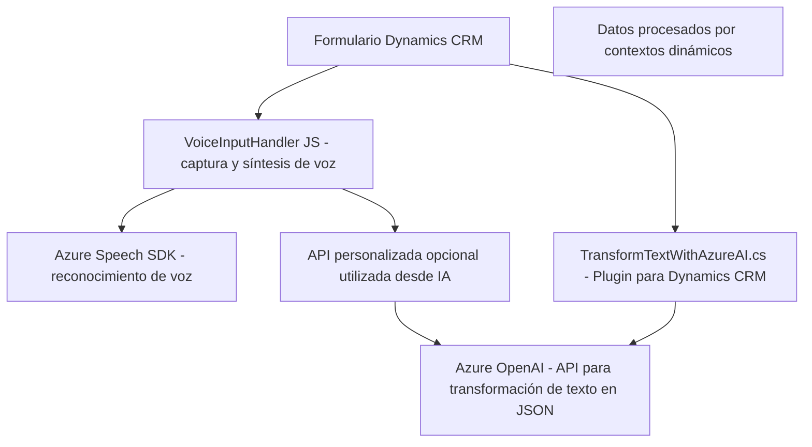

### Breve Resumen Técnico
El repositorio contiene integraciones focalizadas en la interacción con datos de formularios, el reconocimiento de voz y la transformación de texto basado en IA. Estas funciones están diseñadas para sistemas como Dynamics CRM, aprovechando servicios externos como Azure Speech SDK y Azure OpenAI.

### Descripción de Arquitectura
La arquitectura está basada en un diseño por capas que interactúa con un sistema CRM (Dynamics). Se divide en un frontend para capturar y procesar voz y texto, y un backend que actúa como un plugin, utilizando servicios externos para ampliar las capacidades mediante IA (Azure OpenAI). Aunque no se trata de un sistema puramente microservicio, sigue patrones orientados a servicio, cada archivo o módulo cumple roles específicos dentro de una plataforma.

### Tecnologías Usadas
1. **Frontend**:
   - JavaScript: Procesamiento de voz y texto.
   - Azure Speech SDK: Reconocimiento de voz y síntesis text-to-speech.
   - Microsoft Dynamics API: Contexto de formulario y manipulación de datos.

2. **Backend**:
   - Dynamics CRM Plugin Framework: Implementación de lógica de negocio.
   - C#/.NET (IPlugin interface): Para interacción de datos a nivel de sistema.
   - Azure OpenAI (gpt endpoints): Transformación de texto en JSON.
   - JSON Libraries (Newtonsoft, System.Text.Json): Manejo eficiente de estructuras serializadas.

### Dependencias Externas
1. **Servicios, SDK y APIs**:
   - Azure Speech SDK.
   - Azure OpenAI (GPT Models).
   - Microsoft Dynamics CRM API (`Xrm.WebApi`).

2. **Librerías JavaScript**:
   - Carga dinámica de scripts (Azure Speech SDK URL).

3. **C# Plugin Framework**:
   - Interacción con librerías como `Microsoft.Xrm.Sdk`.

### Diagrama **Mermaid**

### Conclusión Final
El repositorio define una solución híbrida que conecta frontend dinámico basado en formularios con capacidades extendidas de interacción por voz y texto usando servicios de Azure. Está diseñado con un patrón modular para garantizar eficiencia en sistemas CRM. Aunque no es una solución completamente microservicio, implementa patrones especializados en integración con servicios externos y persistencia dinámica en entornos regulados como Dynamics CRM, destacando una arquitectura por capas bien definida.