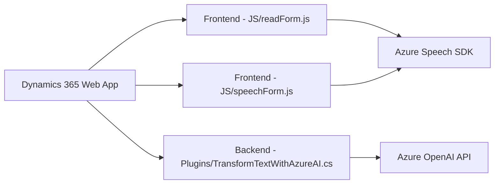

### Breve resumen técnico:
El repositorio contiene tres módulos distintos:
1. **Frontend**: Dos archivos JavaScript (`readForm.js` y `speechForm.js`) que procesan formularios y gestionan interacciones de entrada/salida de voz mediante el **Azure Speech SDK**.
2. **Plugin Backend**: Una clase C# (`TransformTextWithAzureAI.cs`) que se ejecuta como plugin en Dynamics 365. Usa **Azure OpenAI API** para transformar texto en datos estructurados en JSON.

---

### Descripción de arquitectura:
La solución emplea una **arquitectura distribuida orientada a servicios**, combinando módulos frontend para la interacción en tiempo real con usuarios y backend que actúa como un servicio procesador integrado en Dynamics 365 a través del patrón de **plugin**. También utiliza dependencias externas como SDKs y APIs de Microsoft Azure para las capacidades de síntesis de voz y procesamiento de texto con inteligencia artificial.

---

### Tecnologías usadas:
1. **Frontend**:
   - Lenguaje: **JavaScript**
   - Frameworks/Librerías: **Azure Speech SDK**, `window.SpeechSDK`, `Xrm.WebApi`
   - UI Context: Dynamics 365 Forms
   - Patrones: Callback, delegador, gestión condicional con fallbacks.

2. **Backend**:
   - Lenguaje: **C#**
   - Framework/Librerías: `Microsoft.Xrm.Sdk`, `Newtonsoft.Json.Linq`, `System.Net.Http`, `System.Text.Json`
   - Externas: **Azure OpenAI API**
   - Patrones: CRM Plugin Architecture, REST Service Integration, DTO.

---

### Diagrama **Mermaid** válido **100 % compatible con GitHub Markdown**:

---

### Conclusión final:
La solución está diseñada para ejecutar tareas de interacción por voz y procesamiento mediante inteligencia artificial. El **Frontend** es responsable de la captura y síntesis de voz, integrándose con Dynamics 365 para la recuperación/mapeo de datos. Por su parte, el **Backend** utiliza **Azure OpenAI API** para transformar texto, devolviendo estructuras interpretables directamente al sistema CRM. La arquitectura es **orientada a servicios**, con una alta dependencia de plataformas cloud (Azure) y Dynamics 365, asegurando modularidad y escalabilidad.