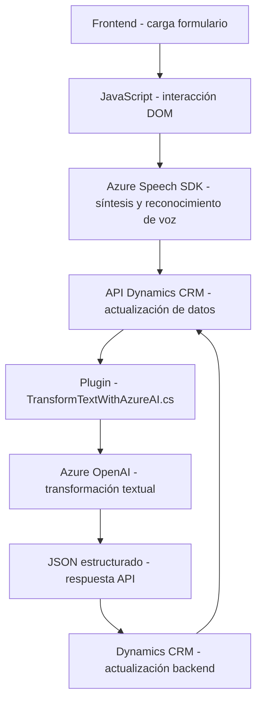

### Breve resumen técnico
El repositorio presenta funcionalidades que apoyan la interacción entre un frontend basado en JavaScript y un backend en Dynamics CRM. En el frontend, se manejan tareas de síntesis y reconocimiento de voz mediante Azure Speech SDK, mientras que el backend está extendido con un plugin de Dynamics CRM que interactúa con Azure OpenAI para transformar texto. La arquitectura combina patrones asíncronos, modularidad y extensibilidad.

---

### Descripción de la arquitectura
La solución tiene una arquitectura de **n capas**, donde:
1. **Frontend:** Contiene lógica de presentación, interacción con el usuario (formulario dinámico) y consumo del Speech SDK.
2. **Middleware:** Representado por la integración con APIs externas y el plugin personalizado de Dynamics CRM.
3. **Backend:** Dynamics CRM gestiona datos y lógica empresarial, extendido por el plugin que transforma texto con Azure OpenAI.

Los archivos están organizados en módulos funcionales con alta cohesión: cada archivo tiene un propósito concreto y código reutilizable.

---

### Tecnologías usadas
1. **Frontend:**
   - **JavaScript ES6+:** Lenguaje para implementar la lógica en archivos como `readForm.js` y `speechForm.js`.
   - **Azure Speech SDK:** Realiza reconocimiento de voz y síntesis de texto a voz.
   - **Dynamics CRM APIs (`Xrm.WebApi`):** Interacción con la capa backend de CRM.
   - **DOM API:** Manipulación dinámica del formulario.
   
2. **Backend:**
   - **Dynamics CRM SDK:** Plugin de `TransformTextWithAzureAI.cs` usando `IPlugin`.
   - **Azure OpenAI API:** API para transformar texto con inteligencia artificial (GPT-4).
   - **HTTP Client:** Para consumir APIs de servicios externos.
   - **Newtonsoft.Json:** Manejo de Json en formato estructurado.

3. **General:**
   - **Microsoft Azure Services:** Speech and OpenAI.
   - **Pattern:** Modular, Event-driven architecture.

---

### Diagrama Mermaid válido para GitHub Markdown
Este diagrama representa la interacción entre módulos y servicios.

---

### Conclusión final
La solución combina el poder del frontend moderno con la robustez de Dynamics CRM y servicios de Microsoft Azure. Con una arquitectura de **n capas**, modulares y orientadas a servicios, ofrece una integración eficiente entre interfaces de usuario, voz y procesamiento textual avanzado. Aunque es funcional y extensible, se recomienda garantizar que las claves de API están gestionadas de forma segura y que las dependencias externas están bajo control para evitar brechas de seguridad.