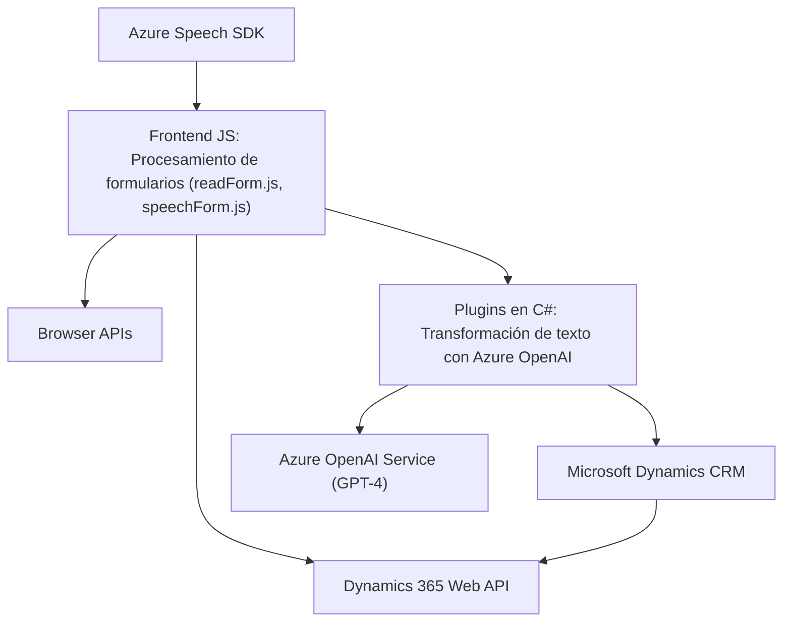

## Breve resumen técnico
El repositorio tiene tres componentes principales:
1. **Frontend JS**: Archivos centrados en el procesamiento de formularios y la integración con el servicio de **Azure Speech SDK** para reconocimiento de voz y síntesis de texto.
2. **Plugins en C#**: Componentes desarrollados como extensiones para **Microsoft Dynamics CRM**, centrados en la transformación de texto mediante **Azure OpenAI** utilizando GPT-4.

El repositorio implementa una solución que combina accesibilidad (lectura y procesamiento de formularios por voz) con la integración de inteligencia artificial para Dynamics 365.

---

## Descripción de arquitectura
1. **Tipo de solución**: Microservicios y plugins especializados, junto con lógica de frontend integrada para procesamiento dinámico de datos.
2. **Patrones y tecnologías usados**:
   - **Patrón Capa**: División entre frontend (procesamiento de formularios), backend (plugins) e integraciones externas (Azure Speech SDK).
   - **Gestión modular**: Cada archivo está diseñado con funciones separadas por responsabilidades específicas.
   - **Integración con servicios cloud**: Uso del protocolo HTTP REST para interactuar con **Azure Speech SDK** y **Azure OpenAI Service**.
3. **Arquitectura**: Monolito extendido con capas, integrado con servicios externos (Azure y Dynamics 365).
4. **Dependencias externas**:
   - **Azure Speech SDK**: Reconocimiento y síntesis de voz.
   - **Azure OpenAI Service**: Transformación de texto con GPT-4.
   - **Microsoft Dynamics CRM SDK**: Para manipular datos y ejecutar plugins directamente en la plataforma CRM.
   - **General APIs**: Uso adicional de bibliotecas como `Newtonsoft.Json.Linq`.

---

## Tecnologías utilizadas
- **Frontend**:
  - Lenguaje: JavaScript.
  - Servicios externos: Azure Speech SDK.
  - Frameworks: No identificado.
- **Backend**:
  - Lenguaje: C#.
  - Servicios externos: Azure OpenAI (GPT-4), Dynamics CRM SDK.
- **Patrones**: Separación de responsabilidades, integración externa mediante APIs, uso de plugins en una arquitectura extensible.

---

## Diagrama Mermaid válido para GitHub

---

## Conclusión final
El análisis del repositorio muestra una solución enfocada en la integración de tecnologías de inteligencia artificial y voz (Azure Speech SDK y Azure OpenAI) con el ecosistema de datos empresariales de **Microsoft Dynamics 365**. El proyecto utiliza una arquitectura basada en capas, donde cada segmento (frontend, plugin backend, y servicios externos) cumple una función específica manteniendo una separación clara entre las áreas de responsabilidad. Además, los patrones de diseño aplicados aseguran modularidad, reutilización de funciones y escalabilidad en el desarrollo futuro.

