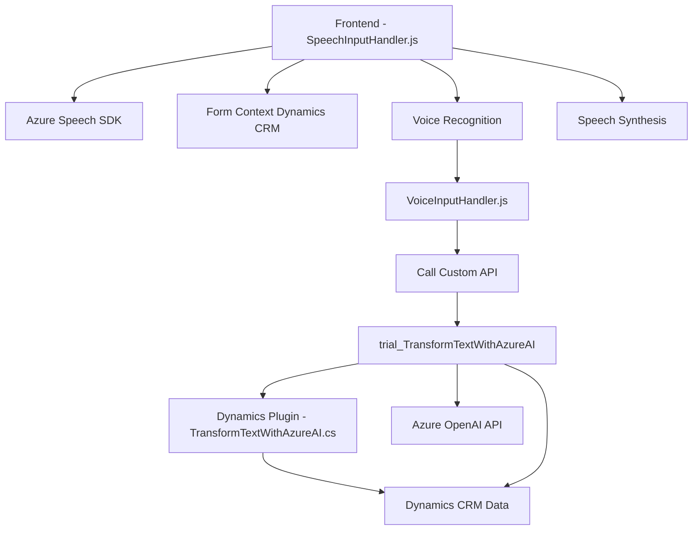

## Breve resumen técnico

El repositorio contiene diferentes componentes organizados en archivos JavaScript y C#, enfocados en la interacción con formularios basados en Dynamics CRM y en el procesamiento de reconocimiento de voz. Utiliza tecnologías como **Azure Speech SDK** y **Azure OpenAI API** para transformar datos, manejar formularios y realizar síntesis/reconocimiento de voz.

---

## Descripción de arquitectura

### Tipo de solución
Este proyecto es una solución híbrida orientada a la gestión de formularios mediante una integración frontend y backend. Incluye:
- **Frontend**: Procesamiento de texto y voz directamente en el navegador.
- **Plugin de backend**: Extensión personalizada de Dynamics CRM que utiliza Azure OpenAI para transformar/validar datos.

### Arquitectura
- **Frontend**: Modularidad basada en eventos y modelos de integración con APIs.
- **Backend (plugin)**: Arquitectura de tipo **servicio externo**, con integración de APIs externas (Azure OpenAI).
- La solución completa se categorizaría como una combinación de arquitectura **n capas** (frontend y backend) y **orientada a servicios** por la dependencia de APIs externas como Azure Speech SDK y Azure OpenAI.

---

## Tecnologías utilizadas
1. **JavaScript**:
   - Reconocimiento y síntesis de voz: **Azure Speech SDK**.
   - Manejo de DOM y lógica de formularios.
2. **C#**:
   - Backend/plugin para **Dynamics CRM**.
   - Uso de **Azure OpenAI API** para procesamiento avanzado de texto.
   - Manejo de integraciones mediante namespaces como `Microsoft.Xrm.Sdk`.
3. **Azure Cloud**:
   - **Azure Speech Services**: SDK basado en JavaScript.
   - **Azure OpenAI API**: Procesamiento de texto estructurado.
   - **Dynamics Web API**: Integración dinámica con el CRM.

### Patrones arquitectónicos
- **Event-driven architecture**: En el frontend (callbacks activados por el reconocimiento de voz y APIs externas).
- **Plugin-based architecture**: En el backend, mediante extensiones para Dynamics CRM.
- **Integration patterns**:
  - Consumo de APIs (Azure Speech SDK, OpenAI).
  - Carga dinámica de dependencias (`ensureSpeechSDKLoaded`).
- **Modularidad funcional**: Separación clara de responsabilidades por funciones y clases en ambos lados (frontend/backend).

---

## Diagrama Mermaid válido para **GitHub Markdown**

---

## Conclusión final

Este repositorio implementa una solución que combina **Frontend** para la interacción de usuario con capacidades avanzadas de reconocimiento y síntesis de voz usando **Azure Speech SDK**, y un **backend plugin** que transforma datos mediante **Azure OpenAI API**, dentro del ecosistema Dynamics CRM. La arquitectura sigue patrones de modularidad y servicio orientado a eventos, adecuada para sistemas que requieren alta integración con APIs y estándares en manejo de datos dinámicos. Su diseño es extensible para admitir nuevos modos de procesamiento de voz y lógica de transformación en el futuro.