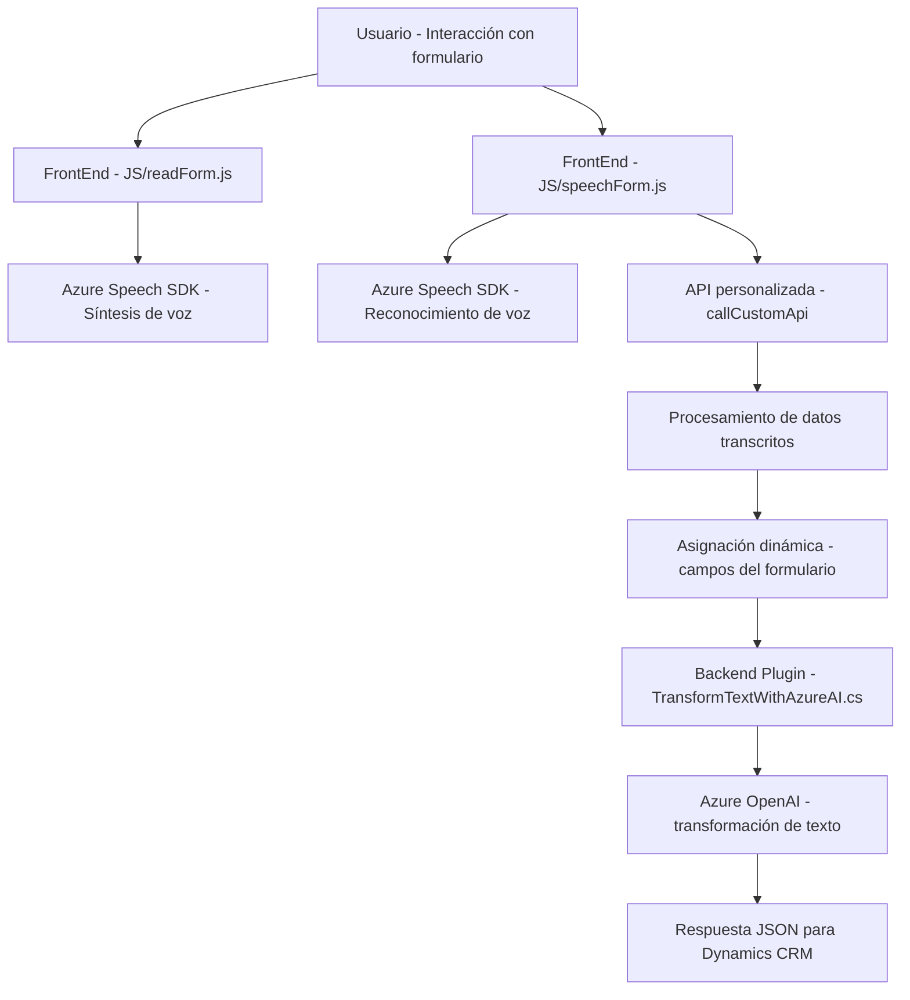

### **Breve resumen técnico**
El repositorio presenta una solución que integra funcionalidades de voz y reconocimiento de texto con formularios dinámicos para Microsoft Dynamics CRM, utilizando el Azure Speech SDK y Azure OpenAI para proporcionar capacidades avanzadas de accesibilidad y procesamiento de texto. Esta solución incluye los siguientes componentes:
1. **Frontend**: Archivos JavaScript para implementar entrada y salida de voz en formularios (readForm.js y speechForm.js).
2. **Backend Plugin**: Archivo C# que extiende la funcionalidad de Microsoft Dynamics CRM con procesamiento de texto mediante Azure OpenAI (TransformTextWithAzureAI.cs).

---

### **Descripción de arquitectura**
La arquitectura se basa en una **n capas** con integración de servicios externos:
1. **Frontend Layer**: Proporciona interacción con el usuario en formularios de Dynamics CRM. Implementa procesamiento y síntesis de voz desde datos del formulario, así como reconocimiento de voz y mapeo de transcripciones a campos del formulario mediante Azure Speech SDK.
2. **Backend Plugin Layer**: Responsable del procesamiento más complejo. Utiliza el patrón de plugins de Microsoft Dynamics CRM y delega las tareas de interpretación y transformación de texto al servicio Azure OpenAI.
3. **External Services Integration**: Se consumen servicios de Azure (Speech SDK y OpenAI) para habilitar funciones de voz y procesamiento inteligente de texto.

---

### **Tecnologías usadas**
- **Frontend:**
  - **JavaScript (ES6)** para manejar interacción del usuario con formularios.
  - **Azure Speech SDK** para síntesis y reconocimiento de voz.
  - **Dynamics CRM Web Resources/API** (`Xrm.WebApi`, `Xrm.Page`) para manipular formularios y entidades del sistema CRM.
  
- **Backend Plugin:**
  - **C#** (Microsoft .NET).
  - **Azure OpenAI API**: Realiza transformación de texto y devuelve respuestas estructuradas en JSON.
  - **ASP.NET APIs**: Manejador de solicitudes HTTP y serialización JSON (`System.Text.Json`, `Newtonsoft.Json.Linq`).

---

### **Patrones que se están utilizando**
1. **Patrón Modular**:
   - La solución utiliza funciones y clases especializadas que dividen las responsabilidades: procesamiento de datos del formulario, síntesis de voz, reconocimiento de voz y procesamiento de texto. Esto favorece la mantenibilidad.

2. **Patrón de Carga Dinámica**:
   - Los SDKs como SpeechSDK se cargan dinámicamente en el frontend, verificando su disponibilidad antes de realizar cualquier operación.

3. **Plugin Design Pattern**:
   - En el backend, la clase C# extiende las funcionalidades del CRM mediante la interfaz `IPlugin` y su método `Execute`.

4. **Service-Oriented Architecture (SOA)**:
   - La arquitectura se basa en la integración de servicios externos como Azure Speech SDK y Azure OpenAI para delegar funcionalidades especializadas.

---

### **Diagrama Mermaid válido para GitHub**

---

### **Conclusión final**
La solución está diseñada para mejorar la accesibilidad y la interacción con formularios en Microsoft Dynamics CRM con capacidades de voz y procesamiento avanzado de texto. Utiliza una arquitectura de **n capas**, combinando componentes frontend (JavaScript) que manejan la voz con un backend (C#) que transforma contenido textual utilizando servicios Azure. Además, el enfoque modular y la integración con servicios externos como Azure Speech SDK y Azure OpenAI garantizan escalabilidad y adaptabilidad al futuro.

Es importante destacar que, aunque funcional, esta arquitectura depende fuertemente de los servicios de Azure para diversas operaciones críticas, por lo que tendría un alto impacto si las claves o servicios externos no están disponibles.