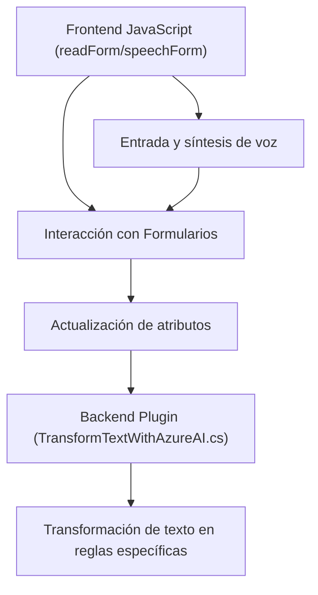

# Breve resumen técnico:
El repositorio se centra en la integración de un sistema de entrada y salida de texto por voz, procesamiento y transformación mediante APIs externas, específicamente Azure Speech SDK y Azure OpenAI, dentro de un sistema CRM (Dynamics 365). Se destacan funcionalidades de captura de entrada por voz, síntesis de campos de formularios en texto hablado y una transformación avanzada de texto siguiendo reglas específicas.

---

# Descripción de la arquitectura:
La solución tiene componentes bien definidos que sugieren una arquitectura basada en **n capas modular**:
1. **Capa de Presentación (Frontend)**: Está representada por los archivos JavaScript (`JS/readForm.js` y `JS/speechForm.js`) que interactúan con el usuario y gestionan eventos en formularios dinámicos CRM.
2. **Capa de Lógica de Negocio (Backend)**: Incluye un plugin (`Plugins/TransformTextWithAzureAI.cs`) que extiende la funcionalidad del CRM y procesa datos mediante Azure OpenAI.
3. **Capa de Servicios Externos**: Centraliza llamadas a APIs de Azure (Speech SDK y OpenAI) que habilitan el reconocimiento de voz, síntesis de texto a voz y transformación avanzada según reglas establecidas.

Esta arquitectura asegura la separación de preocupaciones, permitiendo modularidad y escalabilidad.

---

# Tecnologías usadas:
### **Frontend**:
- **JavaScript**: Implementa las funcionalidades de entrada y salida de texto por voz.
- **Azure Speech SDK**: Procesa el reconocimiento de voz, texto a voz y síntesis.

### **Backend e Integración con CRM**:
- **Microsoft Dynamics CRM SDK**: Extensiones del CRM mediante plugins (`IPlugin`).
- **C#/.NET**: Utilizado en el plugin `TransformTextWithAzureAI.cs` para comunicación con APIs y lógica de negocio.
- **Azure OpenAI API**: Proporciona transformación avanzada de texto en JSON según especificaciones.

### **Dependencias**:
- **Externas**:
  - Azure Speech SDK: Reconocimiento y síntesis de voz.
  - Azure OpenAI: Procesamiento basado en Inteligencia Artificial para transformación de texto.
- **Internas**:
  - Contexto del formulario CRM.

---

# Diagrama Mermaid (GitHub Markdown compatible):

---

# Conclusión final:
La solución combina una integración sólida con servicios de Azure (Speech SDK y OpenAI) y extensiones del CRM mediante plugins. Utiliza una arquitectura modular en **n capas**, asegurando que cada componente cumpla una función específica: entrada y salida por voz en la interfaz frontend, procesamiento de datos en el plugin backend y transformación avanzada mediante APIs. Esto permite ampliar fácilmente la funcionalidad y escalar hacia otras soluciones basadas en el mismo CRM o servicios orientados a IA en la nube.