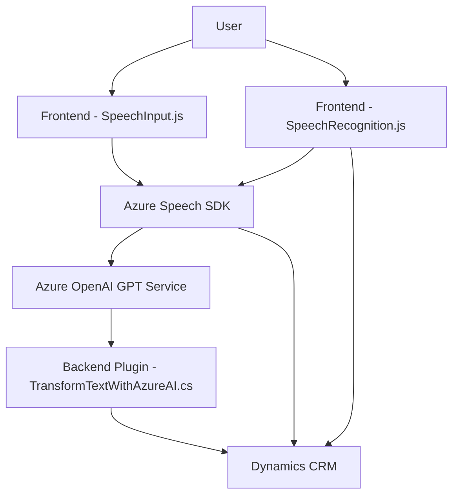

### Breve resumen técnico

Este repositorio está orientado a integrar funcionalidades avanzadas de inteligencia artificial y reconocimiento/síntesis de voz. Los componentes se distribuyen entre archivos específicos para `frontend` (JavaScript) y un `backend/plugin` desarrollado en C#. Utiliza servicios de **Azure**, específicamente el **Azure Speech SDK** para manipulación de voz y el **Azure OpenAI GPT** para procesamiento textual.

---

### Descripción de arquitectura

La solución tiene elementos de una arquitectura orientada a servicios (**SOA**) y modular. Se observan cuatro grandes módulos:
1. **Frontend dinámico para formularios** (JavaScript):
   - Interactúa con datos de formularios visibles en cliente (`formContext`).
   - Implementa funciones de reconocimiento y síntesis de voz con el **Azure Speech SDK**.
   - Traduce valores hablados a formato que el formulario comprende y realiza asignaciones dinámicas.

2. **APIs externas (Azure Speech y Azure OpenAI)**:
   - La funcionalidad de reconocimiento de voz y transformación de texto depende de endpoints externos en Azure.

3. **Backend/plugin para CRM** (C#):
   - Integra un plugin personalizado en Dynamics CRM que utiliza **Azure OpenAI Service**.
   - Funciona como un transformador de texto para automatizar entradas en CRM.

4. **Patrones modulados y conectados**:
   - Usa **loader dinámico** para cargar el SDK de Azure Speech en frontend.
   - En backend sigue el patrón de plugins, con procesamiento modular y delegación de responsabilidades usando SOA.

---

### Tecnologías usadas

#### Frontend
- **Lenguaje:** JavaScript/ES6.
- **Servicios:** Azure Speech SDK y APIs basadas en HTTP REST.
- **Framework subyacente:** Dynamics 365.
- **Browser APIs:** Manipulación del DOM.

#### Backend
- **Lenguaje:** C# (.NET Framework).
- **Servicios:** Azure OpenAI GPT, Microsoft Dynamics CRM SDK.
- **Framework:** Dynamics 365.
- **Librerías adicionales:** Newtonsoft.Json, System.Net.Http, Regex.

#### Arquitectura
- **SOA (Service-Oriented Architecture):** La solución está diseñada para interactuar tanto con APIs externas (Azure) como con módulos internos (CRM plugins).
- **Modularidad funcional:** Los componentes están especializados por responsabilidad (voz, reconocimiento textual, procesamiento JSON).
- **Loader dinámico:** En el frontend se emplea la carga dinámica del SDK de Azure Speech para evitar dependencias iniciales.

---

### Diagrama Mermaid compatible con GitHub Markdown

---

### Conclusión final

La solución está diseñada como un conjunto de herramientas integradas que aprovechan las capacidades de **Azure AI** y sintetizan/interactúan con voz y texto en un ecosistema de **Dynamics CRM**. La arquitectura está bien modulada, haciendo uso de servicios externos para mayor escalabilidad y funciones avanzadas de IA. El uso de SOA y patrones de modularidad aseguran flexibilidad y separación de preocupaciones. Esto convierte al proyecto en un excelente ejemplo de integración de inteligencia artificial con plataformas empresariales.