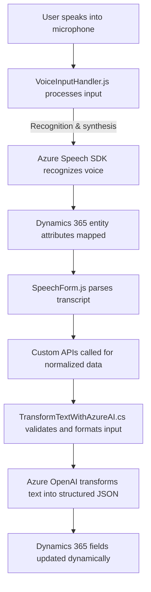

### Breve resumen técnico
La solución presentada en el repositorio tiene múltiples archivos organizados según roles específicos en una arquitectura modular. Es una combinación de frontend en JavaScript, que incluye la gestión de formularios y síntesis de voz mediante Azure Speech SDK y Dynamics 365 APIs, complementada con un backend basado en plugins de Dynamics que utiliza servicios avanzados como Azure OpenAI.

### Descripción de arquitectura
La arquitectura combina **integración de servicios externos** y facilita la automatización de procesos mediante reconocimiento de voz, generación de texto a audio, transcripciones, e incorporación de datos en formularios de Microsoft Dynamics 365. Los archivos presentan una cohesión modular, donde cada código tiene responsabilidades específicas. También se observa un patrón de comunicación con APIs externas (Azure Speech SDK y OpenAI), todo ello bajo una arquitectura **Plugin-Oriented y Service-Oriented**, con aspectos que podrían adaptarse a una arquitectura **n-capas** si se expanden los módulos.

### Tecnologías usadas
- **Frontend**:
  - JavaScript (funciones modulares y asincrónicas).
  - **Azure Speech SDK**: Para reconocimiento de voz y manejo de síntesis en tiempo real.
  - **Microsoft Dynamics 365 APIs**: Manipulación dinámica del modelo de datos y formularios.
  
- **Backend**:
  - **C# Plugins**: Programación orientada a objetos y basada en la interfaz `IPlugin` específica de Dynamics.
  - **Azure OpenAI**: Transformación de texto en JSON estructurado y formato personalizado.
  - **Microsoft.Xrm.Sdk**: Integración directa con Dynamics 365 entidades y servicios.
  - **HTTP & JSON Libraries**:
    - `System.Net.Http` y `System.Text.Json`.
    - `Newtonsoft.Json.Linq`.

### Dependencias o componentes externos
- **Azure Speech SDK**: Para manejo de audio e interacciones con síntesis de voz.
- **Azure OpenAI**: Interfaz para transformar texto según normas específicas.
- **Microsoft Dynamics 365 APIs (Xrm namespace)**: Manipulación dinámica de formularios y datos.
- **HTTP Clients**: Para integrar servicios externos con OpenAI.

### Diagrama Mermaid (válido para GitHub)

### Conclusión Final
La solución se centra en integrar sistemas de reconocimiento de voz, procesamiento de texto y gestión de datos empresariales mediante Microsoft Dynamics 365 y Azure Cloud Services. Los archivos evidencian:
- Uso de **modularidad** para optimizar la interacción entre componentes y servicios.
- **Event-Driven Architecture**, especialmente en la gestión de entrada de voz.
- Un **Service-Oriented Pattern** con integración de Dynamics 365 y varios servicios Azure.
- Potencial de evolución hacia una arquitectura más integrada como **n-capas** o **hexagonal**, con servicios y facades agrupados según responsabilidades.

Esta solución es ideal para escenarios corporativos que requieran automatización avanzada entre usuarios, formularios dinámicos y generación o procesamiento de voz bajo las mejores prácticas de arquitectura y tecnologías cloud y empresariales modernas.