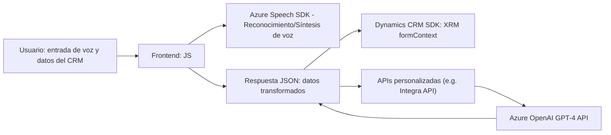

### Breve resumen técnico

El repositorio contiene una solución que implementa integración de funcionalidad avanzada basada en servicios externos para Microsoft Dynamics CRM. Los archivos analizados apuntan a la incorporación de entrada de voz y generación de texto mediante **Azure Speech SDK** para formularios CRM HTML, así como el uso de **Azure OpenAI** para la transformación de texto en el backend. La solución combina el uso de tecnologías modernas en el frontend (JavaScript, Azure SDK) con extensiones de Microsoft Dynamics CRM en el backend, bajo una arquitectura orientada a servicios (Service-Oriented Architecture).

---

### Descripción de arquitectura

La solución tiene una arquitectura de **Servicio Orientado (SOA)**. El frontend (JavaScript) actúa como un punto de entrada donde los datos se procesan y se convierten mediante servicios externos como **Azure Speech SDK**. En el backend, la extensión del CRM en C# utiliza un **plugin basado en la interfaz `IPlugin`** para enviar datos a un API externo (Azure OpenAI) que transforma el texto y retorna un JSON estructurado.

Simultáneamente, la capa de integración interactúa tanto con APIs personalizadas como con datos del CRM utilizando **Dynamics CRM SDK** (para formularios, atributos y relaciones). De esta forma, el sistema está diseñado para aprovechar varios servicios en un flujo integrador y modular.

---

### Tecnologías utilizadas

**Frontend:**
1. **Azure Speech SDK**: Ofrece capacidades de reconocimiento de voz y síntesis de voz.
2. **JavaScript (Vanilla)**: Es utilizado para integrar con el SDK y con los formularios de Dynamics CRM en el navegador.
3. **Microsoft Dynamics CRM SDK**: Gestiona la interacción con los formularios CRM y sus atributos.

**Backend:**
1. **C# (.NET Framework)**: Utilizado para implementar el plugin de Dynamics CRM.
2. **Microsoft Dynamics CRM SDK**: Extensión del sistema CRM.
3. **Azure OpenAI API**: Proporciona procesamiento avanzado para transformar texto mediante el modelo GPT-4.
4. **Newtonsoft.Json/System.Text.Json**: Manipulación del JSON para entrada y procesamiento.
5. **System.Net.Http**: Comunicación HTTP con el servicio externo.

**Patrones de diseño aplicados:**
1. **Service-Oriented Architecture (SOA)**: Utilización de servicios externos (Azure Speech, Azure OpenAI).
2. **Integration Layer Pattern**: En el frontend y plugin se implementa una capa de conexión con APIs externas (Azure OpenAI, Dynamics CRM).
3. **Modular Design**: Código dividido en múltiples funciones para facilitar reutilización y legibilidad.
4. **Facade Pattern**: Existen funciones dedicadas que simplifican la interacción con elementos externos y el sistema CRM.
5. **Callback Pattern / Asynchronous Execution**: El frontend utiliza métodos basados en funciones de callback para controlar el flujo asíncrono.

---

### Diagrama Mermaid válido para GitHub

---

### Conclusión final

La arquitectura presentada está diseñada para una integración específica entre el frontend, Dynamics CRM y servicios avanzados de inteligencia artificial de Azure. El enfoque principal radica en maximizar la modularidad y reusabilidad del código mediante la implementación de múltiples patrones de diseño (SOA, fachada, callbacks) y robustas integraciones externas (Azure Speech SDK y Azure OpenAI). Del análisis se puede concluir que este sistema tiene aplicaciones en mejoras de productividad y experiencia de usuario dentro del ecosistema de CRM, optimizando tareas como el análisis de datos mediante IA o la entrada de voz.