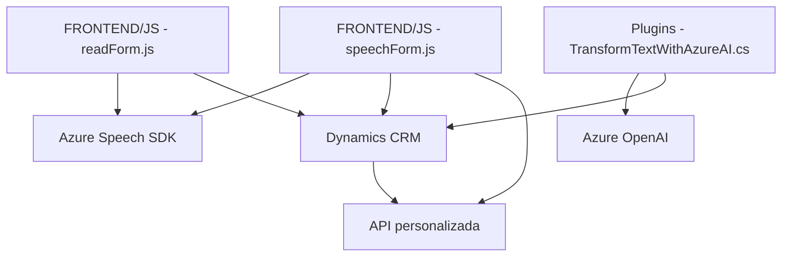

## Breve Resumen Técnico

El repositorio consiste en una solución que utiliza **Azure Speech SDK**, **API externas como Azure OpenAI**, y **Microsoft Dynamics CRM** para implementar funcionalidades relacionadas con la **captura y procesamiento de datos mediante entrada por voz**. Está compuesto de varios módulos JavaScript y un plugin en C#. Los scripts JavaScript se integran con formularios de Dynamics 365 para interactuar dinámicamente con datos del usuario, mientras que el plugin C# transforma información de texto usando inteligencia artificial en Azure OpenAI.

---

## Descripción de Arquitectura

La solución implementa una **arquitectura híbrida basada en servicios**:

1. **Frontend JS Modules**:
   - Los scripts en el directorio `FRONTEND/JS` están diseñados como módulos funcionales autónomos para la interacción con formularios y la integración con **Azure Speech SDK**.
   - Conforman una **estructura con separación de responsabilidades** (procesamiento de datos del formulario y consumo del servicio de síntesis/reconocimiento de voz).

2. **Plugin Dynamics CRM**:
   - El archivo `TransformTextWithAzureAI.cs` adopta el patrón **Plug-in**, una extensión estándar de Microsoft Dynamics CRM. Permite integrar servicios externos (en este caso, Azure OpenAI) directamente en el flujo del CRM.

3. **Interacción de componentes**:
   - Los módulos frontend interactúan con formularios y APIs personalizadas de Dynamics 365 y dependen del SDK para el reconocimiento/síntesis de voz.
   - El plugin en C# es responsable del procesamiento avanzado del texto usando Azure OpenAI y transforma comandos naturales a JSON.

La arquitectura general podría clasificarse dentro de **una arquitectura de n capas**, con la capa de presentación gestionada por JavaScript en los formularios, la lógica de negocio distribuida en los plugins de Dynamics CRM y los servicios externos que realizan tareas especializadas (Azure Speech SDK y OpenAI).

---

## Tecnologías Utilizadas

### Lenguajes y Frameworks:
1. **Frontend:**
   - **JavaScript ES6** para la interacción con DOM y módulos funcionales.
   - Manejo de asincronía con Promises y callbacks.
2. **Backend:**
   - **C# (.NET Framework)**: Desarrollo del plugin implementado en Dynamics CRM.

### Servicios y Librerías:
1. **Azure Speech SDK**:
   - Componentes para reconocimiento y síntesis de voz.
2. **Azure OpenAI Service**:
   - Análisis y transformación de texto con modelos avanzados como GPT.
3. **Microsoft Dynamics CRM SDK**:
   - Manipulación de datos en formularios y contexto de usuario.

### Patrones de diseño y arquitectura:
- **Modular Design**: Separación de funcionalidades en métodos únicos y reutilizables.
- **Plug-in Architecture**: Uso de IPlugin para integrar componentes directamente al flujo de negocio de Dynamics CRM.
- **State Mapping**: Relación entre campos visibles en UI y valores internos gestionados en el backend.
- **Callback & Promises (Asynchronous Programming)**: Garantiza la ejecución secuencial y manejo de eventos asincrónicos.
- **External Service Dependency Management**: Integración explícita con servicios en la nube.

---

## Diagrama Mermaid

El siguiente diagrama muestra la interacción entre los componentes principales y las dependencias externas de la solución.

---

## Conclusión Final

Este repositorio implementa una solución escalable y modular para **captura, procesamiento y síntesis de voz**, junto con transformación de datos basada en inteligencia artificial para el ecosistema de **Microsoft Dynamics CRM**. La arquitectura híbrida combina servicios externos como **Azure Speech SDK** para funcionalidad de voz y **Azure OpenAI** para procesamiento avanzado de texto, permitiendo integrar capacidades inteligentes en aplicaciones empresariales de cara al usuario final.

Tiene una estructura que facilita la separación de responsabilidades y la extensión futura mediante la carga dinámica de SDKs y la integración de APIs especializadas como Dynamics WebApi.