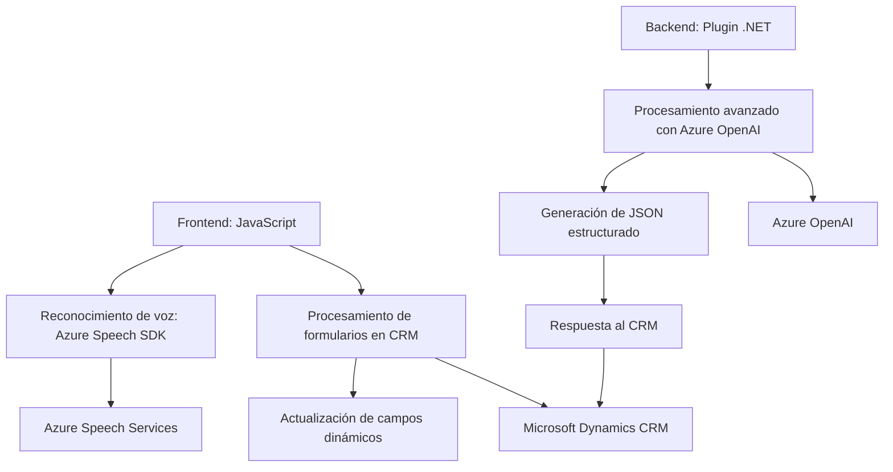

### Breve resumen técnico
El repositorio explora una solución de integración avanzada de tecnologías, con un enfoque en la interacción de voz y procesamiento de datos en formularios dentro del contexto de Microsoft Dynamics CRM. Incluye elementos de frontend (JavaScript) para integración con la API Azure Speech SDK, junto con un plugin backend (.NET) que utiliza Azure OpenAI para procesamiento y transformación de texto.

---

### Descripción de arquitectura
La solución tiene una arquitectura híbrida con tres bloques principales:
1. **Frontend interactivo para entrada/salida de voz**:
   - Usando JavaScript, ejecuta funciones como reconocimiento y síntesis de voz vía Azure Speech SDK.
   - Realiza procesamiento dinámico de formularios en el CRM basándose en datos obtenidos de voz.

2. **Backend y procesamiento avanzado**:
   - Incluye un plugin desarrollado en .NET para Dynamics CRM, que transforma texto con Azure OpenAI y lo devuelve como JSON estructurado.
   - Se utiliza una arquitectura basada en `Plugin-based architecture` para conectar de forma nativa con Dynamics CRM.

3. **Conexión con servicios externos**:
   - Usa integración directa de servicios como Azure Speech SDK y Azure OpenAI.

La arquitectura tiene elementos de **Event-Driven Architecture** en el frontend y sigue el modelo **n-capas** en el backend (plugin). Los puntos de integración están claramente definidos para facilitar el flujo de datos entre frontend, backend y servicios externos.

---

### Tecnologías usadas
- **Frontend**:
  - JavaScript.
  - Azure Speech SDK.
  - HTML/DOM.
  
- **Backend**:
  - C# y .NET Framework para desarrollo de plugins.
  - Dynamics CRM SDK (`Microsoft.Xrm.Sdk`).
  - HTTP API (System.Net.Http).
  - Azure OpenAI.

- **Externos**:
  - Azure Speech SDK para reconocimiento y síntesis de voz.
  - Azure OpenAI para procesamiento avanzado de texto.

---

### Diagrama Mermaid válido para GitHub

---

### Conclusión final
La solución combina tecnologías modernas de frontend y backend con servicios en la nube, orientada a mejorar la experiencia de usuario con funcionalidad dinámica en formularios CRM. Aprovecha Azure Speech SDK para entrada/salida de voz, mientras el plugin en Dynamics CRM expande la funcionalidad del sistema mediante procesamiento inteligente con Azure OpenAI.

La arquitectura es modular y fácilmente extensible, ideal para escenarios empresariales que requieren una integración con inteligencia artificial y reconocimiento de voz. Sin embargo, se podrían identificar áreas de refinamiento en el código redundante (e.g., en funciones de JavaScript) y en optimización de llamadas HTTP en el plugin backend.