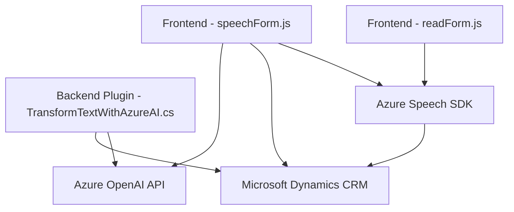

### Breve resumen técnico

El repositorio contiene tres archivos principales que implementan diferentes soluciones relacionadas con la integración de servicios de Azure y gestión de formularios en Microsoft Dynamics CRM:

1. **readForm.js**: Sintetiza texto a voz desde campos visibles en un formulario utilizando Azure Speech SDK.
2. **speechForm.js**: Procesa entrada de voz para interpretar y actualizar datos en un formulario de Dynamics CRM, utilizando tanto Azure Speech SDK como APIs personalizadas.
3. **TransformTextWithAzureAI.cs**: Plugin desarrollado para Dynamics CRM que usa Azure OpenAI para transformar y estructurar texto basado en reglas predefinidas.

---

### Descripción de arquitectura

Se trata de una solución híbrida, compuesta por varios módulos que interactúan con servicios de Microsoft Azure y Dynamics CRM. La estructura del código sugiere que se implementa una arquitectura **modular**, con responsabilidad bien segregada en funciones y servicios específicos.

El modelo arquitectónico principal se aproxima a una **arquitectura orientada a servicios**, donde las distintas piezas del sistema interactúan mediante APIs y SDKs especializados.

#### Aspectos destacados:
- Dependencia fuerte en servicios Cloud externos, particularmente **Azure Speech SDK** y **Azure OpenAI**.
- Uso de **event-driven programming** en los módulos frontend, con callbacks que gestionan la sincronización con los servicios de reconocimiento de voz y texto.
- Los plugins y módulos son componentes independientes, lo que permite su fácil reutilización y escalabilidad en otros proyectos.

---

### Tecnologías usadas

1. **Frontend/JavaScript**:
   - **Azure Speech SDK** para reconocimiento y síntesis de voz.
   - **Dynamics CRM (Xrm.WebApi)** para integrar la gestión del formulario.
   - Modular design con funciones organizadas y reutilizables.

2. **Backend/.NET**:
   - **Microsoft Dynamics CRM SDK**: Framework utilizado para desarrollar plugins que interactúan con Dynamics CRM.
   - **Azure OpenAI API**: Servicio externo para transformación y generación de texto.
   - **JSON Processing**: Uso de `Newtonsoft.Json` para manejar respuestas y peticiones JSON en .NET.
   - **HTTP Client**: Librería estándar para realizar solicitudes HTTP.

3. **Patrones de diseño**:
   - **Client-Server Architecture**: Por la interacción continua de cliente (frontend) con servicios en la nube.
   - **Facade Pattern**: Encapsulación de la lógica compleja de integración con Azure SDKs y APIs dentro de funciones concretas.
   - **Event-driven Programming**: Uso extensivo de callbacks y eventos en los scripts de JavaScript.
   - **Dependency Injection**: En el plugin de .NET, las dependencias de Dynamics CRM se gestionan mediante `IServiceProvider`.

---

### Diagrama Mermaid válido para GitHub

---

### Conclusión final

Este repositorio implementa una solución integrada para trabajo con formularios en Microsoft Dynamics CRM, aprovechando servicios de texto a voz (Azure Speech SDK) y generación y transformación de texto (Azure OpenAI API). La arquitectura se organiza en una estructura modular para facilitar el mantenimiento y la escalabilidad, mientras que los patrones utilizados permiten la reutilización de código y la interacción con APIs externas. 

Sin embargo, el diseño de la solución muestra un fuerte acoplamiento con los servicios de Microsoft y Azure, lo que podría ser una limitante en entornos donde tales servicios no fueran accesibles o permitidos. Además, la solución requiere consideraciones de seguridad para gestionar las claves y accesos a las APIs.