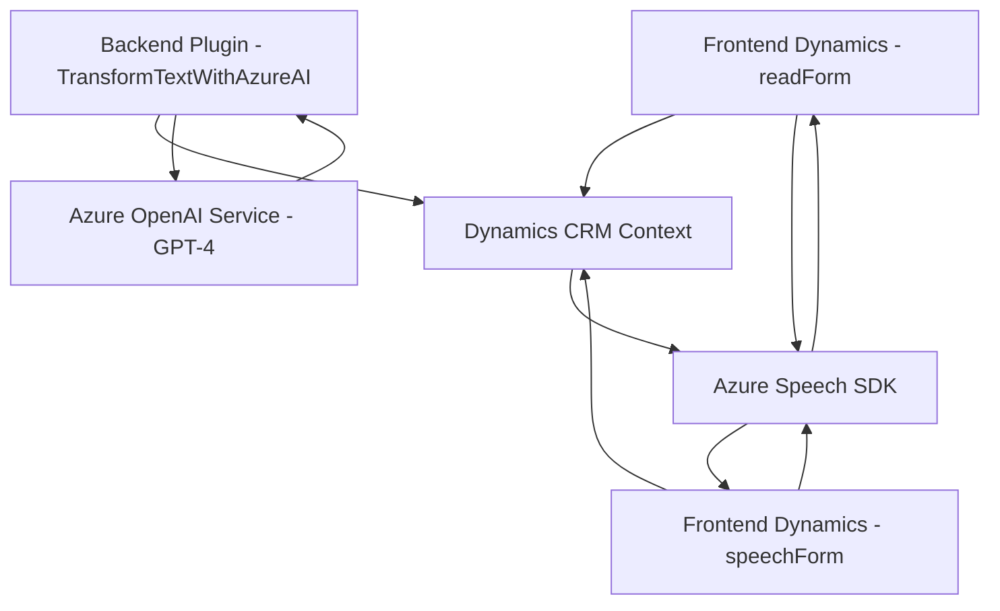

### Resumen técnico

El repositorio en cuestión implementa funcionalidades relacionadas con la integración de reconocimiento y síntesis de voz, basándose en el SDK de Azure Speech y el contexto de formularios de Dynamics 365. Adicionalmente, incluye un plugin en el backend que interactúa con Azure OpenAI para transformar texto.

### Descripción de arquitectura

La solución sigue una arquitectura **modular orientada a servicios**, combinando patrones de desarrollo frontend (JavaScript), backend (.NET C#), y dependencias externas (Azure Speech SDK, Azure OpenAI). Si bien está organizada en capas por componentes (Frontend: Formularios interactivos y Backoffice: Plugins), no es estrictamente un monolito ni una arquitectura hexagonal debido a su alta dependencia en APIs externas y modelos de interacción entre cliente-servidor.

Principalmente, este repositorio implementa tres componentes clave:
1. **Frontend (JavaScript)**: `readForm.js` y `speechForm.js` manejan la voz y datos del formulario CRM.
2. **Backend (Dynamics Plugins)**: Implementa lógica de servidores complementada con Azure OpenAI para transformar datos desde texto.
3. **Integración con servicios externos**: Usos del SDK de Azure Speech y Azure OpenAI.

### Tecnologías usadas

1. **Frontend**:
   - Lenguaje: JavaScript.
   - Integración: Dynamics 365 (`Xrm.WebApi`).
   - Servicios Externos: Azure Speech SDK.
   - Patrones: Modularidad, integración de API, orientación a eventos.

2. **Backend**:
   - Lenguaje: C# (.NET Framework).
   - Plugin Dynamics (`IPlugin`).
   - Servicios Externos: Azure OpenAI.
   - Patrones: Desacoplamiento, DTOs, comunicación basada en HTTP.

3. **Dependencias externas**:
   - **Azure Speech SDK**: Para síntesis y reconocimiento de voz.
   - **Azure OpenAI (GPT-4)**: Para analizar y transformar texto en JSON con reglas específicas. 

### Diagrama Mermaid

### Conclusión

El repositorio proporciona una solución orientada a servicios con el uso extensivo de SDKs externos (Azure Speech y OpenAI). La arquitectura modular facilita escalabilidad, aunque destaca por su alta dependencia de los servicios en la nube. Recomendamos evaluar la gestión segura de datos sensibles como las claves de acceso y monitorear los costos operativos derivados del uso de Azure.