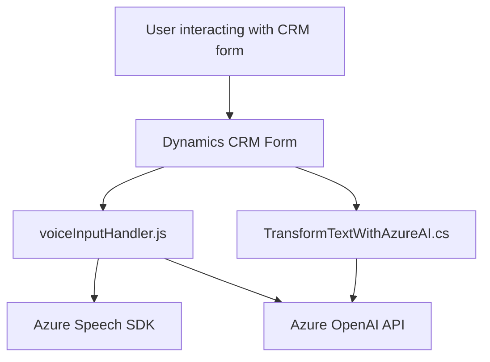

### Breve resumen técnico
El proyecto es una solución que integra servicios en la nube (Azure Speech SDK y Azure OpenAI API) con un sistema CRM (Microsoft Dynamics). Incluye un frontend en JavaScript para la interacción con formularios y voz, junto con un plugin en C# para realizar transformaciones de texto mediante servicios de inteligencia artificial.

---

### Descripción de arquitectura
La solución emplea una arquitectura **mixta**:
1. **Frontend**: Modular y basado en funciones encapsuladas orientadas a la interacción entre el usuario y servicios en la nube (Azure Speech para síntesis de voz y reconocimiento).
2. **Plugin en Backend (Microsoft Dynamics)**: Orientado a servicios y comunicación con APIs externas para transformar datos en tiempo real mediante Azure OpenAI.
3. Capas:
   - **Presentación (UI)**: Formularios integrados en Dynamics CRM (frontend en JavaScript).
   - **Lógica de negocio**: Plugins (.NET y C#) ejecutados en el backend de Dynamics CRM.
   - **Servicios externos**: APIs como Azure OpenAI y Azure Speech SDK.

En general, la arquitectura sigue un enfoque **evento-controlador**, donde las interacciones de usuario activan llamadas a APIs externas y procesos en el sistema CRM.

---

### Tecnologías usadas
1. **Frontend**:
   - JavaScript.
   - Azure Speech SDK (integración mediante carga dinámica).
   - Xrm.WebApi de Dynamics CRM.

2. **Backend**:
   - C# (.NET Framework).
   - Microsoft Dynamics CRM SDK.
   - Azure OpenAI API (integración con HTTP requests).

3. **Patrones arquitectónicos**:
   - Modelo de **carga dinámica** para optimizar recursos (Azure Speech SDK).
   - **Event-driven programming**: Operaciones activadas mediante eventos definidos.
   - **Modularidad** en funciones del frontend y clases del backend.
   - **Integración con servicios externos**.

---

### Dependencias o componentes externos
1. **Azure Speech SDK**: Para síntesis y reconocimiento de voz desde formularios.
2. **Azure OpenAI API**: Para procesar texto dinámico y responder con estructuras JSON.
3. **Microsoft Dynamics CRM SDK (Xrm.WebApi.online)**: Proporciona acceso a las funcionalidades internas y las API del CRM.
4. **Bibliotecas JSON**: `System.Text.Json`, `Newtonsoft.Json.Linq` para manipulación de datos estructurados.
5. **Claves API y configuración externa**:
   - Clave y endpoint de Azure Speech SDK.
   - Clave y configuración del recurso OpenAI en Azure.
6. **Fuzzy matching**: Para detectar coincidencias entre etiquetas de formularios y valores de voz.

---

### Diagrama Mermaid válido para GitHub

---

### Conclusión final
La solución está diseñada para complementar un CRM como Microsoft Dynamics mediante integración con servicios basados en la nube. El frontend ofrece funcionalidades modernas como voz a texto y síntesis vocal, y el backend permite procesar texto con IA avanzada. Se utiliza una arquitectura modular con integración de servicios externos, siguiendo buenas prácticas como carga dinámica y separación de responsabilidades.

Es adecuada para entornos empresariales que requieren automatización con IA en sistemas CRM, aunque puede beneficiarse de mejoras relacionadas con el manejo seguro de claves API y optimización de la configuración externa.