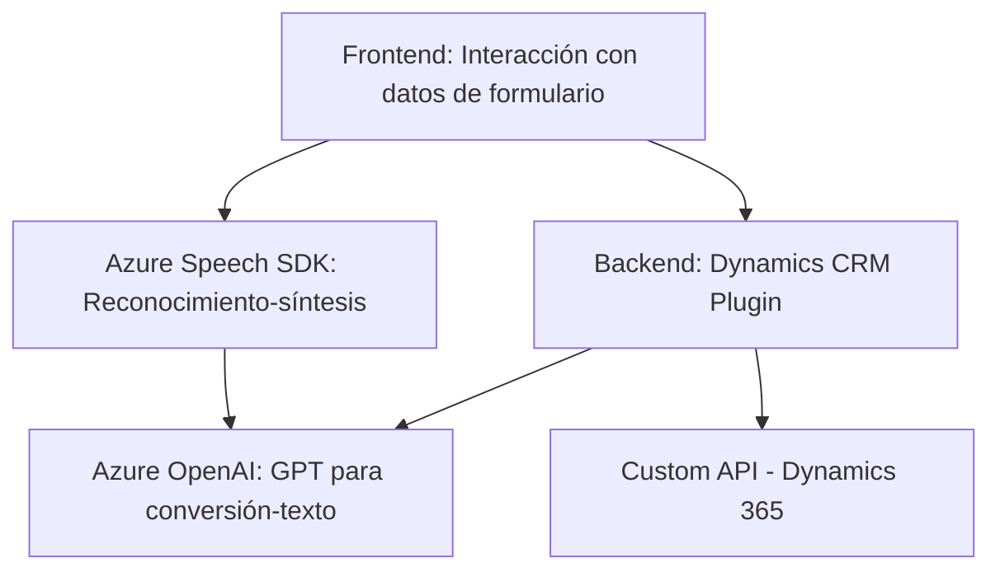

### Breve resumen técnico

El repositorio parece ser parte de una solución que integra capacidades avanzadas de voz y procesamiento de texto usando **Azure Speech SDK**, **Azure OpenAI** y **Microsoft Dynamics 365**. Está diseñado para habilitar interacción entre formularios web y los servicios mencionados, tanto para entrada de voz como para procesamiento avanzado mediante inteligencia artificial.

---

### Descripción de arquitectura

La solución está dividida en dos áreas principales:
1. **Frontend**: Archivos JavaScript encargados de la interacción directa con el usuario. Procesan datos de formularios y habilitan la función de captura y síntesis de voz ligera dentro del navegador o ecosistema CRM.
2. **Backend plugin**: El archivo en C# habilita la comunicación con Azure OpenAI desde Microsoft Dynamics 365, procesando texto y transformándolo en un formato semántico útil para el sistema.

La arquitectura utilizada integra varios subsistemas en un modelo **n capas**, donde los componentes del frontend interactúan directamente con el usuario y envían solicitudes al backend. La lógica del backend se ejecuta como un plugin en Dynamics 365, fomentando la modularidad. También hace uso del patrón de diseño de **cliente HTTP** para interactuar con servicios externos (Azure Speech SDK y OpenAI).

---

### Tecnologías usadas

1. **Frontend**
   - **Azure Speech SDK**: Para síntesis de voz y reconocimiento, cargado dinámicamente desde una URL pública.
   - **JavaScript**: Para implementación de funciones y validación en el frontend.
   - **Dynamics 365 API**: Para manipulación de formularios y datos del CRM.

2. **Backend**
   - **Microsoft Dynamics 365 SDK**: Para crear plugins que se integren con procesos internos del CRM.
   - **Azure OpenAI GPT**: Realiza funciones avanzadas de transformación de texto según instrucciones predefinidas.
   - **C#**: Lenguaje utilizado para implementar el plugin.
   - **System.Net.Http**: Para solicitudes HTTP.
   - **System.Text.Json** y **Newtonsoft.Json.Linq**: Para manejar datos en formato JSON, esencial en la comunicación entre servicios.

3. **Patrones de diseño**
   - **Patrón de Proxy de Dependencia Dinámica**: Gestión del Azure Speech SDK en tiempo de ejecución sin acoplamiento fuerte.
   - **Event-driven Architecture**: Uso de callbacks en el frontend, especialmente para gestionar eventos como reconocimiento de voz y síntesis.
   - **n capas**: Separación clara de responsabilidades entre presentación (frontend) y lógica empresarial (backend C# plugin).

---

### Diagrama Mermaid válido para GitHub

---

### Conclusión final

La solución en este repositorio es una aplicación extensible centrada en mejorar la accesibilidad y usabilidad de formularios en Dynamics 365. Mediante la integración de tecnologías de voz y procesamiento de texto, permite a los usuarios interactuar de manera intuitiva con los datos, ampliando las capacidades tradicionales del CRM. La arquitectura *n capas* muestra una correcta separación de responsabilidades, lo que permite manejar dependencias externas como Azure Speech SDK y OpenAI sin comprometer la modularidad del sistema. Sin embargo, un punto a considerar es la dependencia de servicios externos (Azure Speech SDK y OpenAI) en términos de disponibilidad y costos.