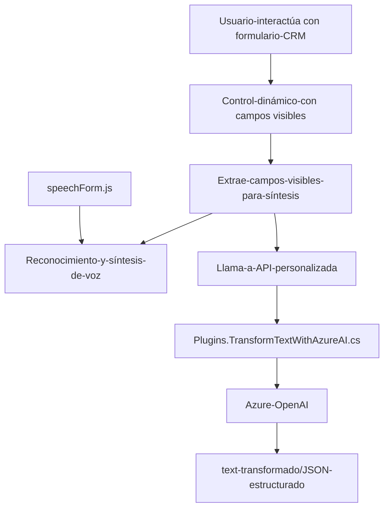

### Breve Resumen Técnico:

El análisis abarca tres archivos del repositorio vinculados al desarrollo de una integración entre formularios dinámicos de Microsoft Dynamics CRM y el SDK de Azure Speech, así como un plugin que utiliza Azure OpenAI API para transformar texto en un formato estructurado. El proyecto incluye funcionalidades tanto del frontend como del backend para soportar el reconocimiento y síntesis de voz, además de procesamiento avanzado de datos con IA.

---

### Descripción de la Arquitectura:

El sistema utiliza una arquitectura **orientada a la integración en n capas**, combinando:
- Frontend dinámico para interacción con usuarios mediante formularios de Dynamics CRM.
- Reconocimiento y síntesis de voz mediante el SDK de Azure Speech.
- Componentes backend en .NET que usan un **evento desencadenado (Event-driven) de Dynamics CRM** para invocar la API de Azure OpenAI y transformar datos.

### Tecnologías Usadas:

1. **Frontend**:
   - JavaScript.
   - Azure Speech SDK.
   - Microsoft Dynamics CRM API (`Xrm.WebApi`).

2. **Backend**:
   - .NET Framework para plugins de Dynamics CRM.
   - Microsoft.Xrm.Sdk para interactuar con entidades del CRM.
   - HttpClient para interactuar con la API de OpenAI.
   - Serialización JSON (`System.Text.Json`) para enviar y recibir datos.

3. **Servicios externos**:
   - SDK de Azure Speech para reconocimiento y síntesis de voz.
   - API de Azure OpenAI para procesamiento y transformación avanzada de texto.

### Patrones Implementados:

1. **Capas n-tiers**:
   - Diferenciación de Responsabilidades: Cada parte (frontend, procesamientos de datos, backend plugin) se realiza en su capa correspondiente.

2. **Facade Pattern**:
   - Simplificación del flujo de entrada y salida para modularizar funcionalidades (por ejemplo, en `startVoiceInput` y `processTranscript`).

3. **Event-Driven Architecture** (en el plugin de backend):
   - El plugin se activa al desencadenarse eventos dentro del CRM según la configuración predefinida.

4. **Decoupled Design**:
   - Alta separación entre las responsabilidades de recogida de datos, interpretación y comunicación con APIs externas.

---

### Diagrama Mermaid:

---

### Conclusión Final:

Este repositorio evidentemente contiene una solución híbrida que combina **frontend** para la interacción con formularios dinámicos y **backend** orientado a la integración de APIs avanzadas de Azure (Speech y OpenAI). La arquitectura se beneficia de una estructura de **n capas** y hace uso de patrones como el **Facade Pattern** para simplificar los flujos y mejorar la modularidad. La solución está principalmente diseñada para integrarse con Microsoft Dynamics CRM, destacando el uso de **eventos y capacidades integradas del CRM** como contexto dinámico de formularios con datos empresariales.

Para mejorar, sería necesario reevaluar la gestión segura de claves de API en el backend (.NET plugin) y considerar mejoras en la validación o manejo de excepciones al comunicarse con servicios externos.