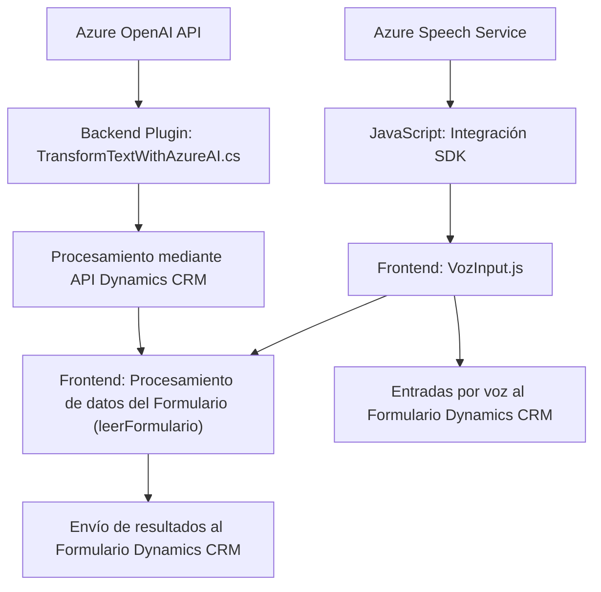

### Breve resumen técnico:
Este repositorio está enfocado en la integración de funcionalidades avanzadas de voz e inteligencia artificial en aplicaciones empresariales basadas en Microsoft Dynamics CRM. Utiliza el SDK de Azure Speech para interacción de voz (texto a voz y voz a texto), y la API de Azure OpenAI para transformar texto bajo reglas específicas. 

### Descripción de arquitectura:
La arquitectura es híbrida:
- **N capas para el frontend**: Módulos JavaScript separan lógicas de entrada/salida de voz, interacción con servicios externos (Azure Speech), generación de datos y mapeo dinámico de formularios.
- **Plugin-based en el backend**: El archivo `.cs` implementa una arquitectura basada en *plugins* de Microsoft Dynamics, con un método que orquesta el flujo de datos y consume servicios externos.
- **Integración de microservicios**: Azure Speech SDK y Azure OpenAI API son externos y se integran como microservicios para procesamiento de voz y texto.

### Tecnologías usadas:
1. **Frontend**:
   - **JavaScript**: Código modular, dependencias dinámicas y procesamiento específico de formularios.
   - **Azure Speech SDK**: Carga dinámicamente el SDK para síntesis de voz, reconocimiento de voz y procesamiento de datos.
   - **DOM API**: Manipulación de scripts dinámicamente para cargar dependencias externas.

2. **Backend**:
   - **C# y .NET**: Implementación de plugins para Dynamics CRM.
   - **Microsoft Dynamics SDK**: Enlaza la funcionalidad del plugin con los datos locales de CRM.
   - **HTTP Client**: Realiza peticiones a Azure OpenAI API.
   - **JSON Manipulation**: Uso de librerías JSON (`Newtonsoft.Json.Linq` y `System.Text.Json`) para convertir datos recibidos de la API.

3. **Externo**:
   - **Azure Speech SDK**: Servicios de síntesis y reconocimiento de voz.
   - **Azure OpenAI API**: Para procesamiento avanzado de texto.
   - **Dynamics CRM Web API**: Para actualización de campos en formularios de CRM interactivos.

### Diagrama **Mermaid** válido para GitHub Markdown:

### Conclusión final:
El repositorio representa un enfoque integral para la integración de voz e inteligencia artificial con Microsoft Dynamics CRM. 
#### Puntos destacados:
- **Híbrido**: Interacción fluida entre el frontend, plugin backend y servicios externos como Azure Speech y OpenAI.
- **Flexibilidad modular**: Tanto los módulos JavaScript como el plugin en C# siguen principios de modularidad y encapsulación, simplificando cambios y mantenimiento.
- **Potente integración con Azure**: Aprovecha API avanzadas para mejorar la experiencia del usuario final y expandir las capacidades nativas de Dynamics CRM.

Los componentes presentados son ideales para un entorno empresarial que requiere interacción por voz avanzada y análisis de texto basado en IA, siendo el diseño escalable y adaptado a ser evolucionado según requerimientos futuros.