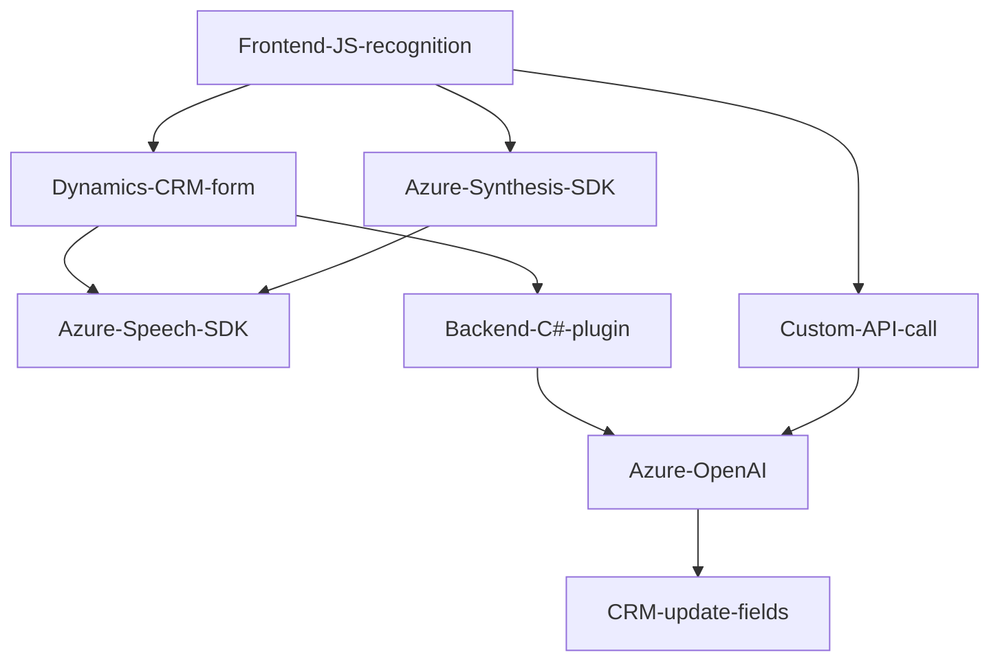

# Resumen técnico

El repositorio claramente define una solución que integra funcionalidades de **síntesis de voz**, **reconocimiento de voz**, y **transformación avanzada de texto mediante IA** en un sistema centralizado (como **CRM**). Estas capacidades están implementadas mediante archivos JavaScript que interactúan con formularios dinámicos y un **plugin para Dynamics CRM** que utiliza **Azure OpenAI**.

La solución se presenta como una combinación de un **sistema frontal de interacción con usuario (frontend)** acoplado directamente con el sistema CRM, y un backend extensible mediante plugins, consumiendo servicios en la nube.

---

# Descripción de arquitectura

La arquitectura se puede clasificar como **n capas**, con interacción estrecha entre:
1. **Presentación (Frontend)**: Código JavaScript que administra la interacción con formularios CRM y ejecuta reconocimiento o síntesis de voz (Azure Speech SDK).
2. **Lógica de negocio (Backend)**: Plugins especializados (ej. el plugin `TransformTextWithAzureAI`) que operan con reglas específicas en Dynamics CRM y llaman **servicios externos** en Azure Cloud.
3. **Servicios externos (API en la nube)**: Azure Speech SDK y OpenAI para funcionalidades avanzadas con IA.

El diseño utiliza patrones como:
- **Modularidad**: Funciones separadas por responsabilidad (como mapeo de campos, síntesis de texto o reconocimiento de voz).
- **Integración de SDK externo**: Azure Speech SDK en frontend y OpenAI en backend.
- **Modelo de eventos**: En frontend, la interacción con el SDK externo ocurre cuando ciertos eventos disparan funciones de voz.
- **Extendibilidad dinámica**: Los plugins permiten incorporar lógica personalizada directamente al contexto CRM.

---

# Tecnologías usadas

1. **Frontend**:
   - **JavaScript**.
   - **Azure Speech SDK**: Para reconocimiento y síntesis de voz en el navegador.
   - **Dynamics CRM Web API**: Para consultar y modificar datos dinámicos del sistema CRM.

2. **Backend**:
   - **C# (.NET Framework / Dynamics SDK)**:
     - Microsoft.Xrm.Sdk (manejo de contexto CRM).
     - Newtonsoft.Json (manejo de JSON en respuestas).
     - System.Net.Http (integración con API REST externa).
   - **Azure OpenAI Service**: Procesamiento avanzado de texto con IA.

3. **Servicios en la nube**:
   - **Azure Speech** y **Azure OpenAI**: Funciones REST para interacciones de voz y texto estructurado.

---

# Dependencias y componentes externos

1. **Azure Speech SDK**: Para síntesis y reconocimiento de voz en tiempo real.
2. **Dynamics CRM**: El punto central donde toda la interacción ocurre.
3. **Azure OpenAI Service**: Para transformar texto en resultados avanzados usando IA.
4. **Newtonsoft.Json / System.Text.Json (backend)**: Manejo de JSON para todas las operaciones de transformación y mapeo.
5. **Custom API Webhook**: Posible integración con funcionalidades específicas del CRM como transformaciones vía IA.
6. **Xrm.WebApi**: Operación asincrónica en formularios del sistema CRM.

---

# Diagrama Mermaid

---

# Conclusión final

Esta solución tiene una arquitectura **n capas** bien definida, con **interacciones frontend-backend**, complementada por servicios de la nube (Azure). El frontend facilita la accesibilidad al usuario mediante reconocimiento y síntesis de voz, mientras que el backend maneja lógica avanzada empleando tecnologías como Azure OpenAI.

### Ventajas:
- **Modularidad**: Funciones y clases están separadas por responsabilidades.
- **Integración con SDK externos**: Uso de tecnologías como Speech SDK y OpenAI asegura escalabilidad con IA.
- **Interacción dinámica**: Actualización y procesamiento directo de formularios CRM.
- **Extendibilidad**: Posibilidades de ampliar funcionalidades mediante nuevos plugins y APIs.

### Potenciales mejoras:
1. **Seguridad**: Claves de API deben estar en configuraciones seguras (e.g., Key Vault).
2. **Robustez**: Manejar errores y casos límite como tiempos de espera en SDK externo.
3. **Portabilidad**: Migrar configuraciones y dependencias locales hacia una infraestructura totalmente integrada con CI/CD.

La solución está preparada para escenarios modernos donde la accesibilidad, automatización y la inteligencia artificial son los pilares fundamentales del producto.