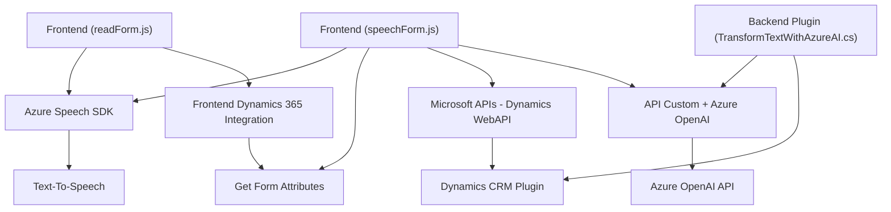

### Breve Resumen Técnico

El repositorio contiene tres archivos que implementan diferentes niveles de integración entre un contexto de Microsoft Dynamics 365 y dos servicios de Microsoft Azure: Azure Speech SDK (para síntesis y reconocimiento de voz) y Azure OpenAI (para transformación de texto mediante IA). 

La integración se realiza tanto en el frontend como en el backend. Los archivos del frontend (`readForm.js` y `speechForm.js`) utilizan el navegador para interactuar con el Azure Speech SDK y con formularios en Dynamics 365. En el lado del backend (`TransformTextWithAzureAI.cs`), una lógica basada en la arquitectura de plugins se conecta con una API de OpenAI en Azure para realizar transformaciones de texto.

---

### Descripción de la Arquitectura

Este proyecto parece implementar una **arquitectura híbrida** entre **microservicios** y **n niveles**:

1. **Microservicios**:  
   - La integración con Azure Speech SDK y Azure OpenAI API indica una dependencia en servicios externos, transformando el proyecto en un sistema distribuido.
   - El backend de Dynamics CRM utiliza un servicio desacoplado para realizar tareas específicas (transformación de texto con Azure OpenAI).

2. **N Capas**:  
   - El frontend está dirigido específicamente al manejo de datos y funcionalidades de formularios para la interacción directa del usuario. Esto convierte la aplicación en una arquitectura n-capas clásica: se separan presentación, lógica del dominio (mapeo/transformaciones), y acceso a APIs o servicios externos.

3. **Patrones**:  
   - Uso del **Patrón de Plugin** para la integración en Dynamics CRM.  
   - **Adapter Pattern** en el manejo de peticiones HTTP a las APIs de Azure.  
   - **Observer Pattern** en el manejo de eventos asincrónicos en el frontend (espera y recepción del resultado del SDK).

---

### Tecnologías Usadas

1. **Lenguajes**:  
   - `JavaScript`: Para el desarrollo de interacciones en el frontend.  
   - `C#`: En el backend, para la lógica del plugin.

2. **Frameworks y Librerías**:  
   - **Microsoft Dynamics 365 Customization Framework**: Proporciona el contexto del formulario y funcionalidades relacionadas con la integración CRM.  
   - **Microsoft Azure Speech SDK**: Utilizado para síntesis de voz y procesamiento de texto transcrito en los archivos de frontend.  
   - **Azure OpenAI API**: En el archivo C#, para transformar texto usando un modelo basado en GPT-4.  
   - **Newtonsoft.Json** y **System.Text.Json**: Para procesar JSON en el backend.  
   - **WebAPI de CRM**: Métodos para interacción con las entidades de Dynamics 365.

---

### Dependencias Externas o Componentes

1. **Servicios Externos**:  
   - **Microsoft Azure Speech SDK**: Para síntesis y reconocimiento de voz.  
   - **Azure OpenAI API**: Para procesamiento avanzado de texto con GPT-4.  

2. **Componentes Internos**:  
   - Integración directa con el modelo de datos y formularios en Microsoft Dynamics CRM.  

3. **Bibliotecas**:   
   - HttpClient para envío de peticiones HTTP, y Newtonsoft.Json para deserialización de respuestas JSON.

---

### Diagrama Mermaid

---

### Conclusión Final

Este repositorio implementa una **solution híbrida** para integrar capacidades de síntesis y reconocimiento de voz y generación de texto con Dynamics CRM utilizando servicios de Microsoft Azure. Su arquitectura, basada en microservicios y n-capas, permite cumplir con prácticas modernas de desacoplamiento y escalabilidad.

El uso del SDK de Azure Speech y la integración del plugin con la API de OpenAI hace del sistema modular y extensible. Sin embargo, se recomienda mejorar la gestión de credenciales con un enfoque más seguro y evaluar el uso de entornos de contenedor para encapsular la lógica backend y las interacciones con APIs externas. 

En general, el diseño del repositorio parece óptimo para soluciones integradas que demandan interacción entre interfaz de usuario web, servicios cloud externos y CRM dinámico.