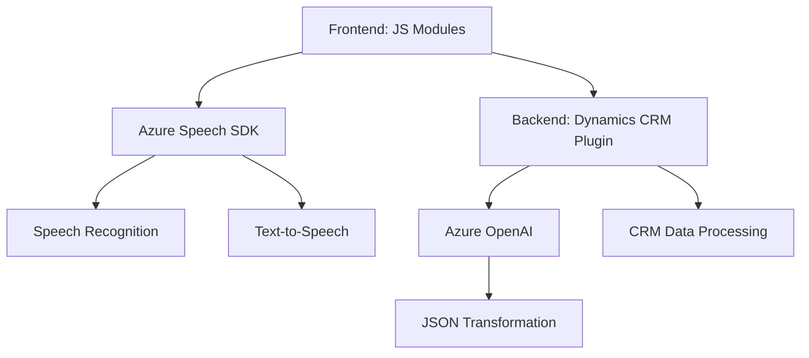

### Breve resumen técnico
El repositorio presenta una solución híbrida que combina el frontend (JavaScript) y la integración con servicios Azure como **Speech SDK** y **OpenAI**. Se observa un fuerte vínculo con Microsoft Dynamics CRM. Los archivos proporcionados contribuyen a dotar a la aplicación de capacidades de reconocimiento de voz, síntesis de texto y procesamiento con IA, integrando APIs externas para enriquecer atributos y formularios de CRM.

---

### Descripción de arquitectura

El sistema tiene una arquitectura basada en la combinación de componentes modulares y plugins, representando un diseño **híbrido**. Los módulos de JavaScript están enfocados en el frontend para manejar interacción en tiempo real y procesamiento local, mientras el plugin en C# opera como parte de **Dynamics CRM**, implementando tareas en el nivel de backend.

Patrones usados:
- **Desacoplamiento de módulos:** Gracias al uso de dependencias externas (Azure Speech SDK y OpenAI API), los módulos JavaScript no están acoplados directamente al backend.
- **Modularidad:** Las funciones son reutilizables y separadas por responsabilidad.
- **Plugin Architecture:** El archivo en C# sigue el diseño típico de plugins de Dynamics CRM, integrándose mediante la interfaz `IPlugin`.

---

### Tecnologías usadas
1. **Lenguajes y frameworks:**
   - **JavaScript:** Frontend para manipulación de DOM, interacción en tiempo real, y síntesis de voz.
   - **C#:** Backend bajo Microsoft Dynamics CRM para procesamiento de datos e integración.
2. **Servicios de terceros:**
   - **Azure Speech SDK:** Reconocimiento y síntesis de voz.
   - **Azure OpenAI:** Transformación de texto mediante procesamiento AI (GPT).
3. **CRM:**
   - **Microsoft Dynamics CRM:** Framework y contexto para formularios y plugins.
4. **APIs:** Uso profundo de servicios como `Xrm.WebApi` para operaciones CRUD en formularios de CRM.

---

### Diagrama Mermaid

---

### Conclusión final
La solución implementada es una integración fuerte entre capacidades frontend dinámicas para interacción en tiempo real y un backend robusto en Dynamics CRM a través de plugins y servicios externos. Con tecnologías como **Azure Speech SDK** y **OpenAI**, el diseño se orienta hacia una arquitectura modular y eficiente, adecuada para entornos corporativos con necesidades de personalización avanzada. Sin embargo, el sistema podría beneficiarse de mejoras en manejo de errores y estrategias de resiliencia cuando se falla al acceder a servicios externos.