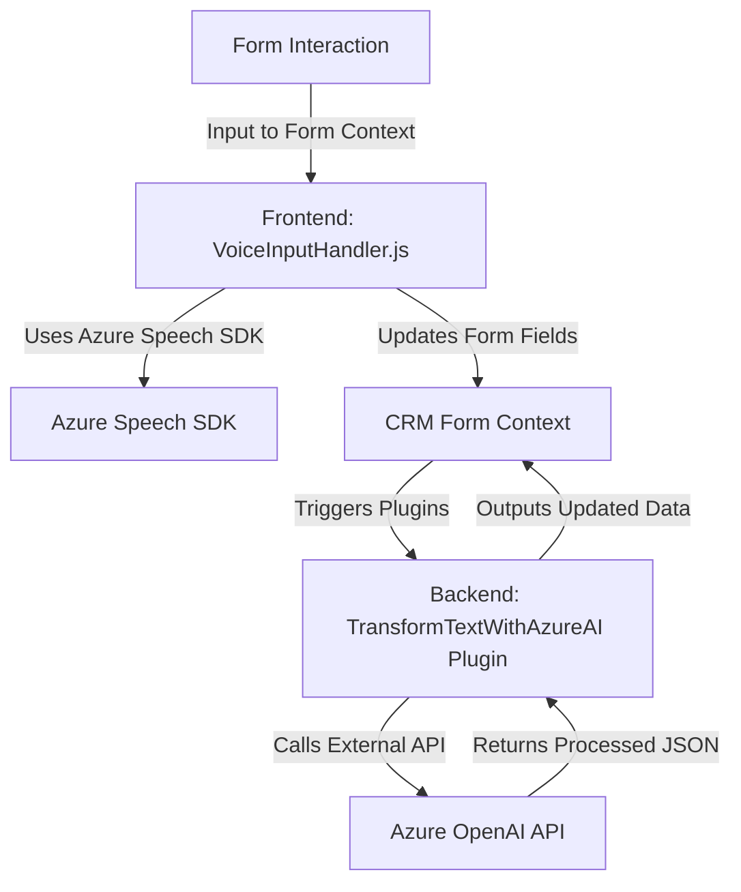

### Breve resumen técnico

El repositorio parece estar relacionado con una solución que incluye funcionalidad de interacción entre formularios y servicios de Azure utilizando tanto transcripción de datos como síntesis de voz. Además, hay un plugin que extiende capacidades en Dynamics CRM para procesar texto con Azure OpenAI. 

Esta solución apunta hacia una integración híbrida entre frontend con funciones avanzadas de voz y un backend en Dynamics CRM para procesamiento específico de datos, habilitado por APIs y servicios externos.

---

### Descripción de arquitectura

**Tipo de solución:** 
La solución se compone de una mezcla entre frontend (con capacidad de síntesis y transcripción de voz) y una integración backend basada en plugins para CRM. 

**La arquitectura:** 
Se extiende principalmente utilizando un enfoque `N capas/híbrido`. El frontend interactúa mediante el navegador (con Azure Speech SDK y APIs HTTP) mientras que el plugin de backend implementa lógica empresarial dentro de Dynamics CRM, configurando lo que parece ser una arquitectura de **integración de servicios REST + plugins**.

### Componentes principales

1. **Frontend/JS:** Contiene funcionalidades para la síntesis de voz, transcripción, y actualización de formularios visibles en un contexto de navegador CRM.
2. **Plugin backend:** Procesa datos mediante Azure AI integrado en Dynamics CRM mediante un paradigma RPC.
3. **Servicios externos:** 
   - **Azure Speech SDK:** Responsable de síntesis de voz y transcripción.
   - **Azure OpenAI API:** Procesa texto y transforma contenido a formato JSON bajo reglas predefinidas.

---

### Tecnologías usadas

- **Frontend:**
   - **Azure Speech SDK:** Biblioteca para síntesis y reconocimiento de voz.
   - **Promesas y Callbacks:** Gestión asíncrona del flujo, especialmente para cargar dinámicamente dependencias.
   - **API personalizada:** Custom API incluida para preprocesamiento adicional.

- **Backend:**
   - **Microsoft Dynamics CRM Plugin:** Uso de servicios de CRM (`IPlugin`, `IOrganizationService`) como el corazón del procesamiento de datos en el backend.
   - **Azure OpenAI Service:** Realiza transformación avanzada de texto.
   - **HTTP Request Libraries:** `HttpClient` para llamadas a servicios externos.
   - **JSON Parsing:** Uso de bibliotecas como `Newtonsoft.Json` y `System.Text.Json`.

---

### Diagrama **Mermaid** válido para GitHub

---

### Conclusión final

La solución presenta una integración innovadora de tecnologías modernas como Azure Speech SDK para habilitar interacción avanzada con formularios en el frontend, complementada por un fuerte backend operando como plugin sobre la infraestructura de Dynamics CRM. 

La arquitectura es híbrida, uniendo funcionalidad de procesamiento en capas independientes: el frontend gestiona voz y actualización de formularios, mientras el backend conecta CRM con servicios de Azure para procesamiento avanzado de datos. La utilización de servicios de Azure (Speech SDK y OpenAI) sugiere que se necesitan claves y configuraciones específicas del cliente, lo que debe administrarse cuidadosamente para un despliegue eficiente y seguro.

Se recomienda:
1. Ampliar el frontend utilizando MVC o frameworks modernos como React o Angular para lograr una mejor modularidad y extensibilidad.
2. Incorporar métodos de validación y manejo de errores más robustos dentro del plugin backend para evitar dependencias rígidas de reglas.