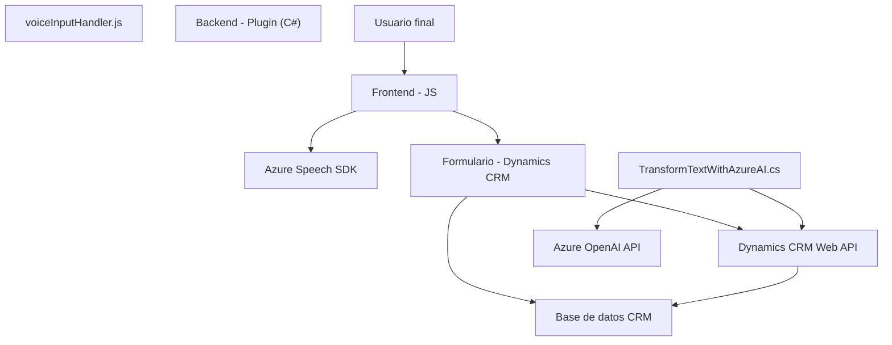

### Resumen técnico del repositorio

El repositorio analiza una solución híbrida orientada al uso de entrada y síntesis de voz en formularios de Dynamics CRM, integrando servicios externos de inteligencia artificial proporcionados por Azure Speech SDK y Azure OpenAI. La solución utiliza tanto código frontend, backend (plugins para Dynamics CRM), y servicios API.

---

### Descripción de arquitectura

1. **Tipo de solución**:
   - **Integración entre APIs (Azure Speech SDK y Azure OpenAI) y Dynamics CRM**:
      - Los proyectos de frontend actúan como componentes de interacción del cliente que utilizan el **Azure Speech SDK** para datos de entrada/salida en formularios y la síntesis de voz.
      - El plugin en C# (`TransformTextWithAzureAI.cs`) extiende la funcionalidad de Dynamics CRM al incorporar un servicio de Azure OpenAI para transformar información textual.

2. **Arquitectura**:
   - **Híbrida con enfoque en patrones de integración**:
      - En el frontend, se utiliza un modelo en capas con una clara separación de responsabilidades (lectura, procesamiento y síntesis de datos).
      - En el backend (plugin), se utiliza el patrón de servicios orientados (`Service-Oriented Architecture`) al delegar la lógica de transformación textual en Azure OpenAI.
      - La solución no sigue un modelo completo de microservicios ni una arquitectura hexagonal. Los componentes interactúan entre sí de forma directa y están acoplados a servicios externos (monolito con extensiones).

---

### Tecnologías, frameworks y dependencias

#### **Frontend (JavaScript/voiceInputHandler.js):**
- **Tecnologías y librerías:**
  - **Azure Speech SDK** (`SpeechSDK`): Reconocimiento y síntesis de voz.
  - Funciones integradas de Dynamics CRM para la manipulación y actualización de formularios (`formContext`, `Xrm.WebApi`).
  - JavaScript/ES6.

- **Patrones de diseño:**
  - **Modularidad funcional**: Uso de funciones auxiliares para mejorar la mantenibilidad.
  - **Event-driven**: Ejecución basada en eventos (callbacks para cargar el SDK y procesar la voz).
  - **API Integration**: Conexión directa con servicios externos (Azure Speech SDK y CRM).

#### **Backend (C#/TransformTextWithAzureAI.cs):**
- **Tecnologías y librerías:**
  - **Microsoft Dynamics SDK**: Extiende funcionalidades de CRM.
  - **Azure OpenAI**: Integración con GPT AI para transformar texto.
  - **Newtonsoft.Json**: Manejo de JSON.
  - **System.Net.Http**: Consumir APIs externas mediante solicitudes HTTP.

- **Patrones de diseño:**
  - **Service-Oriented Architecture (SOA)**: Delegación de operaciones específicas a servicios externos como Azure OpenAI.
  - **Singletons**: Uso de servicios centralizados como `IOrganizationServiceFactory` para gestión de contexto.

---

### Diagrama Mermaid válido para GitHub

---

### Conclusión final

Este repositorio implementa una solución integrada que utiliza Azure Speech SDK (para interacción con entrada y salida de voz) y Azure OpenAI (para procesamiento avanzado del texto) dentro del contexto de Dynamics CRM. La arquitectura utilizada combina un frontend modular en JavaScript con un backend basado en plugins C# y servicios REST.

Sin embargo, tanto el frontend como el plugin tienen dependencias expuestas directamente en el código (como claves de API), lo que podría provocar vulnerabilidades críticas en un ambiente de producción. Se recomienda:
- Utilizar soluciones de configuración segura para gestionar credenciales (ejemplo: Azure Key Vault).
- Mejorar el manejo de excepciones en el plugin para evitar el riesgo de fallos críticos.
  
Aunque no utiliza microservicios ni una arquitectura orientada totalmente a eventos, sigue patrones de integración claros y un diseño modular que facilita tanto el uso como el mantenimiento del código.