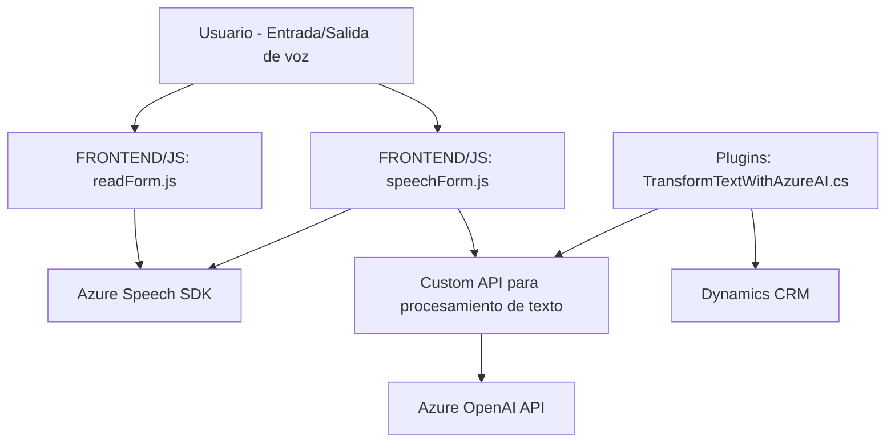

### Breve resumen técnico
El repositorio contiene una solución que integra funciones avanzadas de reconocimiento y síntesis de voz mediante el Azure Speech SDK y procesamiento de texto con Azure OpenAI. Los diversos archivos están diseñados para interactuar con formularios dinámicos en aplicaciones como Dynamics CRM, ofreciendo capacidades de entrada y salida de voz, autocompletar campos de formularios, y transformación avanzada de texto en JSON. La interacción con SDKs externos y APIs define el carácter modular y extensible de la solución.

---

### Descripción de arquitectura
La solución es híbrida, combinando un front-end modular con integración directa de servicios inteligentes (Azure Speech SDK y Azure OpenAI API) y plug-ins personalizados para Dynamics CRM. El patrón predominante es n capas:
1. **Presentación**: Scripts de JavaScript (`readForm.js` y `speechForm.js`) procesan las interacciones del usuario y la conexión con SDKs.
2. **Lógica de negocio**: Plugin en C# (`TransformTextWithAzureAI.cs`) para procesar y estructurar datos.
3. **Datos**: Interacciones directas con Dynamics CRM y servicios externos como Azure OpenAI.

---

### Tecnologías usadas
- **Front-end**:
  - JavaScript
  - Azure Speech SDK (Reconocimiento y síntesis de voz)
  - Dynamics CRM FormContext API (formularios dinámicos)

- **Back-end**:
  - C# (Microsoft .NET Framework)
  - Azure OpenAI API (GPT-4 para procesamiento de lenguaje natural)
  - Dynamics CRM Plugin SDK (`Microsoft.Xrm.Sdk` y otras dependencias de Dynamics CRM)

- **Patrones de software**:
  - MVC (en Frontend)
  - Plugin Pattern (Dynamics CRM)
  - Delegación y modularidad
  - Integración asincrónica con SDKs y APIs

---

### Diagrama Mermaid

---

### Conclusión final
La solución combina varias tecnologías avanzadas para procesar voz y texto, integrando Microsoft Azure Speech y OpenAI con Dynamics CRM. Su arquitectura basada en capas es apropiada para entornos empresariales, asegurando modularidad, extensibilidad y una separación lógica entre presentación, datos y lógica de negocios. Es ideal para aplicaciones que requieren la combinación de interacción por voz, autocompletado de formularios y capacidades avanzadas de transformación de datos.