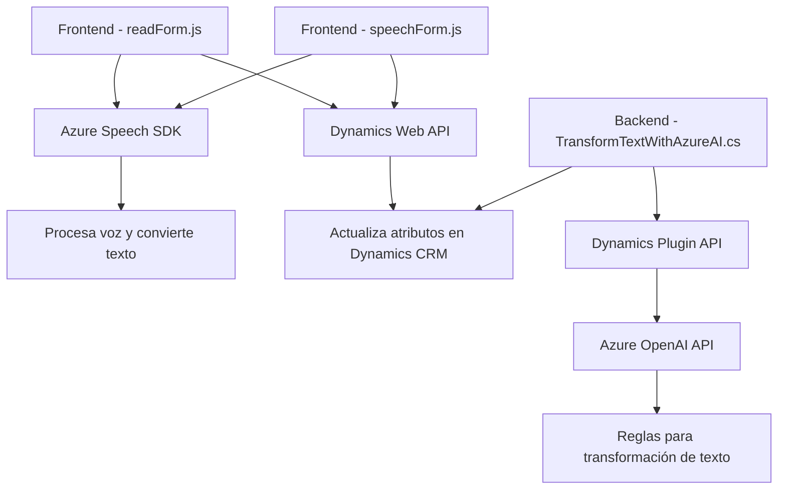

## Breve resumen técnico
Esta solución está compuesta por tres componentes principales:
1. **Frontend**: Archivos JS (`readForm.js`, `speechForm.js`) que interactúan con formularios en Dynamics CRM mediante comandos de voz y síntesis de texto a voz, utilizando el SDK de Speech de Azure.
2. **Backend**: Plugin C# (`TransformTextWithAzureAI.cs`) que extiende Dynamics CRM con una integración directa a Azure OpenAI para procesamiento de texto estructurado.
3. **API Externa**: Uso de servicios de terceros (Azure Speech SDK y Azure OpenAI) para procesamiento de voz y texto, respectivamente.

## Descripción de arquitectura
### Tipo de arquitectura: **Cliente-Servidor modular**
- El frontend se basa en módulos de JavaScript bien definidos que interactúan con APIs externas y el entorno de Dynamics CRM.
- El backend utiliza un patrón de plugin específico de Dynamics CRM que encapsula sus funciones en una clase implementadora de `IPlugin` para manejar eventos del CRM.
- Se utiliza **event-driven architecture** en el backend, ya que el plugin responde a la lógica de negocio de Dynamics mediante `IPluginExecutionContext` en la ejecución de eventos.
- La integración con Azure Speech SDK y OpenAI sigue un enfoque **servicio externo/microservicio**, delegando la mayor parte del procesamiento a sistemas externos.

## Tecnologías usadas
1. Frontend:
   - JavaScript ES6.
   - Azure Speech SDK (procesamiento de voz).
   - Dynamics Web API para manipulación de formularios.
   - Métodos auxiliares para extracción y procesamiento de datos en formatos dinámicos.
2. Backend:
   - C# con .NET Framework (Dynamics CRM Plugin).
   - Microsoft.Xrm.Sdk para integración con Dynamics CRM.
   - Azure OpenAI API (procesamiento de texto mediante inteligencia artificial).
   - Newtonsoft.Json y System.Net.Http para realizar peticiones API REST y manejar JSON.
   
### Patrones utilizados
- **Modularización**: Separación clara de funciones para diferentes responsabilidades.
- **Cliente-Servidor**: Procesamiento descentralizado entre el cliente y las APIs externas.
- **Dependency Injection**: Carga condicional de SDKs y APIs para reducir el acoplamiento.
- **Pipeline de Procesamiento**: Implementación de una cadena de pasos desde entrada por voz hasta actualización de atributos en Dynamics.
- **Integración de Servicios**: Interacción directa con servicios externos (Speech SDK y OpenAI).

## Dependencias y componentes externos
1. **Azure Speech SDK**: Procesa la entrada de voz del usuario y convierte texto en voz.
2. **Azure OpenAI API**: Realiza transformaciones avanzadas en texto según las reglas proporcionadas.
3. **Dynamics Web API**: Permite interactuar con los datos del CRM y los formularios.
4. **Newtonsoft.Json y System.Text.Json**: Para manejo de JSON entre servicios externos y el CRM.
5. **JavaScript y C#:** Lenguajes usados para la lógica front de lectura de voz/formularios y backend para plugins CRM.

## Diagrama Mermaid

## Conclusión final
La solución integra múltiples tecnologías para enriquecer la interacción del usuario con Microsoft Dynamics CRM, aprovechando procesamiento por voz (Azure Speech SDK) y texto estructurado basado en IA (Azure OpenAI API). Su arquitectura modular y utilización de servicios externos asegura escalabilidad y adaptabilidad. El uso de patrones orientados a servicios garantiza acoplamiento bajo entre los componentes, haciendo que la solución sea mantenible y extensible en el tiempo.