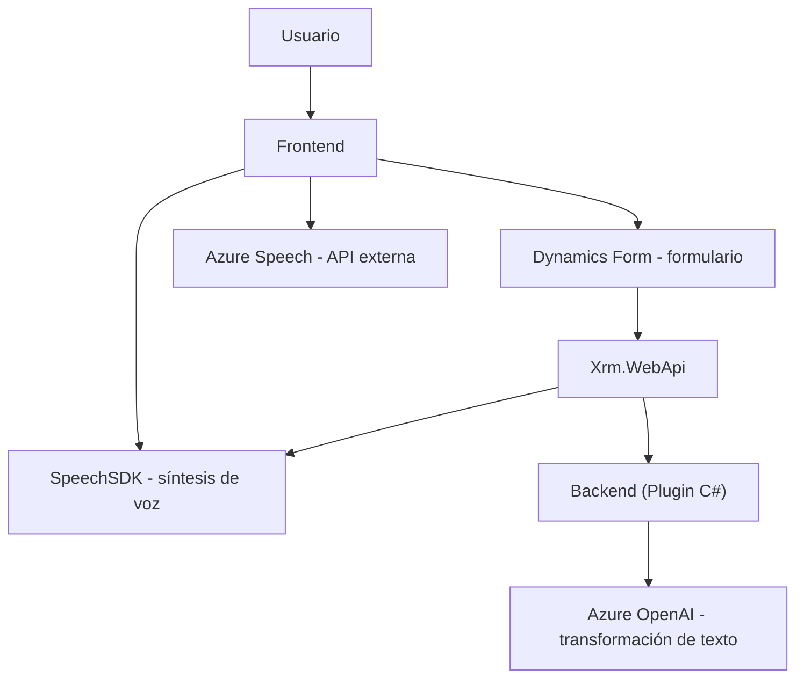

### Breve resumen técnico
El repositorio analiza una solución integrada que responde a la categoría de una **aplicación con módulos frontend y backend**, diseñada para trabajar en un entorno orientado a **CRM (Dynamics 365)**. Este sistema hace uso de varios componentes y servicios externos, principalmente **Azure Speech SDK** para síntesis y transcripción de voz, y **Azure OpenAI API** para transformar texto según reglas específicas. La solución aparentemente extiende la funcionalidad de formularios dinámicos en el CRM y utiliza tanto procesamiento frontend (JavaScript/SDK) como backend (C# plugin).

---

### Descripción de arquitectura
El sistema implementa una arquitectura basada en **n-capas**:
- **Frontend (Presentación):**
  El Javascript del frontend ejecuta funciones relacionadas con interacción del usuario (p.ej., lectura y síntesis de voz desde y hacia el formulario). Aquí se observa modularidad y orientación a eventos para las operaciones del **Azure Speech SDK**.
  
- **Backend (Negocios):**
  El backend (plugin en C#) sirve como lógica de negocio adicional, que interactúa con **Azure OpenAI** para transformar texto según reglas definidas.
  
- **Dependencias externas:**
  Servicios de Azure (Speech para transcripción/síntesis y OpenAI para procesamiento avanzado de texto) actúan como componentes externos clave.

Estos elementos configuran una arquitectura **semi-integrada**, donde el frontend y backend dependen de servicios terceros, particularmente en áreas donde la solución propia delega tareas de IA o síntesis de voz textuales a **Azure**.

---

### Tecnologías, frameworks y patrones usados
#### **Tecnologías principales:**
- **Frontend:**
  - JavaScript con integraciones específicas de APIs del navegador.
  - Azure Speech SDK para síntesis y transcripción.
  - Dynamics CRM SDK (`Xrm.WebApi`) para manejar datos en formularios.
  
- **Backend:**
  - C# como lenguaje principal.
  - Dynamics CRM SDK (`IPlugin` para extensibilidad).
  - Azure OpenAI API para transformación avanzada de texto.

#### **Patrones usados:**
1. **Event-Driven Programming:**
   Definición de funciones por propósito que se disparan en respuesta a eventos específicos como interacciones del usuario.
   
2. **Modular con Responsabilidad Única:**
   Código dividido en pequeños bloques funcionales específicos. Las funciones están diseñadas siguiendo el principio SOLID de SRP (Single Responsibility Principle).

3. **Service Provider Pattern:**
   En el backend, se usa dependencia de `IServiceProvider`.

4. **Builder Pattern:**
   Usado implícitamente en la construcción de solicitudes HTTP para interactuar con Azure APIs.

5. **Integration Pattern:**
   La solución depende de servicios externos mediante API REST (en C# y JavaScript).

---

### Dependencias o componentes externos
1. **Azure Speech SDK:** Utilizado en el frontend para interactuar y manejar voz en la interfaz del usuario.
2. **Azure OpenAI API:** Utilizado en el backend para realizar transformaciones de texto mediante IA avanzada.
3. **Dynamics CRM SDK (`Xrm.WebApi` y `IPlugin`):**
   - Integraciones estándar para interactuar con formularios y ejecutar lógica de negocio.
4. **SO del cliente y APIs de navegador:** Para ejecutar scripts frontend dinámicos.
5. **Librerías de C#:**
   - `Newtonsoft.Json`: Manejo de JSON avanzado.
   - `System.Net.Http`: Para realizar solicitudes web externas.
6. **dependency management:** La configuración directa de claves de Azure (speech/openAI) podría beneficiarse de centralización (p.ej., configuración parametrizada).

---

### Diagrama Mermaid válido para GitHub

---

### Conclusión final
El repositorio constituye un **ecosistema integrado frontend-backend** diseñado para potenciar formularios dinámicos dentro de un **CRM** (Dynamics 365). Se hace un uso extensivo de servicios externos (Azure Speech y OpenAI), junto con principios sólidos de programación modular y patrones de integración. Aunque el código es funcional, sería beneficioso mejorar el manejo de configuraciones externas y centralizar claves API para una mejor gestión de seguridad y mantenimiento. 

Esta solución es ideal para entornos donde la interacción de usuario (voz-texto) y la automatización basada en IA son cruciales. Sin embargo, debido a la dependencia de servicios de Azure, la solución está fuertemente vinculada a dicho proveedor, lo cual es algo a tener en cuenta para escenarios de larga escala o intercambiabilidad tecnológica.