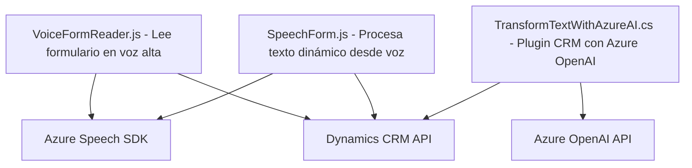

### Breve resumen técnico

El repositorio contiene archivos relacionados con procesamiento y transformación de datos en aplicaciones integradas con Microsoft Dynamics CRM, además de interacción con servicios de Azure, como Speech SDK (síntesis/reconocimiento de voz) y OpenAI para procesamiento de texto. La solución aborda la síntesis de voz, reconocimiento de voz para formularios dinámicos y transformación de texto mediante IA.

---

### Descripción de arquitectura

La arquitectura sigue un patrón **n capas** orientado al cliente-servidor. La solución se divide en tres partes:
1. **Frontend (JS):** Procesamiento de sintesis y reconocimiento de voz usando Azure Speech SDK.
2. **Backend (Plugins en C#):** Extensiones de lógica del negocio en Dynamics CRM, con integración directa de datos CRM y Azure OpenAI.
3. **Dependencias externas:** Azure Speech SDK para el manejo de voz, y Azure OpenAI para procesamiento de texto avanzado.

La solución utiliza componentes que interactúan con un software CRM, integrándose en un paradigma **Service-Oriented Architecture (SOA)**. Hay una clara separación entre la presentación (JS) y lógica del negocio (Plugins en C#).

---

### Tecnologías usadas

1. **Frontend:** 
   - JavaScript 
   - Azure Speech SDK

2. **Backend:**
   - C# (.NET Framework) para plugins de Dynamics CRM.
   - Dynamics CRM APIs como parte de integración.

3. **Servicios y APIs externos:** 
   - Azure Speech SDK (síntesis/reconocimiento de voz).
   - Azure OpenAI (procesamiento de texto).

4. **Patrones de diseño:**
   - **Facade:** Abstracción de APIs externas.
   - **Modularización:** Separación de funciones específicas por objetivo (ej. reconocimiento, síntesis, manipulación de datos).
   - **Eventos y Promesas:** En JavaScript, gestión de eventos y control asíncrono.
   - **Service-Oriented Architecture:** Integración con APIs externas en plugins de C#.

---

### Diagrama Mermaid válido para GitHub

---

### Conclusión final

Este repositorio define una solución basada en la integración de formularios dinámicos de Microsoft Dynamics CRM con capacidades avanzadas de reconocimiento y síntesis de voz mediante Azure Speech SDK, así como transformación de texto con inteligencia artificial (Azure OpenAI). Es un ejemplo de arquitectura moderna en **n capas** que aprovecha ampliamente la interoperabilidad de APIs externas y sistemas SaaS.