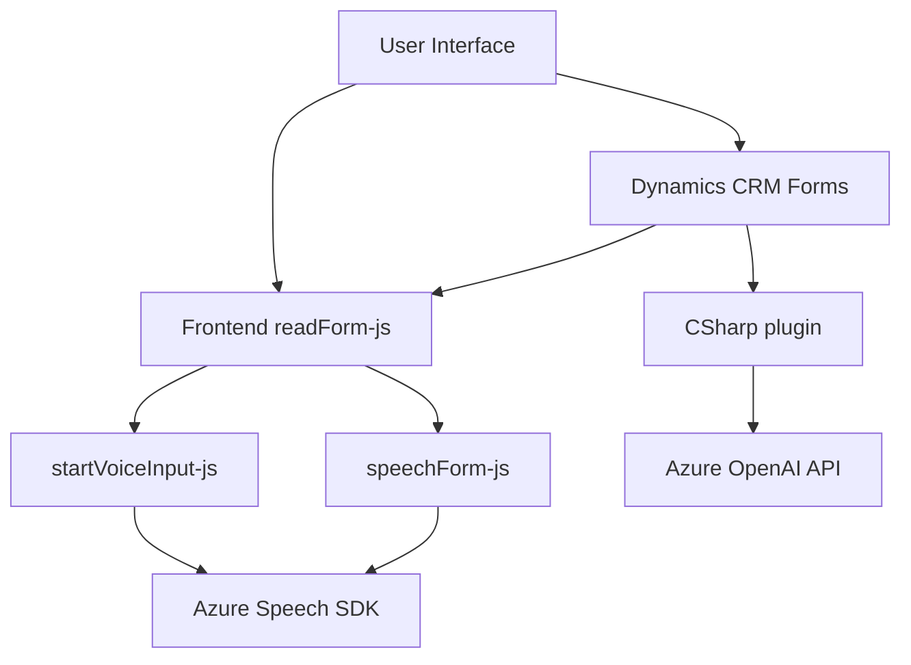

# Análisis técnico del repositorio

## Breve resumen técnico
El repositorio contiene tres principales archivos organizados en dos carpetas: `FRONTEND/JS` y `Plugins`. Cada archivo se enfoca en una tarea específica:
1. Generación de voz desde un formulario (Frontend) utilizando Azure Speech SDK.
2. Entrada de voz que convierte el habla en texto y lo mapea a campos de formularios.
3. Un plugin en C# que transforma contenido textual utilizando Azure OpenAI y reglas predefinidas.

El sistema se conecta a servicios externos como Azure Speech SDK y Azure OpenAI API y opera junto a Microsoft Dynamics CRM, indicando que está relacionado con funcionalidades de integración y extensibilidad para Dynamics.

---

## Descripción de arquitectura

### Tipo de solución
El repositorio implementa una **arquitectura híbrida** que incluye:
1. **Frontend** construido con herramientas JavaScript para gestionar interacciones del usuario con formularios de Dynamics.
2. **Plugins del backend**, diseñados en C# bajo el SDK de Dynamics CRM, para la transformación avanzada de datos.

Por lo tanto, el repositorio combina **componentes frontend** para interacción y un **backend plugin** con procesamiento de negocio e integración con servicios externos.

### Arquitectura
La arquitectura general se puede clasificar como **sistema multicapa** compuesto por:
1. **Capa de frontend:** JavaScript interactúa con formularios y APIs de Dynamics.
2. **Capa de backend:** Un plugin en C# diseñado para interactuar con servicios en la nube (Azure OpenAI), proporcionando procesamiento avanzado de datos.
   
Aunque tiene elementos de procesamiento modular, sigue una estructura orientada a capas, ya que el frontend envía datos procesados al backend (plugin) y los plugins ejecutan lógica y transformaciones.

---

## Tecnologías, frameworks y patrones usados

### Tecnologías usadas
1. **Frontend**:
   - **JavaScript** (Cliente): Maneja lógica de interacción con formularios y SDK importado dinámicamente.
   - **Azure Speech SDK**: Procesa la síntesis y el reconocimiento de voz.
   - **APIs de Dynamics**: Interacción directa con formularios y entidad.
2. **Backend**:
   - **C#** (Plugin): Implementación de lógica empresarial basada en Dynamics CRM SDK.
   - **Newtonsoft.Json**: Para procesar datos en JSON de forma eficiente.
   - **Azure OpenAI API**: Realiza transformaciones avanzadas de texto.
3. **Servicios externos**:
   - Azure Speech SDK (importado desde CDN) para reconocimiento y síntesis de voz.
   - Azure OpenAI API para procesamiento textual basado en inteligencia artificial.

### Patrones arquitectónicos
- **Inclusión dinámica de SDK**: En el frontend, las dependencias como Azure Speech SDK son cargadas bajo demanda.
- **Modularidad**: División clara de responsabilidades en funciones específicas.
- **Callback pattern**: Uso de funciones de retroalimentación para tareas asincrónicas como carga del SDK.
- **Integración de servicios externos**: Uso del patrón de servicio para integrar Azure OpenAI y Speech SDK en el backend y frontend respectivamente, transformando datos y ejecutando lógica.

---

## Componentes externos y dependencias
1. **Azure Speech SDK**: Proporciona la síntesis de voz y el reconocimiento vocal mediante endpoints de Azure.
2. **Azure OpenAI API**: Utilizada por el backend para transformar mensajes según las reglas.
3. **Microsoft Dynamics CRM APIs**:
   - `Xrm.WebApi`: Utilizado en el frontend para actualizar y leer datos del formulario CRM.
   - Plugins en C#: Comunicación directa con servicios e interfaces de Dynamics CRM utilizando el SDK.
4. **Newtonsoft.Json**: Gestión de datos JSON en el backend.
5. **HTTP API Requests**: Para enviar solicitudes y obtener datos de Azure OpenAI en el plugin.

---

## Diagrama Mermaid

---

## Conclusión final
Este repositorio representa una aplicación integrada que combina un frontend basado en JavaScript con Azure Speech SDK y un backend como plugin de Dynamics CRM desarrollado en C#. La solución está diseñada para operarse en un ambiente de Microsoft Dynamics CRM y emplea una combinación de estrategias como distribución dinámica de SDKs, modularidad y servicios orientados a la integración. La comunicación se realiza a través de APIs externas, incluyendo la integración con Azure.

