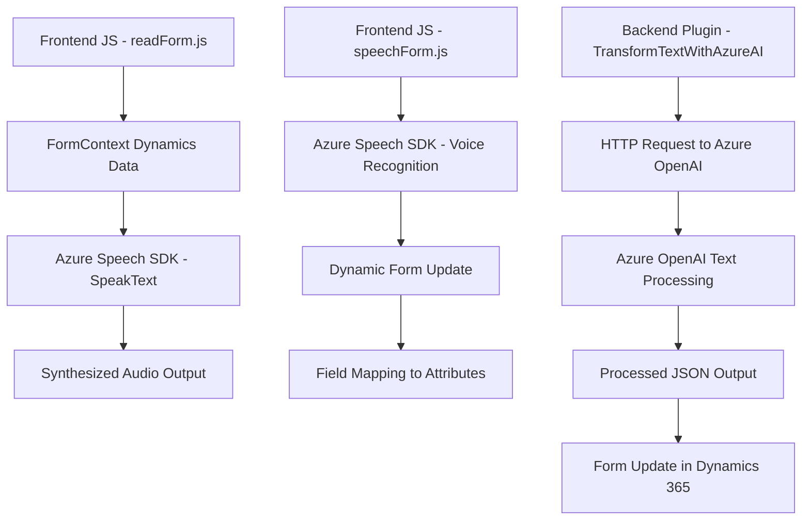

### Breve Resumen Técnico:
El repositorio presenta una solución integrada para mejora de formularios en contextos de Dynamics 365 CRM, mediante interacción con servicios cognitivos de Microsoft Azure (Speech SDK para voz y OpenAI para procesamiento de texto). Contiene archivos organizados para el reconocimiento de voz, síntesis de texto a voz, y el procesamiento mediante un plugin desarrollado en C#. La solución combina frontend basado en Javascript con backend mediante plugins.

---

### Descripción de Arquitectura:
La arquitectura global presenta un patrón **multicapa** que incluye:
1. **Capa de Presentación**: Archivos frontend en JavaScript para interactuar con formularios de Dynamics CRM, basados en el contexto del cliente (formContext).
2. **Lógica de Aplicación (Backend)**: Plugins de Dynamics CRM que ejecutan procesos definidos mediante el interfaz `IPlugin` y conectan con servicios externos.
3. **Servicios Externos**:
   - Azure Speech SDK para síntesis y reconocimiento de voz.
   - Azure OpenAI API para procesamiento de texto y generación de JSON.

El diseño sigue principalmente una arquitectura **N-Capas**, donde se separa:
- Presentación/interacción en JavaScript.
- Backend lógico en plugins.
- Servicios externos en Azure.

Adicionalmente, se encuentran patrones funcionales claros, encapsulación modular (SRP - Principio de Responsabilidad Única), y una ligera aproximación al **patrón fachada** en interacciones del frontend con APIs y servicios.

---

### Tecnologías Usadas:
1. **Tecnologías Frontend**:
   - Javascript como base para integrar la lógica interactiva de formularios.
   - Dependencia de APIs y contexto de Dynamics CRM (formContext).
   - Azure Speech SDK cargado dinámicamente para texto-a-voz y reconocimiento de voz.

2. **Tecnologías Backend (Plugins)**:
   - C# para desarrollo de plugins en Dynamics CRM.
   - Azure OpenAI API para procesamiento de texto y generación de JSON bajo condiciones establecidas.

3. **Frameworks y Librerías**:
   - **Microsoft.Xrm.Sdk**: Para interactuar con Dynamics CRM desde el backend.
   - **Newtonsoft.Json**: Serialización/deserialización JSON en C#.
   - **System.Net.Http**: Cliente HTTP para integrar APIs externas.
   - **System.Text.Json**: Deserialización avanzada de respuesta JSON.

4. **Servicios**:
   - **Azure Speech SDK**: Reconocimiento de voz.
   - **Azure OpenAI**: Procesamiento inteligente de texto.

---

### Dependencias Externas Potenciales:
1. **Microsoft Azure**:
   - Speech SDK: Reconocimiento/síntesis de voz.
   - OpenAI API: Procesamiento avanzado de texto.
2. **Custom API Dynamics 365**:
   - Lógica definida para escenarios específicos del negocio.
3. **Dynamics 365 SDK**:
   - Dependencias directas a `Xrm.WebApi`.
4. **Hosting y Configuración**:
   - Los plugins podrían requerir configuración adicional en Dynamics 365 (ej. registrar el plugin y servicios asociados).

---

### Diagrama Mermaid:

---

### Conclusión Final:
La solución es una integración avanzada para mejorar la interacción con formularios Dynamics 365 CRM. Combina tecnologías frontend y backend con servicios cognitivos de Microsoft Azure, como reconocimiento de voz, síntesis de texto y procesamiento mediante inteligencia artificial. Su arquitectura está orientada a N-Capas, con modularidad y reutilización destacadas, facilitando flexibilidad en implementaciones futuras. Una mejora potencial sería la ampliación del uso de patrones modernos como arquitectura hexagonal para desacoplar aún más los servicios externos del código principal.