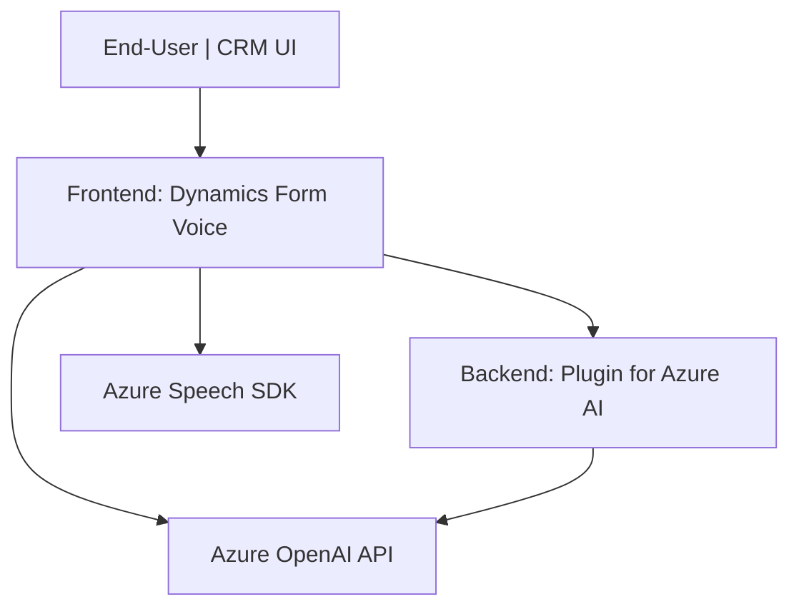

### Breve resumen técnico

Los archivos presentados forman parte de un sistema enfocado en gestionar formularios dinámicos en Dynamics CRM, integrándose con herramientas avanzadas para la conversión de texto y voz, y aprovechando servicios externos como Azure Speech SDK y Azure OpenAI API.

---

### Descripción de la Arquitectura

El sistema sigue una **arquitectura de microservicios**, donde cada componente tiene una responsabilidad específica y está diseñado para ser altamente desacoplado. El módulo de **Frontend** (implementado en JavaScript) interactúa con formularios dinámicos para realizar conversión de texto y manejo de voz (entrada por voz, lectura/síntesis de audio). 

Por otro lado, el módulo **Plugins** (implementado en C#) es más orientado a backend y expone ciertos puntos de extensión (plugins) que procesan solicitudes relativas al procesamiento avanzado de texto a través de Azure OpenAI.

En conjunto, estos componentes implementan los principios de arquitectura orientada a servicios (**Service-Oriented Architecture - SOA**) mediante la integración de servicios de terceros (Azure Speech SDK y OpenAI API).

---

### Tecnologías usadas

1. **Frontend:**
   - **Lenguaje:** JavaScript.
   - **Framework:** Dynamics CRM APIs (para manipulación de formularios).  
   - **Servicios externos:** Azure Speech SDK para conversión texto-voz y reconocimiento de voz.  
   - **Patrones:** Modularización, carga dinámica de dependencias, delegación.

2. **Plugins:**
   - **Lenguaje:** C#.
   - **Framework:** Dynamics CRM SDK (implementando la interfaz `IPlugin`).  
   - **Servicios externos:** Azure OpenAI API para procesamiento de lenguaje natural.  
   - **Patrones:** Encapsulación, integración con microservicios, principios de diseño dinámico bajo SOA.

3. **Común:**
   - **Servicios de Microsoft Azure:** 
     - Azure Speech SDK.
     - Azure OpenAI API.
   - **Dinámica de carga:** Evita dependencias innecesarias hasta que son requeridas.

---

### Diagrama **Mermaid** compatible con GitHub Markdown

---

### Conclusión final

El repositorio presenta una solución híbrida compuesta por un **frontend dinámico** que intercambia voz y datos con formularios CRM y servicios de Azure, complementado por un plugin backend que utiliza **AI de Azure OpenAI** para el procesamiento avanzado de texto.

La arquitectura implementa principios de microservicios, delega responsabilidades explícitamente y emplea tecnologías modernas como el SDK de Azure Speech y la API de Azure OpenAI. Este diseño está enfocado en la modularidad, escalabilidad y facilidad de integración con servicios externos, adaptándose perfectamente a entornos corporativos como Dynamics 365 CRM.