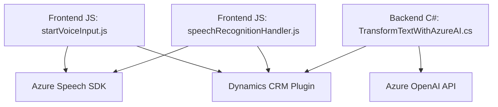

#### Breve resumen técnico:
- La solución incluye tres componentes principales: un frontend en JavaScript, un plugin backend construido en C#, y el uso de servicios de Azure (Azure Speech SDK y Azure OpenAI API). Su propósito principal es facilitar la interacción entre usuarios y sistemas CRM como Dynamics 365, usando reconocimiento y síntesis de voz, procesamiento de transcripciones, y transformación de texto mediante inteligencia artificial.

---

#### Descripción de arquitectura:
- **Tipo de solución**: Sistema basado en APIs y extensiones para formularios dinámicos y un CRM (Dynamics 365).
- **Arquitectura**: Multi-capas con integración de servicios externos.
  - **Frontend**:
    - Modular JavaScript design.
    - Procesamiento de formularios dinámicos.
    - Comunicación directa con SDKs de voz (Azure Speech SDK).
  - **Backend (Dynamics Plugin)**:
    - Implementa el patrón Plugin para Dynamics CRM.
    - Interactúa con los servicios REST de Azure OpenAI.
  - **Servicios externos**:
    - Azure Speech SDK: Reconocimiento y síntesis de voz.
    - Azure OpenAI API: Generación de texto usando inteligencia artificial.

---

#### Tecnologías usadas:
1. **Frontend**:
   - JavaScript ES6+.
   - Azure Speech SDK.
   - Asynchronous programming (Promises, Callbacks).

2. **Backend Plugin**:
   - C# (.NET Framework).
   - Dynamics CRM SDK (`IPlugin` interface).
   - JSON object manipulation (`System.Text.Json`, `Newtonsoft.Json`).
   - Azure OpenAI REST API.

3. **Dependencias externas**:
   - Azure Speech SDK loaded dynamically via CDN.
   - Azure OpenAI API requires API keys and endpoints.
   - Microsoft-related frameworks (.NET).

---

#### Diagrama Mermaid:

---

#### Conclusión final:
La solución presentada es una arquitectura basada en capas especializadas para mejorar los flujos de trabajo en sistemas CRM como Dynamics 365. A través de integraciones con Azure Speech SDK y Azure OpenAI API, implementa funcionalidades avanzadas de voz y procesamiento de texto. La estructura modular del frontend garantiza adaptabilidad y mantenibilidad, mientras que el backend implementa un Plugin Pattern eficiente para extensibilidad en Dynamics CRM.