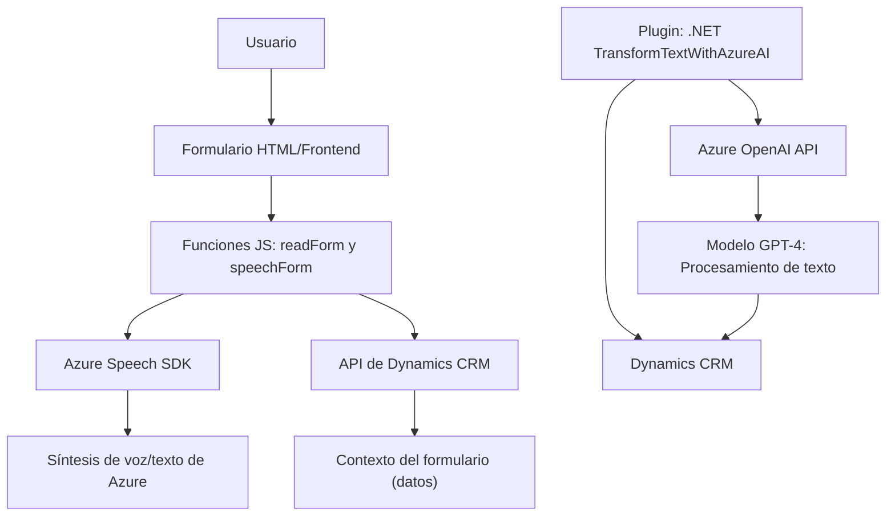

### Análisis de la solución

#### 1. Tipo de solución
La solución es una **aplicación híbrida** que combina elementos de **frontend** (JavaScript) y **backend** (plugin .NET para Dynamics CRM). Implementa funcionalidades de reconocimiento de voz y procesamiento de texto, integrando servicios externos como **Azure Speech SDK** y **Azure OpenAI**.

#### 2. Tecnologías, frameworks y patrones utilizados
- **Frontend (JavaScript):**
  - Usa el Azure Speech SDK para reconocimiento y síntesis de voz.
  - Acceso a datos contextuales de formularios usando APIs de Dynamics CRM (Xrm.WebApi).
  - Organización modular con funciones especializadas para cada paso, como extracción de datos, aplicación a formularios, y procesamiento de valores.

- **Backend (.NET Plugin):**
  - Implementa un plugin de Dynamics CRM usando la interfaz `IPlugin`.
  - Consume el **Azure OpenAI API/GPT-4** para realizar procesamiento avanzado de texto.
  - Manejo de peticiones HTTP y JSON usando librerías estándar de .NET.

- **Patrones usados:**
  - **Carga condicional de dependencias:** En el frontend, el SDK se carga dinámicamente solo cuando es requerido (`ensureSpeechSDKLoaded`).
  - **Separación de responsabilidades:** Las funciones y métodos están organizados por responsabilidades específicas, facilitando la extensibilidad y mantenimiento.
  - **Event-driven architecture:** El backend sigue el patrón típico de plugins de Dynamics CRM, reaccionando a eventos definidos en su contexto.
  - **Delegación modular:** Procesos como síntesis de texto, extracción de datos, y transformación JSON están separados en métodos independientes.

#### 3. Tipo de arquitectura
- **Frontend:**
  - La arquitectura del JavaScript es una implementación orientada al cliente, integrada con APIs y servicios externos.
  - Se podría considerar como una **arquitectura de n-capas**:
    - Capa de presentación (HTML/UI Form).
    - Capa lógica (Funciones JS para procesar datos y aplicar valores).
    - Acceso a datos (interacción con el SDK y APIs externas).

- **Backend:**
  - El plugin sigue una arquitectura **event-driven** y está diseñado para interactuar con Dynamics CRM.
  - Utiliza un enfoque distribuido para comunicación con Azure OpenAI (microservicios).

#### 4. Dependencias o componentes externos
- **Frontend:**
  - `Azure Speech SDK`: Para reconocimiento de voz y síntesis con soporte multilingüe.
  - `Xrm.WebApi`: Para interacción con formularios de Microsoft Dynamics CRM.
- **Backend:**
  - `Azure OpenAI API`: GPT-4 para transformación de texto.
  - Dependencias estándar de .NET (`HttpClient`, `Json`).

---

### Diagrama Mermaid válido para GitHub

---

### Conclusión final
La solución es un sistema híbrido de reconocimiento y síntesis de voz con procesamiento avanzado de texto, diseñado para integrarse con Dynamics CRM usando APIs. Implementa una arquitectura modular y distribuida, dividiendo responsabilidades en el frontend (extracción y envío de datos a servicios) y el backend (procesamiento avanzado con Azure OpenAI).

Este diseño facilita la extensibilidad y descentralización para usar servicios de nube como Azure Speech SDK y GPT-4, manteniendo la interoperabilidad entre el entorno local de Dynamics CRM y los servicios externos basados en IA.