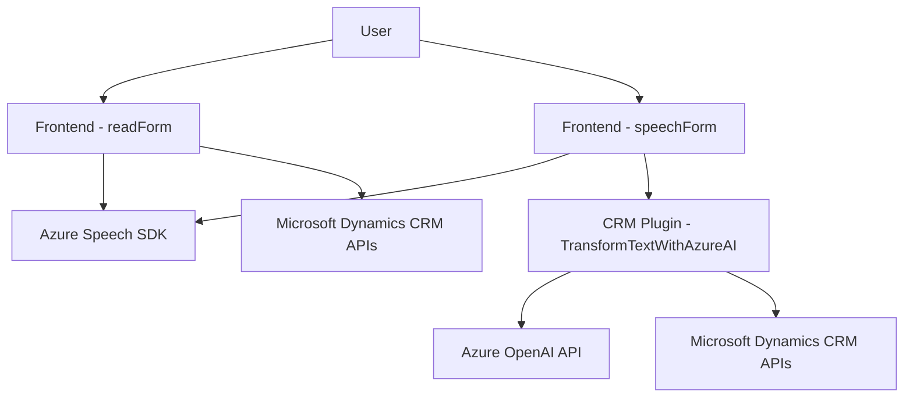

### Breve resumen técnico
El repositorio define una solución que integra procesamiento con análisis de texto, síntesis y reconocimiento de voz. Está diseñado como una extensión para formularios de Microsoft Dynamics CRM, apoyándose en tecnologías de Azure mediante el Speech SDK y OpenAI para tareas de reconocimiento y generación de texto inteligente.

---

### Descripción de arquitectura
La solución está diseñada con una arquitectura de **componentes distribuidos** orientada a servicios externos. Por un lado, hay una integración con el cliente de Dynamics para la interacción directa con los formularios (cuando el usuario trabaja en la interfaz gráfica). Por otro lado, existe un plugin que utiliza **Azure OpenAI** para transformar texto según reglas específicas y actualizar atributos CRM.

La solución utiliza un enfoque híbrido con elementos de **n capas**, donde cada capa está encargada de una parte específica:
1. **Presentación**: Los componentes de frontend con JavaScript se encargan de la interacción del usuario y la llamada a los SDKs. 
2. **Lógica de negocio**: Los plugins en C# desarrollan la lógica de transformación y actualización en la capa del servidor de CRM.
3. **Servicios externos**: Los SDKs de Azure para integración con IA y voz.

La modularidad en las implementaciones JavaScript y C# ayuda al manejo de tareas específicas en funciones independientes.

---

### Tecnologías usadas
1. **Microsoft Dynamics CRM**: Framework principal para la integración con formularios y atributos.
2. **Azure Speech SDK**: Para reconocimiento y síntesis de texto a voz.
3. **Azure OpenAI API**: Para transformación de texto en JSON estructurado.
4. **JavaScript**: Para implementaciones del lado cliente, usando la API de Dynamics y llamadas dinámicas a Azure.
5. **C#**: Para el desarrollo de extensiones/Plugins del servidor CRM.
6. **Librerías utilizadas**:
   - `Newtonsoft.Json.Linq`: Deserialización de JSON.
   - `System.Text.Json`: Serialización y procesamiento JSON.
   - `System.Net.Http`: Comunicación HTTP.

---

### Dependencias o componentes externos
1. **Azure Speech SDK**: Cargado dinámicamente desde Azure, depende de autenticación con claves de acceso y región.
2. **Azure OpenAI API**: Servicio de inteligencia artificial para transformar texto basado en normas específicas.
3. **Microsoft Dynamics CRM APIs**: Para interacción con los datos de formularios, entidades y atributos.
4. **Newtonsoft.Json**: Para manipulación avanzada de JSON. Esto podría ser redundante si `System.Text.Json` ya está en uso.

---

### Diagrama Mermaid válido para GitHub Markdown

---

### Conclusión final
La solución está orientada a ofrecer capacidades avanzadas mediante dos tecnologías destacadas de Azure: Speech SDK y OpenAI. Se trata de una arquitectura **orientada a microservicios** que incluye componentes distribuidos entre el frontend y los plugins en el lado del servidor. La elección de JavaScript para la parte de frontend y C# para los plugins es adecuada, al igual que la integración con CRM para manipulación directa de datos de los formularios.

Sin embargo, hay retos claros con el manejo de credenciales, que debería mejorarse mediante mecanismos más seguros, como Azure Key Vault u otras soluciones especializadas. Por último, este modelo híbrido permite el uso eficiente de servicios cognitivos y facilita la escalabilidad al separar claramente las responsabilidades entre cliente, servidor y servicios externos.