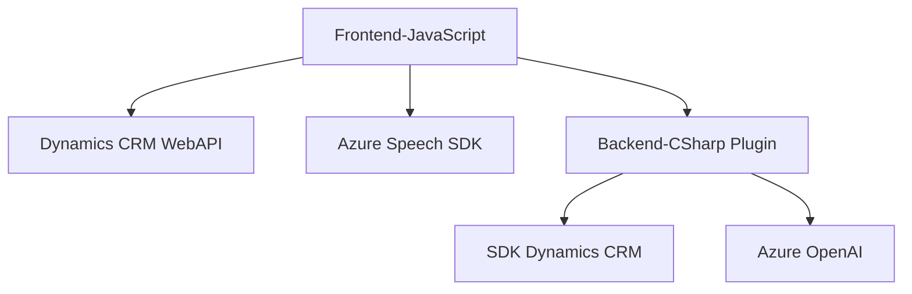

# Análisis del repositorio

### Breve resumen técnico
El repositorio incluye diversas piezas de software orientadas al uso conjunto de **Microsoft Dynamics CRM** y servicios de **Azure** (Speech SDK y OpenAI). Los archivos están estructurados como módulos independientes que conectan un frontend basado en JavaScript con funcionalidades de voice-to-text y text-to-Speech, y un backend en .NET para usar servicios de inteligencia artificial. Además, se observa un plugin que extiende la funcionalidad de Dynamics CRM para transformar texto en estructuras mas adaptativas mediante Azure OpenAI.

---

### Descripción de arquitectura
La arquitectura es **n capas** modularizada, destacando en cada capa:
1. **Frontend:** Scripts de JavaScript integrados en la UI de Dynamics CRM para capturar voz, procesar transcripciones y actualizar formularios en tiempo real. Además, utiliza el SDK de Azure Speech en el navegador para realizar funciones de texto-a-voz y voz-a-texto.
2. **Backend:** Implementa un plugin para Dynamics CRM. Este se encarga de comunicarse con Azure OpenAI para procesar y transformar texto en estructuras JSON dentro de flujos definidos.
3. **Servicios externos:** Comunicación con SDK de Azure Speech y Azure OpenAI a través de REST APIs o paquetes de navegador. Estos servicios amplían las capacidades del sistema para interacción por voz e inteligencia artificial.

Patrones más relevantes:
- **n capas:** Separación clara de responsabilidad entre frontend (captura de voz y procesamiento) y backend (transformación de texto e integración con OpenAI).
- **Integración de servicios externos:** Uso del SDK de Azure Speech y REST API para comunicación con Azure OpenAI.
- **Plugin Architecture:** Extensión de la funcionalidad de Dynamics CRM mediante plugins personalizados.
- **Modularización:** Los scripts están diseñados como módulos independientes y reutilizables.

---

### Tecnologías usadas
1. **Frontend:**
   - JavaScript.
   - Azure Speech SDK.
   - Dynamics CRM Web API.
2. **Backend:**
   - .NET Framework, lenguaje C#.
   - Plug-in SDK de Dynamics CRM.
   - Azure OpenAI (GPT-4).
   - API REST (OpenAI) y HttpClient para solicitudes.

---

### Dependencias o componentes externos
1. **Azure Speech SDK**: Importado dinámicamente desde `https://aka.ms/csspeech/jsbrowserpackageraw`. Maneja texto-a-voz y voz-a-texto.
2. **Azure OpenAI**: Conexión establecida mediante una API REST para transformar texto usando GPT-4. Dependencia de credenciales seguras y clave API para autenticación.
3. **Microsoft Dynamics CRM SDK**: Utilizado en los scripts y el plugin para interactuar con atributos y controladores del formulario.

---

### Diagrama Mermaid

---

### Conclusión final
La solución propuesta en el repositorio está diseñada para integrar servicios cognitivos de **Azure** directamente en los formularios de Dynamics CRM. Permite funcionalidades avanzadas como captura de voz (voice-to-text), síntesis de voz (text-to-speech), y procesamiento de texto mediante inteligencia artificial. La arquitectura es modular, sólida y adaptable, con una clara separación entre las responsabilidades del frontend y el backend. El uso de tecnologías como Azure Speech SDK y OpenAI facilitan la creación de una experiencia de usuario mejorada y más intuitiva. Sin embargo, se debe garantizar el manejo seguro de credenciales al conectar con los servicios de Azure.