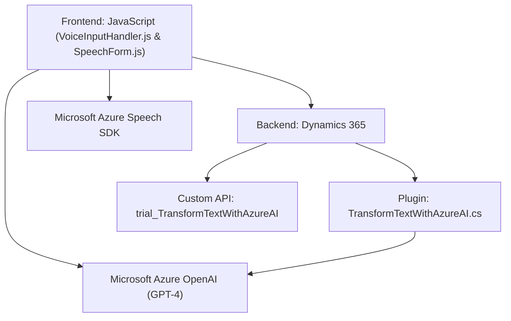

### Resumen Técnico

El repositorio describe una solución que combina distintos componentes para habilitar un flujo de reconocimiento y síntesis de voz integrado con Microsoft Dynamics 365. Se utiliza Microsoft Azure Speech SDK y Azure OpenAI para procesar comandos por voz y transformar texto según reglas predefinidas. La arquitectura y la implementación parecen ser orientadas al cliente-servidor con interacción en tiempo real entre frontend (control de voz) y servicios backend (Dynamics CRM y Azure AI).

---

### Descripción de Arquitectura

La arquitectura propuesta es una combinación de tres enfoques:

1. **Cliente-servidor**:  
   El frontend (JavaScript) actúa como cliente que se comunica con APIs (Dynamics 365, Azure Speech, Azure OpenAI) para completar sus tareas. Esta interacción se realiza principalmente mediante solicitudes HTTP y componentes predefinidos del SDK de Dynamics.

2. **Plugins-basados**:  
   El backend incluye un plugin para Dynamics CRM (C#) que extiende la funcionalidad del sistema al integrar el servicio de Azure OpenAI para la transformación avanzada de texto.

3. **Modular y basada en servicios**:  
   Las operaciones están divididas en módulos claros y funcionales que interactúan con APIs externas, como el SDK de Azure Speech para la síntesis de voz y reconocimiento, y el servicio de OpenAI para procesamiento avanzado de texto.

Esta arquitectura puede clasificarse como una solución **n capas**. La capa de presentación, lógica de negocio (frontend), y backend (Dynamics Plugins y Azure APIs) operan de manera separada, manteniendo responsabilidades individuales.

---

### Tecnologías Usadas

- **Frontend (JavaScript)**:
  - SDK de Microsoft Azure Speech (sintetización y reconocimiento de voz).
  - APIs de Dynamics 365 (`formContext`, `Xrm.WebApi` para conexión con el sistema CRM).
  - Métodos propios del navegador para diferentes operaciones asíncronas.

- **Backend (C#)**:
    - `Microsoft.Xrm.Sdk`: SDK de Microsoft Dynamics para creación de plugins y acceso al contexto CRM.
    - REST API para consumir servicios de Azure OpenAI GPT-4.
    - Serialización JSON con `System.Text.Json` y `Newtonsoft.Json`.
    - `HttpClient` para integrar servicios externos como Azure.

- **Servicios:**  
    - **Microsoft Azure Speech SDK**: Para reconocimiento de voz y síntesis de texto.  
    - **Azure OpenAI Model GPT-4**: Para transformar texto ingresado mediante comandos predefinidos.

---

### Dependencias o Componentes Externos

1. **Microsoft Azure Speech SDK**: Se utiliza para reconocer y sintetizar la voz emitida por el usuario desde el frontend.
2. **Azure OpenAI GPT-4**: Machine learning para transformar texto según lógica definida.
3. **Microsoft Dynamics CRM SDK**: Permite insertar plugins y operar directamente sobre objetos del modelo de datos de Dynamics 365.
4. **Rest APIs Personalizadas**: Comunicación entre componentes externos (Speech y OpenAI) y el sistema central.
5. **Servicios de Third-party Internas**: APIs internas de Dynamics CRM personalizadas para mejorar los flujos.

---

### Diagrama Mermaid

**Repositorio y flujos básicos representados:**

---

### Conclusión Final

La solución descrita en el repositorio es un sistema híbrido diseñado para integrar procesos de voz, transformación automática de datos (basado en IA) y sintesis de texto dentro de un entorno corporativo utilizando Dynamics 365. El frontend proporciona una interfaz de reconocimiento y síntesis de voz robusto, mientras que el backend extiende las capacidades del CRM mediante un plugin y comunicación directa con servicios de inteligencia artificial. Este enfoque modular y orientado a servicios es adecuado para entornos dinámicos y escalables.