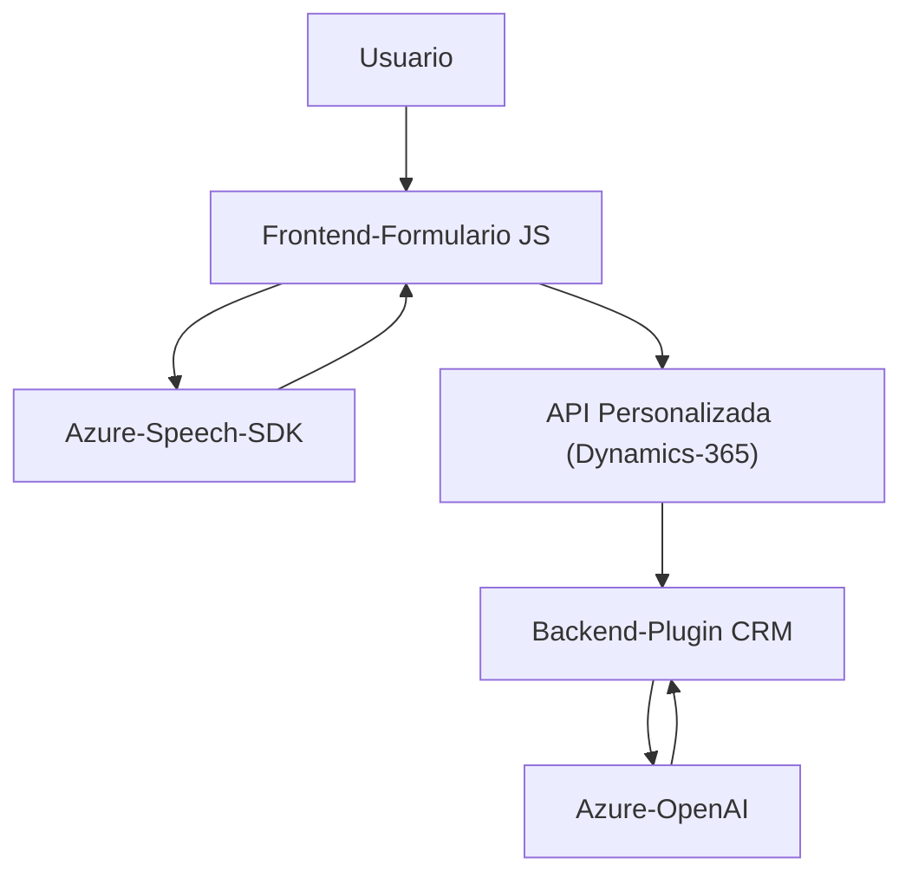

### Breve resumen técnico
El repositorio contiene varios archivos con funcionalidades complementarias:
1. **Frontend (JavaScript):** 
   - Gestión de voz (sistema de síntesis y reconocimiento de voz mediante **Azure Speech SDK**).
   - Interacción con formularios y secciones de Dynamics 365, con transformación de datos para representar texto hablado en formato estructurado.
   
2. **Backend / Plugins (C#):**
   - Plugin programado para Dynamics CRM que utiliza **Azure OpenAI** para transformar texto siguiendo reglas específicas (Procesos de transformación y respuesta en formato JSON).

---

### Descripción de arquitectura
El sistema utiliza un enfoque **cliente-servidor** basado en un esquema híbrido, donde:
1. **Frontend**:
   - Consume APIs externas (Azure Speech SDK) y procesa datos en un cliente (JavaScript).
   - Maneja localmente las transcripciones y transformación de su estructura antes de enviar datos hacia el backend o consumir APIs personalizadas.
   
2. **Backend**:
   - Funciona sobre **Dynamics CRM** mediante plugins que delegan funciones de transformación de texto a servicios externos (Azure OpenAI).
   - Incluye procesamientos en tiempo real y API personalizada para interactuar con datos del formulario o campos del CRM.

El diseño muestra características de una arquitectura orientada a servicios (SOA), donde cada elemento está modularizado y se delegan responsabilidades específicas a componentes externos (Azure Speech SDK, Azure OpenAI).

---

### Tecnologías usadas
1. **Frontend:**
   - **Lenguaje principal:** JavaScript.
   - **Framework/SDK principales:** 
     - Azure Speech SDK: reconocimiento y síntesis de voz.
     - Navegadores Web estándar (DOM, alertas).
   - APIs específicas: Consumo del API de Dynamics 365.

2. **Backend:**
   - **Lenguaje principal:** C#.
   - Framework: .NET Framework para desarrollo de plugins de Dynamics CRM.
   - **Servicios externos:**
     - **Azure OpenAI:** Para transformación de texto.
     - HTTP client y JSON processing libraries (`System.Net.Http`, `System.Text.Json`).

3. **Patrones:**
   - **Encapsulación modular:** Cada función se encarga de una tarea específica.
   - **Integración de servicios externos:** Uso de SDKs y APIs como Azure Speech y OpenAI.
   - **Cliente/Servidor:** Interacción directa entre frontend y backend, con delegación en APIs SaaS.

---

### Diagrama **Mermaid**

---

### Conclusión final
Este repositorio implementa una solución híbrida centrada en la interacción de usuarios vía voz y texto con formularios en Dynamics 365. Utiliza tecnología avanzada como **Azure Speech SDK** y **Azure OpenAI**, permitiendo que los datos sean dictados, transformados y procesados eficientemente. 

La arquitectura cliente-servidor y modular facilita la escalabilidad y extensibilidad, aunque depende fuertemente de servicios externos, lo cual puede impactar en la fiabilidad del sistema en entornos de alta demanda o baja disponibilidad del SaaS.