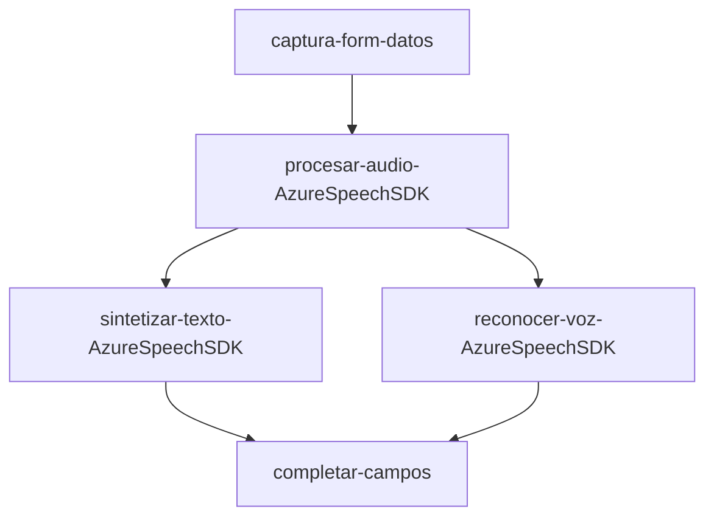
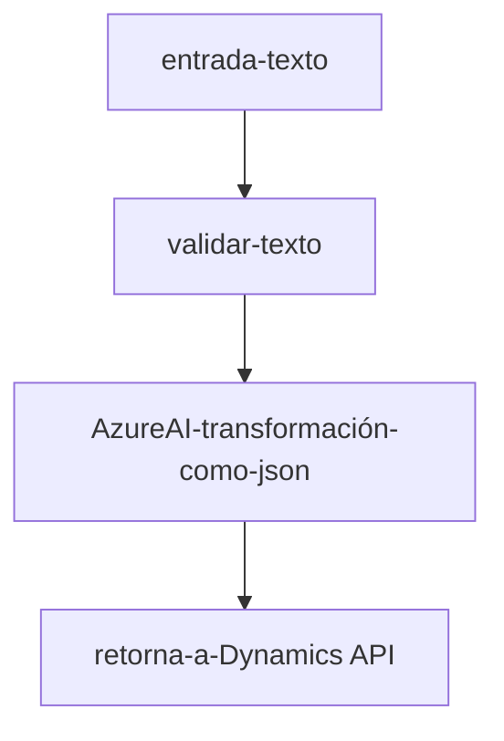

### Resumen técnico:
Este repositorio parece estar relacionado con una solución integrada entre una **interfaz web** (probablemente un frontend para un CRM, como Dynamics) y un CMS/api basada en **Microsoft Dynamics CRM**. Utiliza servicios en la nube proporcionados por **Microsoft Azure** (como Azure Speech SDK y Azure OpenAI) para gestiones avanzadas de voz y texto. La funcionalidad principal se basa en procesar datos de formularios mediante entrada de voz y texto transformado por inteligencia artificial.

---

### Descripción de arquitectura:
1. **Tipo de solución**:
   - Una solución bordeada de un **frontend** interactivo en JavaScript (FRONTEND/JS/readForm.js y speechForm.js) que se comunica con servicios externos de Azure y sirve como cliente del sistema de Microsoft Dynamics CRM.
   - **Backend** implementado como un plugin (C#) para Dynamics CRM que amplía la funcionalidad del sistema al integrar servicios externos como Azure OpenAI.
   - En conjunto, tiene características de **arquitectura de múltiples capas**, donde los módulos de procesamiento están segregados claramente:
     - **Frontend**: Captura, proceso inicial.
     - **Servicios de Azure**: Procesamiento de entrada de voz o texto.
     - **Backend (Dynamics Plugin)**: Transformación avanzada y persistencia.

2. **Microservicios/integración con nube**:
   - Uso de servicios de Azure para reconocimiento de voz, síntesis de voz y AI (OpenAI).
   - Probablemente un ecosistema distribuido donde las aplicaciones (frontend y extensiones del CRM) se comunican directamente con servicios en la nube.

---

### Tecnologías y patrones observados:
**Tecnologías:**
- **Frontend:** JavaScript.
- **Backend:** C#.
- **Servicios externos:**
  - Azure Speech SDK.
  - Azure OpenAI (GPT-based processing).
  - Dynamics CRM Web API.
  
**Patrones relevantes:**
1. **Factorización modular**: Las funcionalidades están claramente divididas en funciones reutilizables como la generación de audio, procesamiento de transcripciones y aplicación de datos en formularios.
2. **Patrón fábrica**: Ejemplo: uso de configuraciones y objetos en Azure Speech SDK (`SpeechConfig` y `AudioConfig`).
3. **Dependencias asíncronas (Promesas)**: Integración con servicios externos mediante AJAX o `async/await`.
4. **Plugin Architecture**: El backend (C# plugin) está diseñado como una extensión del sistema Dynamics.
5. **API Gateway/Orchestration**: Backend y frontend funcionan como operaciones independientes conectando y orquestando múltiples servicios externos (Azure).

---

### Diagramas Mermaid:  
Representación de arquitectura basada en las conexiones funcionales descritas.  

#### Frontend (readForm.js y speechForm.js):  

#### Backend (Plugins/TransformTextWithAzureAI.cs):  

---

### Conclusión final:
Esta solución está diseñada con un enfoque de **n-capas** distribuido, usando herramientas de **programación modular** en frontend y backend. Se fundamenta en servicios de terceros como **Azure Speech SDK** para manejar la entrada y salida de voz, y **Azure OpenAI** para procesos avanzados de transformación de texto.

El frontend enfatiza la **experiencia del usuario** mediante el reconocimiento de voz y la síntesis, mientras que el backend se encarga del mapeo y validación de datos (mediante plugins para Microsoft Dynamics CRM). Aunque no es estrictamente un sistema de microservicios, la integración con APIs externas lo asemeja a una arquitectura distribuida habilitada por **APIs en la nube**.