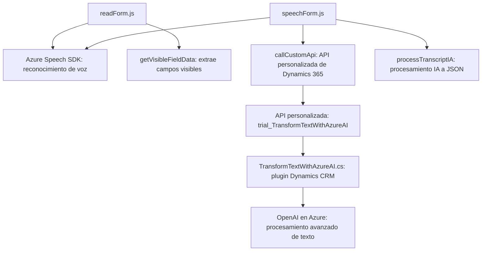

### Breve resumen técnico

El repositorio parece ser una solución orientada a la integración entre el sistema Dynamics 365 y los servicios de Azure (Azure Speech SDK y Azure OpenAI) con enfoque en formularios interactivos. Se utilizan tres componentes principales:
1. Frontend con funcionalidad de síntesis y reconocimiento de voz.
2. Backend basado en plugins para comunicación con APIs externas.
3. Comunicación integracional mediante el SDK de Azure y un servicio externo (API personalizada y OpenAI).

---

### Descripción de arquitectura

La arquitectura combina **Cliente-Servidor**, **Facade Pattern**, **API Gateway** y **External API Integration**. Consta de tres capas principales:
1. **Frontend**: Incluye archivos JavaScript (como `readForm.js`, `speechForm.js`) para interactuar con el SDK de Azure Speech y con APIs de Dynamics 365, mostrando una estructura modular y desacoplada.
2. **Backend**: Utiliza un *plugin* desarrollado en C#, que actúa como un middleware entre Dynamics CRM y servicios externos, como Azure OpenAI.
3. **Servicios de Nube**: Interacción directa con servicios de Azure (Speech SDK y OpenAI) para funciones específicas.

La solución tiene elementos de una arquitectura **orientada a eventos** debido al uso de callbacks y funciones asincrónicas que responden a eventos del sistema y usuarios.

---

### Tecnologías usadas
1. **Frontend**:
   - **JavaScript**: Código client-side para interacción con formularios y servicios Azure.
   - **SDKs de Dynamics 365**: Uso de su API para manipular datos.
   - **Azure Speech SDK**: Módulo para síntesis y reconocimiento de voz.
2. **Backend**:
   - **Microsoft Xrm.Sdk**: Librería esencial de Dynamics CRM Plugins.
   - **Azure OpenAI**: Servicio de procesamiento avanzado de texto con GPT.
   - **HTTP Client Libraries**:
     - `System.Net.Http` y `System.Text.Json` de .NET para interactuar con servicios externos.
     - `Newtonsoft.Json` de .NET para gestión avanzada de JSON.
3. **APIs dinámicas**:
   - **Xrm.WebApi.online**: API interna de Dynamics 365 para llamadas asincrónicas.
   - **Azure AI/ML Services** para procesamiento de texto.

---

### Dependencias y componentes externos
1. **Dependencia principal**: SDK de Azure Speech.
2. **Componente externo clave**: Integración con Azure OpenAI para procesamiento de texto.
3. **API personalizada**: Llamadas a APIs específicas de Dynamics 365.
4. **Modelo de datos**: Mapeo dinámico entre atributos y entidades internas de Dynamics 365.
5. **Contexto externo (executionContext)**: Proporciona datos dinámicos desde el frontend.

---

### Diagrama Mermaid

---

### Conclusión final

El código analizado se divide en tres capas: **Frontend**, **Backend** y **Servicios en la nube**, logrando una integración eficaz entre Dynamics CRM, Azure Speech Services y OpenAI para mejorar la experiencia de usuario. 

El diseño técnico, basado en patrones como modularidad funcional, Facade y callbacks, garantiza que el sistema sea escalable y permita usar servicios externos no solo para reconocimiento y síntesis de voz, sino también para procesamiento avanzado mediante IA en lenguaje natural, lo que amplía sus capacidades y flexibilidad.

Este diseño califica como una **arquitectura de N capas con integración de servicios externos en la nube**, enfocada en lograr una interfaz más interactiva y amigable, especialmente en contextos de formularios dinámicos en entornos empresariales.