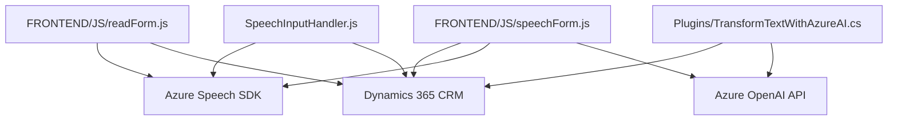

### Análisis técnico y arquitectónico

#### Breve resumen técnico

El repositorio consiste en una solución que utiliza **Azure Speech SDK** y **Azure OpenAI** para interactuar con formularios de Microsoft Dynamics CRM, procesar texto y realizar síntesis de voz. Incluye funciones para:
1. Extraer elementos visibles de formularios.
2. Permitir entrada interactiva mediante voz.
3. Transformar texto mediante un plugin en el CRM, utilizando **Azure OpenAI**.
La estructura de la implementación refleja un enfoque modular y basado en servicios externos.

---

#### Descripción de arquitectura

1. **Tipo de solución**:
   Esta solución corresponde a una **arquitectura híbrida API-plugin**, con interacciones en tiempo real entre dinámicas de formularios en el frontend, servicios de terceros (SDK/API), y un plugin de backend en Microsoft Dynamics CRM.

2. **Arquitectura**:
   La solución presenta una arquitectura de **n capas**, típica en aplicaciones empresariales integradas con Dynamics CRM, que incorpora:
    - **Capa de presentación**: Representada por los scripts en el frontend (`SpeechInputHandler.js` y `speechForm.js`), encargados de interactuar en tiempo real con los formularios del CRM y habilitar funcionalidades avanzadas como entrada por voz y síntesis.
    - **Capa de integración**: Los scripts y el plugin interactúan con **Azure Speech SDK** y **Azure OpenAI API** para habilitar capacidades de aprendizaje automático y síntesis de voz.
    - **Capa de negocios/backend**: Representada por el archivo `TransformTextWithAzureAI.cs`, que se integra como un plugin en Dynamics 365 CRM para transformar texto.

3. **Patrones usados**:
   - **Carga dinámica**: Se utiliza para cargar el SDK de Azure Speech únicamente cuando se necesita (en frontend).
   - **Modularidad y separación de responsabilidades**: Cada función en los scripts y plugin está dedicada a una tarea específica.
   - **Integración de servicios externos**: Uso de APIs y SDKs para ampliar las capacidades del CRM.
   - **Plugin Pattern**: Aplicado en la extensión funcional en Dynamics CRM.

---

#### Tecnologías y frameworks utilizados

1. **Lenguajes de programación**:
   - **JavaScript**: Para gestionar las interacciones en el frontend y funcionalidades de voz/síntesis.
   - **C#**: Para la creación del plugin interno de Dynamics CRM.

2. **Frameworks/Entornos**:
   - **Microsoft Dynamics CRM**: Como el núcleo de la solución.
   - **Azure Services**:
     - **Azure Speech SDK**: Para reconocimiento de voz y síntesis de texto a voz.
     - **Azure OpenAI API**: Para el procesamiento y transformación de texto mediante modelos como GPT.

3. **Librerías externas**:
   - **Newtonsoft.Json**: Manejo de estructuras JSON en el plugin.
   - **System.Net.Http**: Para peticiones HTTP al servicio de **Azure OpenAI** desde el backend.

---

#### Dependencias o componentes externos potenciales:

1. **Azure Speech SDK**:
   - Cargado dinámicamente, dependiendo de la configuración del CRM y el frontend, desde el CDN.
   - Requiere claves y configuración de región específicas.

2. **Azure OpenAI API**:
   - Accede a modelos de procesamiento de lenguaje natural mediante la API REST desde el plugin del CRM.
   - Requiere configuración de despliegue específico en el servicio Azure OpenAI, como el modelo `gpt-4`.

3. **Microsoft Dynamics 365 Web API**:
   Utilizado para acceder a datos del CRM, realizar actualizaciones de campos y efectuar llamadas al plugin.

4. **Navegador**:
   Requiere navegadores modernos que soporten Web Audio API para el correcto uso del **Azure Speech SDK**.

---

#### Diagrama **Mermaid** compatible con GitHub

---

#### Conclusión final

La solución consiste en una arquitectura altamente integrada que aprovecha servicios en la nube como **Azure Speech SDK** y **Azure OpenAI API** para extender la funcionalidad de Microsoft Dynamics CRM. Es una implementación híbrida con una capa de presentación basada en JavaScript y una capa de backend mediante un plugin en C#. Los patrones aplicados (modularidad, carga dinámica, y orientación a eventos) destacan por su eficiencia en integraciones empresariales. El uso de servicios de nube asegura una alta respuesta y capacidad de escalabilidad, recomendando revisar las configuraciones de seguridad y optimizar el manejo de errores en la comunicación con APIs externas.