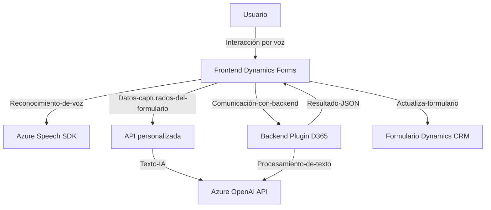

### Breve resumen técnico
Este repositorio parece implementar una solución orientada al reconocimiento e interacción por voz para aplicaciones de formularios sobre Dynamics 365, aprovechando servicios de síntesis y de reconocimiento de voz ofrecidos por Azure. Arquitectónicamente integra funcionalidad de frontend para manejo de interacción de formularios y un plugin en la capa de backend que comunica el entorno Dynamics con Azure OpenAI.

---

### Descripción de arquitectura
La solución implementa una **arquitectura de múltiples capas (n-capas)** enfocada en la integración entre cliente, servidor y servicios externos. Al menos dos capas principales están claramente diferenciadas:
1. **Frontend**: Responsable de la interacción del usuario con formularios en Dynamics 365 (modificación, reconocimiento de voz y síntesis de texto a voz).
2. **CRM Plugin Backend**: Amplía la funcionalidad del servidor Dynamics 365 mediante un plugin. Este realiza procesamiento más complejo del texto y se comunica con servicios de Azure para manejar tareas de inteligencia (como el procesamiento de texto vía OpenAI).

---

### Tecnologías usadas
1. **Frontend**:
   - **Azure Speech SDK**: Usado para la síntesis de voz (texto a voz) y el reconocimiento de voz (voz a texto).
   - **JavaScript** para interacción con el DOM y procesamiento de formularios.
   - **Dynamics 365 SDK**: Facilita la comunicación con el cliente Dynamics para manejar los formularios y sus modelos de datos.
   - **API personalizada**: Interactúa con una API externa para procesamiento adicional basado en IA.

2. **Backend**:
   - **C# .NET SDK**: Desarrollado como un plugin compatible con Dynamics CRM.
   - **Azure OpenAI API**: Servicio externo para transformar texto utilizando modelos IA.
   - **HttpClient**: Gestión de comunicación HTTP con servicios externos.
   - **Newtonsoft.Json** / **System.Text.Json**: Parseo y manipulación de JSON.

---

### Patrones y principios observados
1. **MVC-like Pattern** (Frontend): 
   - Separación lógica manifestada en las funciones para entrada, procesamiento de datos y aplicación al modelo del formulario.
   
2. **Service-Oriented Architecture (SOA)**:
   - Comunicación fluida entre el plugin (servidor CRM) y el servicio externo (Azure OpenAI), encapsulando la lógica entre ambos.

3. **Single Responsibility Principle**:
   - Funciones dedicadas y enfocadas en realizar tareas específicas (por ejemplo, `speakText`, `leerFormulario`, `applyValueToField`).

4. **Lazy Loading Pattern**:
   - Uso de carga dinámica para componentes como Azure Speech SDK mediante la función `ensureSpeechSDKLoaded`.

5. **Error Handling**:
   - Mecanismos básicos para identificación de errores en dependencias (e.g., SDK no cargado correctamente).

---

### Diagrama Mermaid compatible con GitHub Markdown

El flujo comienza cuando el usuario interactúa con el frontend basado en formularios de Dynamics 365 por medio de voz. La voz se interpreta mediante Azure Speech SDK y, en caso de requerir procesamiento especializado, se realizan peticiones a una API personalizada o directamente al plugin del backend CRM. Este plugin se comunica con el servicio Azure OpenAI API para estructurar datos recibidos y devolver un JSON procesado al frontend, donde los campos visibles del formulario son actualizados.

---

### Conclusión final
1. **Tipo de solución**:
   - Un cliente **frontend** construido en **JavaScript** (Dynamics 365 Forms), una capa de integración mediante **API personalizada** y un plugin de **backend** desarrollado en **C#** para Dynamics CRM.

2. **Tecnologías utilizadas**:  
   - **Frontend**: JavaScript, Azure Speech SDK, Dynamics 365 SDK.
   - **Backend**: C#/.NET, Microsoft.Xrm.Sdk, Azure OpenAI, Newtonsoft.Json y System.Text.Json para manejo de JSON.

3. **Arquitectura**:  
   - Principalmente una **n-capas** donde:
     - **Frontend**: Interactúa directamente con el usuario y Azure Speech SDK.
     - **Middleware/API y Plugin**: Procesa datos y proporciona servicios en Dynamics 365 extendiendo funcionalidades.
     - **Servicio externo (Azure)**: Procesamiento avanzado vía IA con OpenAI y soporte para voz.

4. **Componentes externos**:
   - Servicio Azure Speech SDK para síntesis/reconocimiento de voz.
   - Azure OpenAI API para procesamiento de texto avanzado.
   - API personalizada para gestionar datos entre componentes.

La solución está bien diseñada para abordar la funcionalidad requerida, pero podría mejorarse mediante una mayor abstracción y centralización de las configuraciones sensibles.