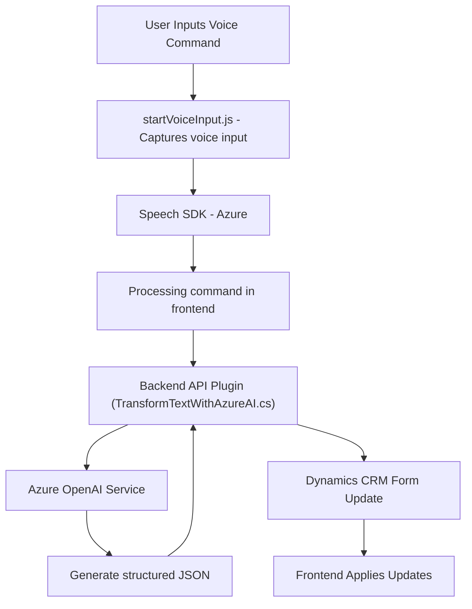

### Breve resumen técnico

Los archivos proporcionados forman parte de una solución completa que integra capacidades de reconocimiento de voz, procesamiento de lenguaje natural y arquitectura cliente-servidor personalizada. Esta solución se alinea con el objetivo de habilitar formularios dinámicos en un CRM (Dynamics 365) para ofrecer procesamiento inteligente de datos mediante interacción con voz e IA. Implica una combinación de frontend modular basado en JavaScript y plugins backend utilizando C# y APIs de Azure.

---

### Descripción de la arquitectura

La solución sigue los principios de arquitecturas orientadas a servicios, destacando por su orientación a eventos y modularidad. La arquitectura combina un **frontend** que interactúa directamente con usuarios por comandos de voz, y un **plugin backend** que procesará datos utilizando capacidades externas (Azure OpenAI). 

- **Tipo de arquitectura:** 
  - **Componentes frontend:** Orientado a servicios con separación modular de funciones (modelo de capas funcionales).
  - **Plugin backend:** Integración de microservicio para procesamiento avanzado con Azure y actualización dinámica de formularios.
- **Interacción:** El frontend captura información del usuario (voz) y la delega al backend para realizar el procesamiento, utilizando el paradigma cliente-servidor. Ambos componentes están acoplados aprovechando servicios web.

---

### Tecnologías usadas

1. **Frontend:**
   - **Lenguaje:** JavaScript.
   - **Frameworks/Bibliotecas:** 
     - Azure Speech SDK para interacción basada en voz.
   - **Patrones:**
     - Asincronía con `async/await`.
     - Lazy Loading para optimizar carga de dependencias.
     - Encapsulación con funciones modulares.

2. **Backend:**
   - **Lenguaje:** C#.
   - **Frameworks/Bibliotecas:**
     - Dynamics SDK (`Microsoft.Xrm.Sdk`) para acceso y manipulación de datos del CRM.
     - Azure OpenAI REST API.
     - JSON management (System.Text.Json, Newtonsoft.Json).
     - HTTP client para interacciones RESTful.
   - **Patrones:**
     - Plugin Pattern para manejar eventos dentro del CRM.
     - Microservicio para el procesamiento de texto por IA.

3. **Servicios Externos:**
   - **Azure Speech SDK:** Reconocimiento de voz y síntesis de texto en audio.
   - **Azure OpenAI:** Transformación de texto en JSON estructurado según normas específicas.
   - **Dynamics CRM APIs:** Integración empresarial con soporte para extensibilidad mediante plugins y Custom APIs.

---

### Diagrama Mermaid válido

---

### Conclusión final

Esta solución se destaca por combinar tecnologías modernas y patrones de diseño robustos para integrar capacidades de voz e IA en una plataforma CRM. La arquitectura, aunque relativamente acoplada al ecosistema Dynamics/Azure, es modular y reutilizable, permitiendo extensibilidad de los componentes tanto en el frontend como en el backend. Esto, junto con una clara separación de responsabilidades entre las distintas capas de la aplicación, permite escalar funcionalidad y adaptarse a casos de uso diversos en entornos empresariales. Sin embargo, el éxito de esta arquitectura depende en gran medida de la disponibilidad y rendimiento de las APIs externas (como Azure Speech y OpenAI).