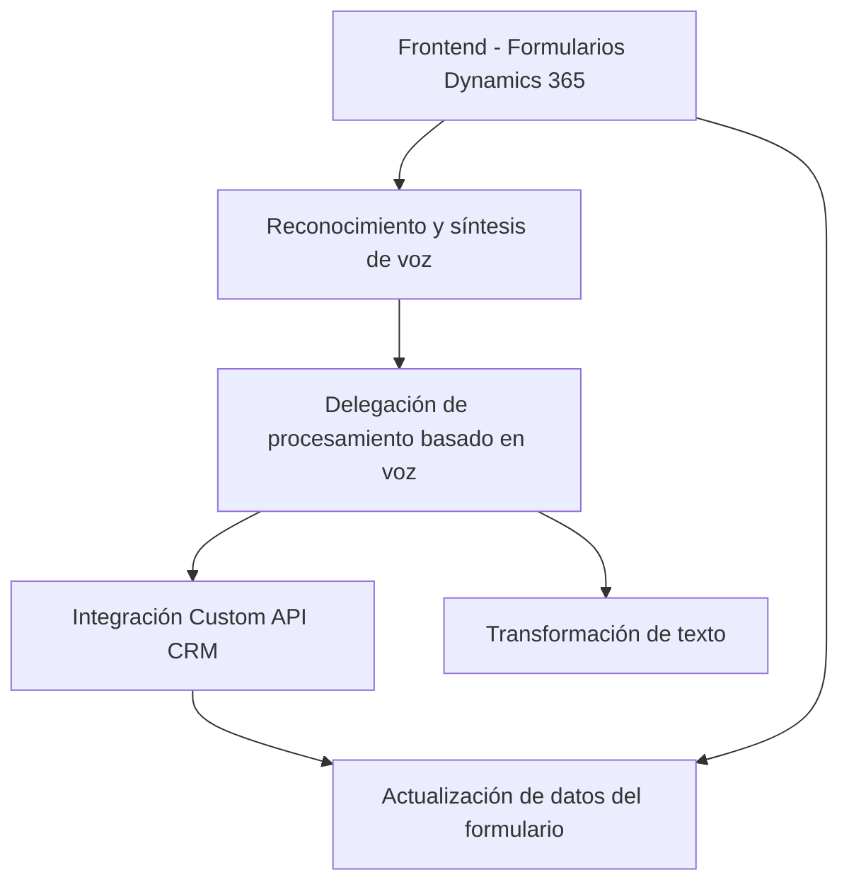

### Análisis Técnico:

---

#### **1. Tipo de solución:**
La solución está dividida entre frontend y backend, con funcionalidades que giran en torno a:
- **Frontend:** Trabaja con formularios en Dynamics 365, captura de voz, síntesis de voz, y transcripción utilizando el SDK de Azure Speech. Parece ser un **cliente interactivo basado en eventos para formularios**.
- **Backend:** Un plugin de Microsoft Dynamics CRM que procesa texto utilizando la **API de Azure OpenAI**. Es **una extensión backend orientada a lógica empresarial**.

---

#### **2. Tecnologías, Frameworks y Patrones usados:**
##### **Frontend:**
- **Tecnologías:**
  - **JavaScript:** Como lenguaje principal.
  - **Dynamics 365 JS SDK:** Para manipulación de datos de formularios y llamadas a APIs en Dynamics CRM.
  - **Azure Speech SDK:** Para síntesis y reconocimiento de voz.
- **Patrones:**
  - **Cliente-API:** Uso de Azure Speech SDK para realizar toda la operación de voz.
  - **Event-driven:** Varias funciones se desencadenan basándose en eventos (del SDK o del entorno del formulario).
  - **Modularidad:** Funciones separadas por tareas específicas (procesamiento de valores visibles, interacción con APIs).

##### **Backend:**
- **Tecnologías:**
  - **Microsoft Dynamics CRM SDK:** Para la integración como plugin.
  - **Azure OpenAI API:** Transformación avanzada de texto.
  - **C# y .NET Framework:** Lenguajes base del plugin.
  - **Newtonsoft.Json y System.Text.Json:** Para el manejo de JSON.
- **Patrones:**
  - **Plugin:** Diseño típico para extensibilidad en Dynamics CRM.
  - **Dependencia de Inyección:** Uso de `IServiceProvider` para acceder a servicios en el entorno de CRM.
  - **Delegación:** La lógica compleja de transformación está delegada al método `GetOpenAIResponse`.

---

#### **3. Tipo de arquitectura:**
- **Frontend:**
  - **Arquitectura modular y orientada a eventos:** Cada archivo está diseñado para manejar responsabilidades específicas. No parece ser un monolito ni una estructura de capas rígida, sino orientado al cliente y servicios externos.
  - **Client-side integration:** La aplicación se conecta dinámicamente a servicios de terceros (Azure, Dynamics 365) sin una dependencia directa en el backend.
- **Backend:**
  - **Plugin-based architecture for extension:** En Dynamics CRM, los plugins se ejecutan en el contexto del servidor, ampliando las capacidades del sistema sin afectar su núcleo. El código presenta una integración directa con Azure OpenAI y utiliza microservicios asociados.

---

#### **4. Dependencias o componentes externos:**
- **Frontend:**
  - **Azure Speech SDK:** Necesario para funciones de síntesis y reconocimiento de voz.
  - **Xrm.WebApi:** Integración con Dynamics 365 para manipulación y lectura de datos de formularios.
  
- **Backend:**
  - **Azure OpenAI API:** Utiliza el modelo GPT de Azure para transformar texto en un formato JSON normativo.
  - **Dynamics 365 Plugins SDK:** Permite integrar lógica personalizada en eventos del sistema.

---

#### **5. Diagrama Mermaid:**

---

### **Conclusión:**
La solución presentada constituye una integración avanzada entre Dynamics CRM, Azure Speech SDK y Azure OpenAI. Su arquitectura modular permite añadir funcionalidades específicas de entrada/salida de voz y procesamiento avanzado del lenguaje sin alterar el core de Dynamics 365. La importancia de servicios en la nube (Azure) y dependencias del SDK de CRM destaca la flexibilidad de la solución, haciéndola escalable y adaptable en diferentes escenarios. Sin embargo, es recomendable manejar las claves API de manera segura y tener cuidado con la latencia en las comunicaciones con los servicios externos.