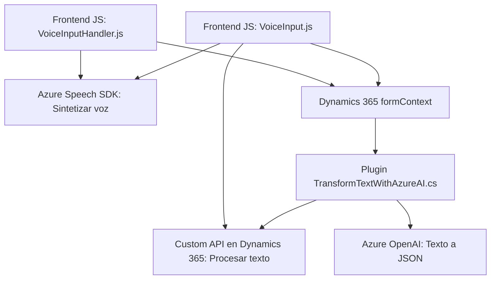

### Breve Resumen Técnico
El repositorio contiene información sobre la implementación de una solución basada en **Microsoft Dynamics CRM** que integra reconocimiento de voz y procesamiento de texto con servicios de **Azure Speech SDK** y **Azure OpenAI**. Utiliza JavaScript para manejar el frontend en contexto de formularios y un plugin de Dynamics en **C#** para la transformación de textos vía IA. La solución está enfocada en la síntesis de voz, el reconocimiento de comandos hablados y su aplicación en formularios de Dynamics 365.

---

### Descripción de Arquitectura
La solución sigue una arquitectura basada en **n capas** con separación entre:
1. **Capa de presentación:** Archivos JavaScript (`readForm.js` y `speechForm.js`) que operan en el frontend sobre formularios de Dynamics 365.
2. **Capa de servicios:** Uso del **SDK de Azure Speech** para síntesis y reconocimiento de voz, con integración dinámica mediante JavaScript.
3. **Capa de negocios:** Plugin en Dynamics (`TransformTextWithAzureAI`) que maneja la lógica de transformación de texto mediante Azure OpenAI, configurado como un servicio externo.
4. **Capa de datos:** Acceso y manipulación de datos dentro de los formularios de Dynamics 365 (`Xrm.WebApi`, `formContext`).

El uso de un **plugin en Dynamics**, junto con servicios externos (Azure OpenAI, Azure Speech SDK), sugiere una arquitectura híbrida entre **n capas** y **client-server**, con integración a microservicios.

---

### Tecnologías Usadas
1. **Lenguajes:**
   - **JavaScript:** Para manejar lógica frontend en los formularios de Dynamics.
   - **C#:** Implementación del plugin en Dynamics 365 que interactúa con Azure OpenAI.
2. **Servicios y SDKs:**
   - **Azure Speech SDK:** Para reconocimiento y síntesis de voz.
   - **Azure OpenAI:** Procesamiento avanzado de texto con modelos GPT.
   - **Microsoft Dynamics CRM SDK:** Para implementación de plugins y manipulación del contexto CRM.
3. **Frameworks y Paquetes:**
   - `.NET Framework`
   - **Newtonsoft.Json**: Serialización y manipulación de JSON en C#.
   - **Dynamics 365 APIs/WebApi**: Peticiones desde JavaScript y plugins.
4. **Patrones de Diseño:**
   - **Modularidad:** Separación de funciones específicas para procesamiento de voz y texto.
   - **Integración dinámica:** Carga del SDK de Azure Speech en tiempo de ejecución.
   - **Responsabilidad única:** Plugins y funciones segmentados por su propósito (lectura, síntesis, procesamiento).

---

### Diagrama Mermaid Válido para GitHub

---

### Conclusión Final
La solución destaca por integrar microservicios como **Azure OpenAI** y **Azure Speech SDK** dentro de un entorno real basado en **Microsoft Dynamics CRM**, donde la lógica está distribuida en capas claramente definidas. La modularidad en los componentes asegura buena mantenibilidad y extensibilidad, mientras que su dependencia en servicios externos como Azure enfatiza la transición hacia arquitecturas cloud-native. Algunas oportunidades de mejora incluyen permitir configuraciones dinámicas (como claves y regiones de Azure) en lugar de valores fijos para facilitar la operación en entornos escalables y más seguros.