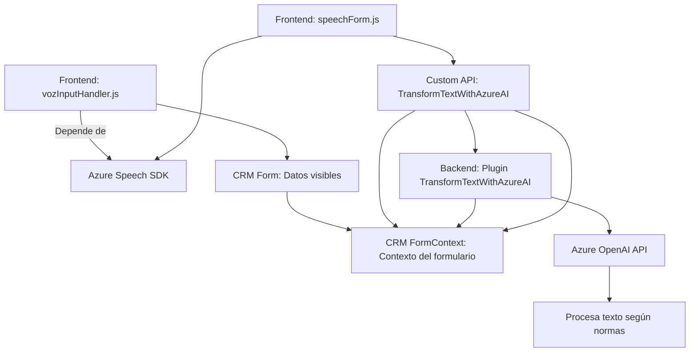

### Análisis Técnico y Arquitectónico

#### 1. **Tipo de solución:**
   - Este repositorio implementa una solución híbrida que interactúa con sistemas CRM internos y servicios externos. Incluye:
     - **Frontend:** Scripts de JavaScript para formularios en Dynamics CRM, integrados con Azure Speech SDK.
     - **Backend:** Un plugin escrito en C# que extiende las capacidades de Dynamics CRM mediante interacción con Azure OpenAI API.

#### 2. **Tecnologías, frameworks y patrones:**
   - **Frontend:**
     - **Lenguaje:** JavaScript.
     - **Framework/SDK:** Azure Speech SDK para reconocimiento y síntesis de voz.
     - **Patrones:**
       - *Event-driven architecture:* Las operaciones dependen de eventos como la carga del SDK o la recepción de transcripciones de voz.
       - *Modular design:* Cada archivo divide funciones en componentes individuales orientados a tareas específicas como captura de formulario, procesamiento de texto e interacción con APIs.
     - **Integración externa:** Azure Speech SDK, APIs personalizadas para extender funcionalidades.
   - **Backend:**
     - **Lenguaje:** C#.
     - **Framework:** Microsoft Dynamics CRM SDK.
     - **Dependencias externas:**
       - Azure OpenAI API para transformar texto.
       - Newtonsoft.Json para manejar estructuras JSON.
     - **Patrones:**
       - *Plugin-based architecture:* Basado en eventos del CRM (interfaz `IPlugin`).
       - *API Consumer:* Diseñado para interactuar con servicios externos como Azure OpenAI.
       - *Encapsulación:* Define normas explícitas para la transformación del texto.

#### 3. **Tipo de arquitectura:**
   - **Híbrida:**
     - **Microservicios:** Interacción con APIs de Azure (Speech SDK y OpenAI) que operan como servicios independientes para reconocimiento y síntesis de voz, y procesamiento de lenguaje.
     - **Monolito orientado a eventos:** El plugin en C# forma parte de una arquitectura centralizada en Dynamics CRM. Aunque consume servicios externos, las operaciones principales están encapsuladas en un único punto de ejecución orientado a eventos.
     - **Frontend modular:** Los scripts de JavaScript actúan como extensiones modulares que interactúan con formularios CRM.

#### 4. **Dependencias y componentes externos:**
   - **Azure Speech SDK:** Reconocimiento y síntesis de voz, carga dinámica desde un enlace externo `https://aka.ms/csspeech/jsbrowserpackageraw`.
   - **Azure OpenAI API:** Transformación de texto en JSON estructurado mediante inteligencia artificial.
   - **CRM Dynamics SDK:** Manipulación de datos y ejecución de reglas de negocio dentro de la plataforma Dynamics.
   - **Newtonsoft.Json:** Manejo de estructuras JSON en plugins.
   - **System.Net.Http:** Realización de solicitudes HTTP a servicios externos.

---

### Mermaid Diagram

---

### Conclusión Final
El repositorio está diseñado para extender funcionalidades de Dynamics CRM utilizando tecnologías avanzadas como Azure Speech SDK y Azure OpenAI. La solución se apoya en una arquitectura híbrida donde el frontend maneja captura y procesamiento de datos desde formularios CRM, y el backend consume servicios externos para transformar datos en reglas personalizadas. La modularidad y la integración con APIs exógenas proporcionan flexibilidad y escalabilidad, mientras que el uso de patrones como event-driven y encapsulación aseguran un flujo estructurado y reusable en varios contextos CRM. Esta solución es ideal para sistemas orientados al manejo de datos dinámicos en aplicaciones empresariales.