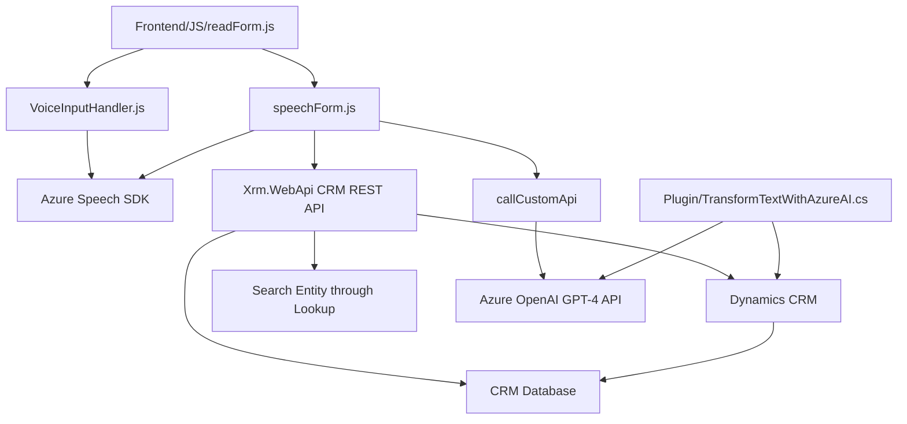

### Breve resumen técnico
El repositorio se describe como una solución integrada que emplea tanto frontend como backend para ofrecer funcionalidades de accesibilidad y procesamiento de interacciones de usuarios mediante voz, texto y APIs externas. Combina una interfaz de usuario para capturar datos en formularios y procesamiento mediante métodos asociados a un entorno CRM (Dynamics 365). Además, incorpora el uso de inteligencia artificial a través de Azure OpenAI para transformar texto bajo normas específicas y generar respuestas estructuradas en JSON. Las dependencias principales incluyen Azure Speech SDK y Azure OpenAI API.

---

### Descripción de arquitectura
La arquitectura empleada combina elementos de **modelado modular** y una estructura próxima al **modelo de n capas** y **event-driven architecture**. Funcionales como la captura de voz, el procesamiento de formularios CRM y las integraciones con APIs, están desacoplados en diferentes módulos frontales y plugins en el backend (en .NET), utilizando técnicas modernas de patrones, como las fábricas, callbacks y la integración con servicios externos. 

- **Frontend**: Provee una interfaz web que integra funcionalidad de entrada y salida por voz, diseñada para mejorar la experiencia del usuario y optimizar la interacción.
- **Backend**: Implementa lógica empresarial avanzada en plugins para Dynamics CRM, delegando la responsabilidad del procesamiento de texto estructurado a Azure OpenAI.

Los archivos actúan como miembros especializados dentro de una **arquitectura orientada a servicios (SOA)** que podría extenderse hacia un conjunto de **microservicios** si se distribuyen entre varias instancias independientes de ejecución. Por ahora, las funcionalidades de procesamiento están centralizadas en el contexto del CRM. Découpage en microservicios podría optimizar aún más su diseño, pero por el momento es un híbrido entre SOA y arquitectura de capas.

---

### Tecnologías usadas
#### Frontend:
- **Lenguaje:** JavaScript.
- **Frameworks:** Ninguno explícito en el alcance del análisis, aunque se asume que podría usarse algún framework si está trabajando en un entorno CRM como Dynamics 365.
- **SDK:** Azure Speech SDK para texto-a-voz y reconocimiento de voz.
- **Patrones:** Callback-based Execution, Modularidad.

#### Backend:
- **Lenguaje:** C#.
- **Framework:** Dynamics CRM plugin framework basado en .NET.
- **SDK:** Azure OpenAI GPT-4 vía REST API.
- **Dependencias:** `System.Net.Http`, `Newtonsoft.Json`, `System.Text.Json`.
- **Patrones:** Plugin Pattern, Factory Method, Microservicio e integración vía API.

---

### Diagrama Mermaid

---

### Conclusión final
El repositorio representa una solución altamente adaptable y colaborativa que une accesibilidad y procesamiento automático en aplicaciones de CRM mediante la integración con servicios de AI avanzados (Azure Speech SDK y OpenAI). Está estructurado bajo principios de modularidad, reutilización de código y diseño escalable. Su arquitectura, actualmente centralizada entre frontend y backend, puede evolucionar hacia microservicios con APIs propias que faciliten la independencia de cada funcionalidad principal. Esto podría permitir una integración más flexible y distribución de carga entre recursos. 

El diagrama Mermaid proporciona una vista clara de los componentes y dependencias clave, incluyendo cómo interactúan los módulos del frontend y backend del repositorio.