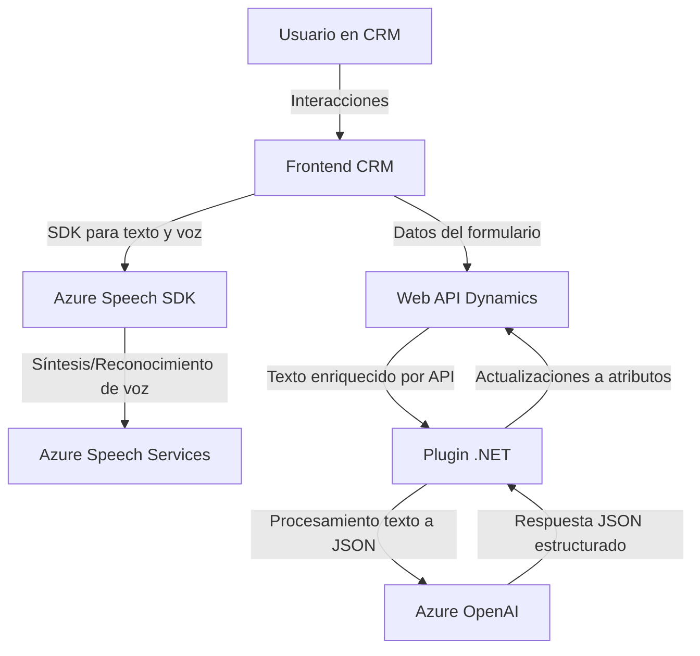

### Resumen Técnico

El repositorio implementa soluciones relacionadas con procesamiento de voz, reconocimiento de voz e integración con Microsoft Dynamics CRM. Se divide en tres áreas principales: procesamiento de voz en el frontend, procesamiento de reconocimiento de voz con Azure Speech SDK, y el uso de plugins para enriquecer operaciones en Dynamics CRM mediante Azure OpenAI API.

---

### Descripción de Arquitectura

#### **Tipo de Solución**
Este repositorio representa un sistema híbrido:
- **Frontend**: Basado en JavaScript, manipula formularios y datos en Dynamics CRM utilizando Azure SDK.
- **Backend Plugins**: Implementados en .NET con **Dynamics CRM Plugins**, manejan lógica de negocio y comunicación con Azure OpenAI API.

#### **Arquitectura**
La arquitectura general combina varios enfoques:
- **Monolito CRM Extendido**: Dynamics CRM centraliza datos y flujo, y se extiende mediante plugins (backend) y manipulaciones del frontend.
- **Arquitectura N-Capas**:
  - **Presentación**: Manipulación y enriquecimiento de formularios (JavaScript en frontend).
  - **Lógica de Negocio**: Plugins en .NET que integran inteligencia artificial para procesamiento de texto.
  - **Gestión de Voz/IA**: Integración con servicios externos (Azure Speech SDK y OpenAI).

#### **Comportamientos y Patrones**
- **Callbacks asíncronos**: Para la carga dinámica del SDK y la ejecución de procesos de voz (JavaScript).
- **Inversión de Dependencias**: Uso del patrón `factory` para integrar los servicios de Dynamics CRM en los plugins .NET.
- **Outsourcing de la lógica compleja**: Delegación de tareas avanzadas (reconocimiento de voz y procesamiento de texto con IA) en APIs de Azure.
- **Encapsulación**: Funciones Javascript y métodos en plugins .NET segmentan tareas específicas.
- **Promesas**: Utilizadas en el JavaScript para la gestión de llamadas API y el reconocimiento de voz.

---

### Tecnologías Usadas
1. **Frontend**
   - **JavaScript**: Para la gestión de formularios y procesamiento de datos de voz.
   - **Azure Speech SDK**: Reconocimiento y síntesis de voz.
   - **Microsoft Dynamics CRM Web APIs**: Interacción con datos del CRM.
   
2. **Backend (Plugins)**
   - **.NET (C#)**: Creación de plugins extendidos.
   - **Azure OpenAI API**: Procesamiento avanzado de texto.
   - **Newtonsoft.Json y System.Net.Http**: Manipulación y consumo de datos JSON mediante llamadas HTTP.

---

### Diagrama Mermaid

---

### Conclusión Final

El repositorio representa una solución integrada de frontend (JavaScript) y backend (.NET) para gestionar datos en Microsoft Dynamics CRM con ayuda de servicios avanzados de Azure (Speech SDK y OpenAI). La solución utiliza una arquitectura n-capas y aplica patrones modernos como asincronía y delegación de tareas complejas hacia APIs externas. Además, su estructura segmentada hace que sea adaptable a configuraciones específicas de la plataforma CRM.