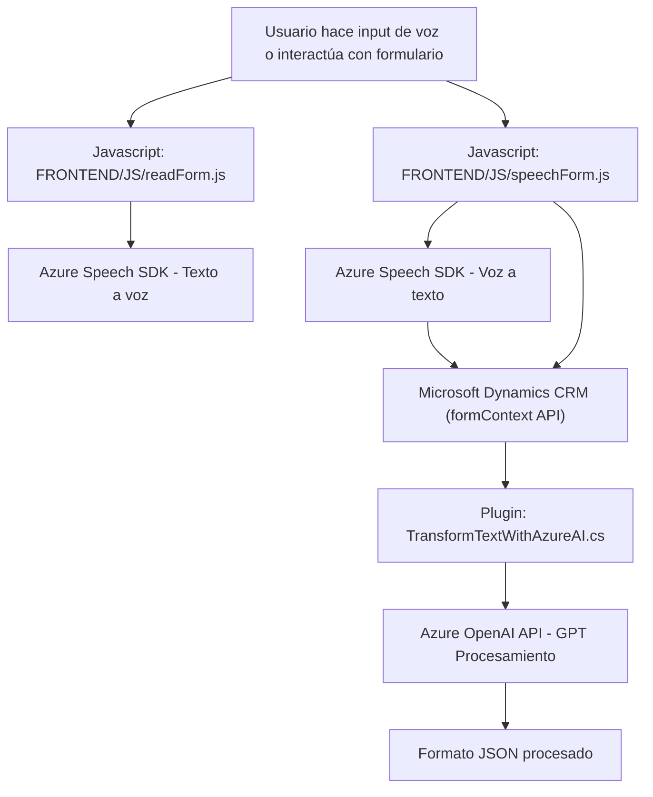

### Breve resumen técnico
El repositorio presenta tres componentes principales:  
1. **Frontend/JS/readForm.js**: Un script JavaScript que permite leer los campos visibles de un formulario y utilizar el servicio de síntesis de voz de Azure Speech SDK para mejorar la accesibilidad.  
2. **Frontend/JS/speechForm.js**: Un script que interpreta comandos de voz, transcribe audio a texto mediante Azure Speech SDK y los aplica dinámicamente a formularios en Microsoft Dynamics 365 usando un flujo de procesamiento básico o basado en inteligencia artificial.  
3. **Plugins/TransformTextWithAzureAI.cs**: Plugin en C# para Dynamics CRM que transforma texto utilizando Azure OpenAI, devolviendo un resultado estructurado en formato JSON, ideal para automatización y procesamiento avanzado del contenido.

---

### Descripción de arquitectura
La solución combina varios paradigmas organizados en capas:  
1. **Frontend**: Scripts JavaScript para interacción directa con el usuario mediante la integración de accesibilidad por voz y visualización interactiva con formularios del sistema Dynamics.  
2. **Backend**: Un plugin alojado en Dynamics CRM que ejecuta lógica empresarial y procesamiento avanzado delegando a servicios externos como Azure OpenAI.  

La arquitectura global puede describirse como **n-capas** con un enfoque modular:
- **Capa de presentación (Frontend)**: Los scripts procesan voz/inputs de formularios y ejecutan transcripciones.  
- **Capa de lógica de negocio (Plugins)**: Implemente reglas específicas integrando los servicios externos con Dynamics CRM.  
- **Servicios externos**: Azure Speech SDK y Azure OpenAI gestionan los aspectos de accesibilidad e IA.  

Se utiliza una estrategia de integración de servicios con orientación hacia la **modularidad** y el **principio de responsabilidad única** en cada componente.

---

### Tecnologías usadas
1. **Frontend**:
   - **JavaScript ES6**: Para manipulación DOM y procesamiento de formularios.
   - **Azure Speech SDK**: Integración de síntesis y reconocimiento de voz.
   - **Microsoft Dynamics formContext API**: Para el manejo de formularios y sus datos.
   - **Promesas**: Para controlar flujos asincrónicos.

2. **Backend**:
   - **C# (.NET Framework)**: Escritura del plugin de Dynamics CRM.
   - **Microsoft Xrm.SDK**: Interacción con Dynamics CRM y flujo interno.
   - **Azure OpenAI API**: Interfaz con GPT-4o para transformar texto.
   - **Newtonsoft.Json**: Procesamiento avanzado de JSON.

3. **General**:
   - **HTTP Client**: Para llamadas REST a servicios externos (Speech SDK y OpenAI).

---

### Diagrama Mermaid válido para GitHub Markdown

---

### Conclusión final
Este repositorio muestra una solución bien organizada y orientada a mejorar la interacción entre el usuario y formularios de Microsoft Dynamics 365. Combina tecnologías modernas como servicios de Azure Speech y OpenAI para ofrecer accesibilidad y capacidades de procesamiento avanzado basadas en inteligencia artificial. La arquitectura modular y el uso de patrones como Single Responsibility y Cliente API garantizan que cada componente cumpla una función específica manteniendo separación de responsabilidades y cohesión.