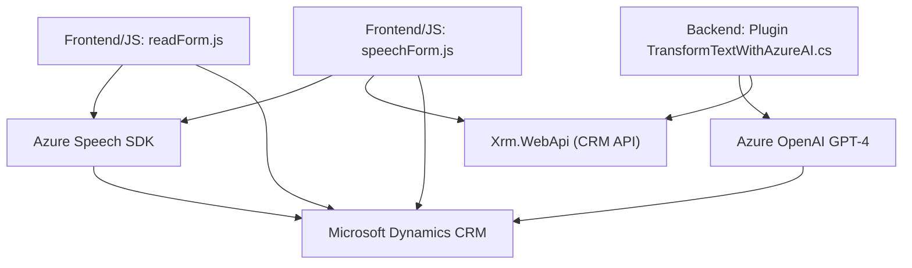

### Breve resumen técnico

Este repositorio contiene componentes relacionados con **Azure Speech SDK** y el procesamiento de datos mediante **Microsoft Azure OpenAI GPT-4**. Principalmente, el código interactúa con formularios dinámicos, permitiendo reconocimiento de voz, síntesis de texto a voz, y la transformación de texto en datos estructurados JSON. Está claramente orientado hacia la integración con **Microsoft Dynamics CRM**, aprovechando capacidades de Azure para extender funcionalidades en escenarios empresariales.

---

### Descripción de arquitectura

La solución aquí presentada tiene una arquitectura **modular y orientada a eventos** con integración de **microservicios externos** para IA avanzada. Combina arquitecturas en capas para organizar las funcionalidades de frontend (`JS` scripts) y backend (`TransformTextWithAzureAI.cs`). Utiliza un enfoque de **event-driven programming** en los scripts para manejar el reconocimiento y procesamiento de voz, activando funciones basadas en eventos del usuario.

El backend (`TransformTextWithAzureAI.cs`) sigue el patrón de **plugin CRM** que define Microsoft Dynamics, generando eventos de transformación textual mediante pedidos HTTP a servicios REST externos. La arquitectura general puede clasificarse como un **monolito modular extendido**, dado que utiliza un núcleo CRM establecido pero suma componentes externos mediante APIs.

---

### Tecnologías usadas

1. **Frontend**:
   - **JavaScript**.
   - **Azure Speech SDK**.
   - **Xrm.WebApi** para integración con Dynamics CRM.

2. **Backend**:
   - **C# (.NET Framework)**.
   - **Microsoft Dynamics CRM SDK**.
   - **Azure OpenAI Service** (GPT-4 model API).
   - **Newtonsoft.Json** for JSON manipulation.

3. **Arquitectura y Patrones**:
   - **Event-driven architecture** en el frontend.
   - **Plugin architecture for CRM** en el backend.
   - **Modular design** en funciones separadas por contextos (SDK management, text transformation, data handling).

---

### Dependencias o componentes externos

- **Microsoft Azure Speech SDK**: Reconocimiento y síntesis de voz.
- **Microsoft Dynamics CRM SDK**: Integración con servicios CRM para procesamiento de datos.
- **Azure OpenAI Service**: Transformación avanzada de texto utilizando GPT-4.
- **Newtonsoft.Json**: Manipulación y generación de datos JSON.
- **Xrm.WebApi**: API para conexión con servicios de datos Dynamics CRM.
- **Microsoft ecosystem components or libraries**: Como `System.Net.Http` para integración con APIs REST.

---

### Diagrama Mermaid válido para GitHub

---

### Conclusión final

La solución integra reconocimiento y síntesis de voz con capacidades avanzadas de transformación de texto en formato estructurado JSON, todo mientras interactúa con un entorno de configuraciones dinámicas en **Microsoft Dynamics CRM**. Utiliza componentes de Azure como el Speech SDK y el servicio OpenAI GPT-4, lo cual refuerza la orientación hacia la inteligencia artificial y servicios en la nube. La arquitectura modular y orientada a eventos sugiere un diseño robusto para procesamiento dinámico y escalabilidad dentro del ecosistema CRM.