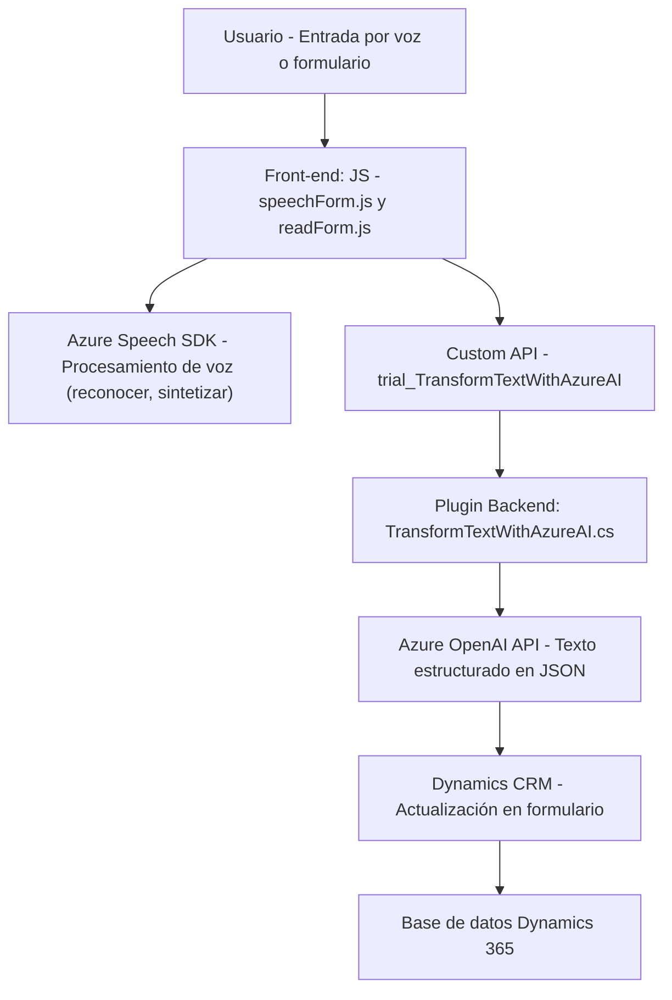

### Breve resumen técnico
El análisis está basado en tres archivos del repositorio:
1. **readForm.js** - Una solución del frontend que extrae datos visibles de formularios, los sintetiza como voz y los reproduce utilizando Azure Speech SDK.
2. **speechForm.js** - Otra solución del frontend que captura entrada por voz, la transcribe usando Azure Speech SDK, llama a una API personalizada y procesa la transcripción para llenar campos en formularios Dynamics 365.
3. **TransformTextWithAzureAI.cs** - Implementación de un plugin de Dynamics CRM para transformar texto en un objeto estructurado utilizando Azure OpenAI.

---

### Descripción de arquitectura
La solución implementa una arquitectura híbrida de **n capas**. Cada capa cumple una función específica:
1. **Frontend** (arquitectura modular): Contiene módulos individualizados para sintetizar voz (readForm.js) y transcribir voz (speechForm.js) utilizando servicios de Azure y APIs personalizadas.
2. **Backend** (plugin de Dynamics CRM): Proporciona extensibilidad al sistema Dynamics 365, centralizando la lógica de integración con Azure OpenAI.
3. **Integración de servicios externos**: Aprovecha Azure Speech SDK para funcionalidades de voz y Azure OpenAI para procesar texto y transformarlo.

---

### Tecnologías usadas
1. **Frontend (JavaScript):**
   - **Azure Speech SDK**: Para síntesis (readForm.js) y transcripción (speechForm.js) de voz.
   - **Promises y async/await**: Para procesamiento asíncrono.
   - **Modularidad**: Funciones especializadas separadas por tareas específicas.
   - **Interface API personalizada**: Realiza una llamada externa desde `speechForm.js` (`trial_TransformTextWithAzureAI`).

2. **Backend (.NET, C# Plugin):**
   - **Dynamics CRM SDK**: Para extender Microsoft Dynamics mediante el patrón `IPlugin`.
   - **Azure OpenAI API**: Transformación de texto en objetos JSON estructurados.
   - **HttpClient y JSON Libraries**: Para solicitudes a la API de Azure OpenAI.
   - **Newtonsoft.Json**: Manipulación avanzada de JSON.

3. **Patrones de diseño:**
   - **Plug-in Patterns**: Extensibilidad en Dynamics CRM para lógica personalizada.
   - **SDK Integration**: Aprovecha funcionalidades de Azure Speech y OpenAI.
   - **Condicional Lazy Loading**: Azure Speech SDK se carga dinámicamente solo si es necesario.

---

### Dependencias externas y componentes
1. **Azure Speech SDK:** Para el procesamiento de voz.
2. **Azure OpenAI API:** Transformación avanzada de texto en objetos estructurados.
3. **Dynamics CRM SDK:** Extensibilidad basada en plugins.
4. **Custom API (Dynamics 365):** API personalizada para la implementación extendida de procesamiento de texto.
5. **Bibliotecas JSON:** Newtonsoft.Json y System.Text.Json.
6. **HttpClient (.NET):** Para el manejo de solicitudes REST.

---

### Diagrama Mermaid válido para GitHub

---

### Conclusión final
La solución implementa una arquitectura **híbrida basada en n capas**, con una clara separación de responsabilidades entre el frontend (interfaz y lógica cliente) y el backend (procesamiento avanzado utilizando Azure OpenAI). La integración de tecnologías como **Azure Speech SDK**, **Dynamics CRM SDK**, y **Azure OpenAI** muestra un uso efectivo de servicios SaaS para abordar problemas complejos como reconocimiento y síntesis de voz, así como transformación de texto con IA.

El sistema utiliza prácticas modernas como modularidad, lazy loading y patrones de diseño centrados en SDKs, optimizando escalabilidad y extensibilidad en un ecosistema empresarial basado en Dynamics 365.