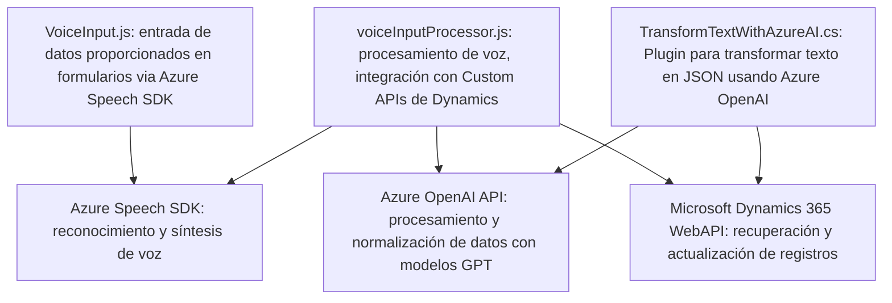

### Breve resumen técnico

El repositorio parece ser parte de un proyecto que se centra en la entrada y salida de voz y texto para formularios de **Microsoft Dynamics 365**, utilizando el **Azure Speech SDK** y **Azure OpenAI API**. Logra integrar reconocimiento de voz, síntesis de texto a audio, y transformación de texto en JSON estructurado mediante inteligencia artificial.

---

### Descripción de arquitectura
#### Tipo de solución: 
La solución implementa múltiples componentes:
- **Frontend**: Scripts JavaScript que interactúan con formularios y procesan entrada de voz con el Azure Speech SDK.
- **Plugins**: Código C# que actúa como una extensión en Dynamics CRM para transformar texto con Azure OpenAI.
  
#### Tipo de arquitectura: 
1. **N capas:** La solución incluye presentación (frontend), lógica de dominio (procesamiento con APIs) e integración con servicios externos (Azure y Dynamics APIs). Esto se puede considerar un patrón de arquitectura multicapa.
2. Potencial para ser **hexagonal** debido al uso de plugins como puertos que interactúan con servicios externos (OpenAI y Speech SDK).

#### Patrones destacados:
- **Single Responsibility Principle (SRP):** Las funciones y clases están diseñadas con responsabilidades bien definidas.
- **Fachada (Facade):** Se implementa para encapsular la lógica de SDKs externos, como el Speech SDK y OpenAI API.
- **Carga dinámica de dependencias:** Se asegura que librerías externas como el Speech SDK se carguen en tiempo de ejecución.
- **Uso de servicios externos:** Comunicaciones con APIs externas de Azure.

---

### Tecnologías usadas
1. **Frontend:**
   - **JavaScript**:
     - Interacción con formularios de Dynamics.
     - Invocación del Azure Speech SDK.
   
2. **Backend/Plugins:**
   - **C#**:
     - Implementación de plugins.
     - Integración con Azure OpenAI para transformar texto.
   - **ASP.NET Core** (posible uso implícito en Dynamics CRM).

3. **Servicios externos:**
   - **Azure Speech SDK**:
     - Reconocimiento de voz y síntesis de texto a voz.
   - **Azure OpenAI (GPT-4o modelo)**:
     - Transformación de texto con IA.
   - **Dynamics CRM Web API**:
     - Recuperación y actualización de datos estructurados.

4. **Dependencias adicionales:**
   - `Newtonsoft.Json`, `System.Net.Http`, y `System.Text.Json`: Para manejar JSON y consultas HTTP desde .NET.

---

### Diagrama Mermaid válido para GitHub Markdown

---

### Conclusión final
La solución está orientada a mejorar la accesibilidad y automatización de procesos empresariales en entornos como **Dynamics 365** mediante el uso de tecnologías avanzadas como **Azure AI**. La implementación modular ayuda a mantener el principio de separación de responsabilidades, mientras que la integración con SDKs externos facilita la adición de características avanzadas como entrada y salida de voz, reconocimiento de texto, y transformación con IA.

El diseño actual es escalable y puede extenderse fácilmente para incluir más servicios o ser adaptado a otros entornos empresariales. Sin embargo, tiene áreas que podrían mejorarse:
1. **Gestión de credenciales**: Evitar incluir claves Azure en el código fuente.
2. **Seguridad en las API externas**: Garantizar que la interacción con servicios de IA esté bien controlada.
3. **Testing automatizado**: No se proporciona información sobre la presencia de pruebas unitarias o de integración en el estado actual.